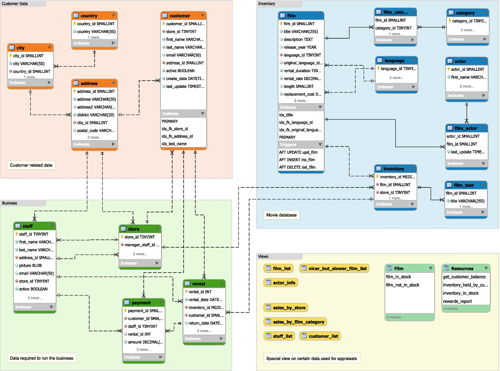
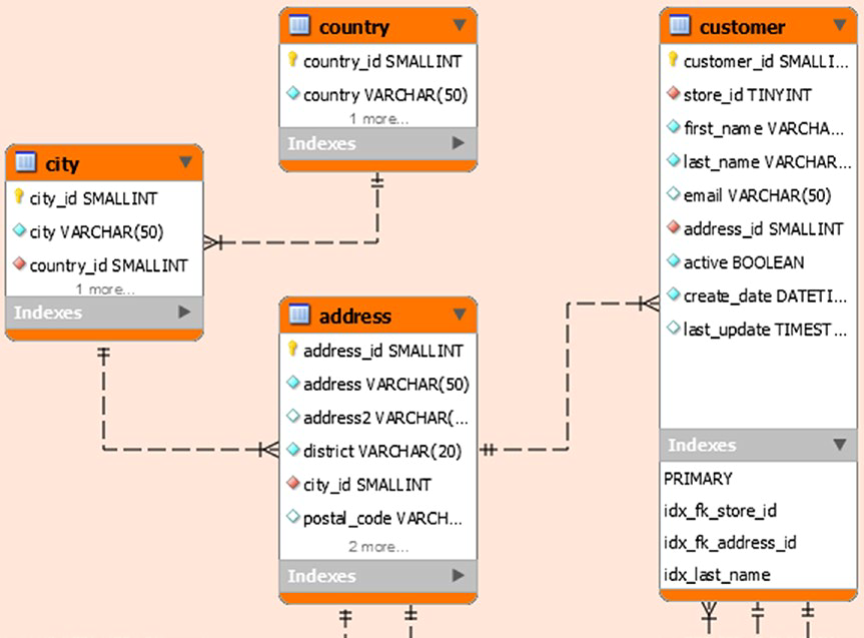
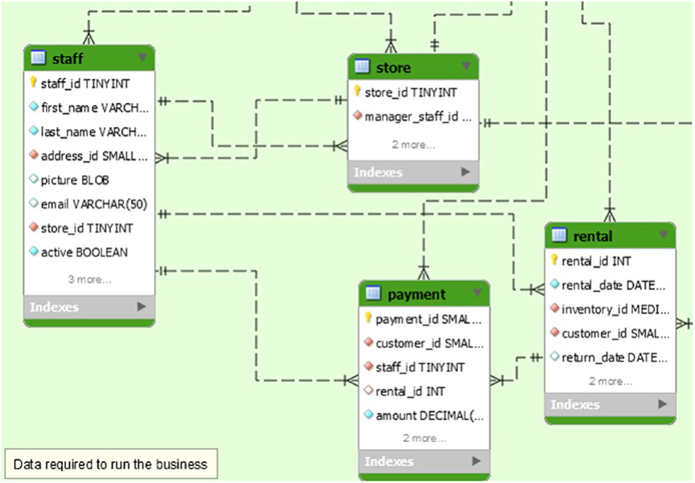
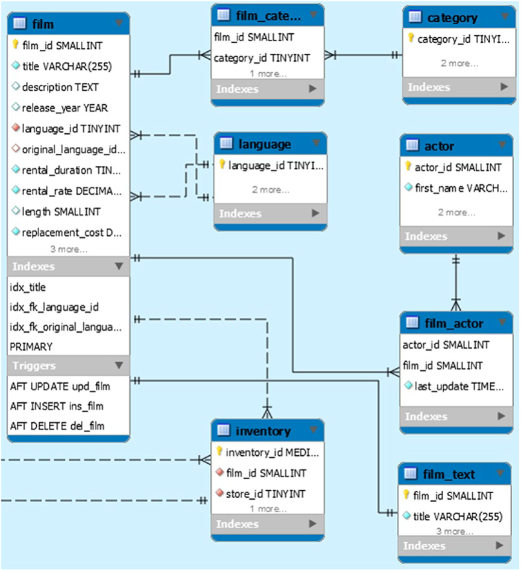
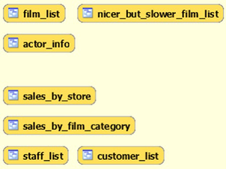
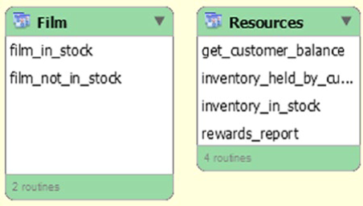
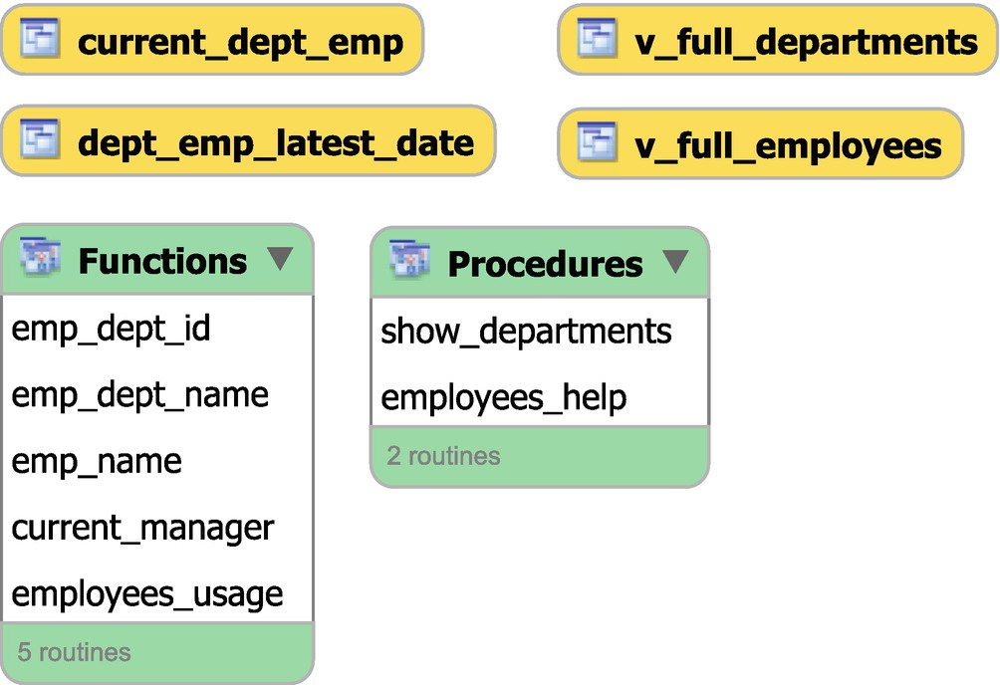

# 测试数据

测试是性能调优工作的一个重要部分，因为在将更改应用于生产系统之前，必须验证更改是否有效。验证更改的最佳数据与生产数据密切相关;但是，对于探索 MySQL 的工作原理，最好使用一些通用测试数据。本章介绍四个标准数据集，其中包含安装说明以及一些可用的其他数据集。

------

**提示** 在本书的其余部分中，将world，world_x和sakila数据库用作测试数据。

------

但是，首先，您需要知道如何下载数据库。

## 下载示例数据库

本章将详细讨论的示例数据库的共同点是可以从https://dev.mysql.com/doc/index-other.html下载它们，或者有指向可以从中下载它们的链接。对于多个数据库，还有从此页面链接的在线文档和 PDF 文件。页面的相关部分如图。


员工数据（数据库）从朱塞佩·马夏（也称为数据魅力）GitHub存储库下载，而其他数据库则从 Oracle 的 MySQL 网站下载。包含员工数据的下载还包括。对于员工数据、数据库和数据库，还有可用的文档。

数据库是一个小型的两表数据库，在 MySQL 手册中为教程部分创建的行数总共少于 20 行。将不作进一步讨论。

## world数据库

示例是用于简单测试最常用的数据库之一。它由三个表组成，有几百到几千行。这使得它成为一个小型数据集，这意味着即使在小型测试实例上，它也可以轻松使用。

### 模式

由/。表之间的关系如图。


国家地区表包括有关 239 个国家/地区的信息，并在城市和国家表。数据库中共有4079个城市，国家语言组合有984。

### 安装

下载的文件由名为 ，具体取决于您是选择了 Gzip 还是 Zip 链接。在这两种情况下，下载的存档都包含一个文件。安装非常简单，因为执行脚本所需的全部时间。

如果您将 MySQL Shell 与 2020 年 1 月左右或之前的世界数据库副本一起使用，则需要使用传统协议，因为 X 协议（默认）需要 UTF-8，而世界数据库使用拉丁语 1。您可以使用从 MySQL 命令程序加载数据：

```
MySQL [localhost ssl] SQL> \source world.sql
```


如果使用旧版命令行客户端，请改为命令：

```
mysql> SOURCE world.sql
```


在这两种情况下，如果位于启动 MySQL Shell 或 mysql 的目录中，请将其添加到。

相关的数据库是包含与世界相同的，但它的组织方式不同。

## world_x数据库

MySQL 8 增加了对 MySQL 文档存储的支持，该存储存储和支持作为 JavaScript 对象表示 （JSON） 文档存储和检索数据。数据库 JSON 文档中存储一些数据，以便为您提供一个测试数据库，该数据库可方便地用于包括使用 JSON 的测试。

### 模式

包含与世界数据库相同的表，尽管列略有不同，例如具有人口（而不是人口的 JSON"信息省略了几列。相反，有一表，它是一个纯文档存储 - 类型表，否则信息将从国家/中删除。图。


虽然城市和国家信息表中没有但可以使用"国家代码和。分别。国家列是存储生成的列的示例，其中值从文档列中的 JSON 文档。

### 安装

安装world_x数据库与世界数据库。下载 world_x 或文件并提取它。提取的文件包括名为的文件以及文件。文件包括创建架构所需的所有语句。

由于使用 UTF-8，因此可以使用其中任一 MySQL 协议安装它。例如，使用 MySQL 外壳：

```
MySQL [localhost+ ssl] SQL> \source world_x.sql
```


如果路径不位于world_x，请将路径添加到文件。

和数据库非常简单，这使得它们易于使用;但是，有时您需要一些更复杂的东西可以提供。

## sakila数据库

数据库是一个现实的数据库，其中包含电影租赁业务的架构，其中包含有关电影、库存、商店、员工和客户的信息。它添加全文索引、空间索引、视图和存储程序，以提供使用 MySQL 功能的更完整示例。数据库大小仍然非常温和，因此适合小型实例。

### 模式

由 16 个表、7 个视图、3 个存储过程、3 个存储函数和 6 个触发器组成。这些可以分为三组：客户数据、业务和库存。为简洁起见，图表中不包括并非所有列，并且不显示大多数索引。图显示了表、视图和存储例程的完整概述。



包含与客户相关数据的表（加上员工和商店的地址）位于左上角的区域。左下角的区域包括与业务相关的数据，右上区域包含有关影片和库存的信息。右下部用于视图和存储例程。

由于对象数量相对较大，因此在讨论架构时，它们将被拆分为五个组（每个表组、视图和存储例程）。第一组是图。



有四个表，包含与客户相关的数据。客户是主表，地址信息存储在地址

客户和业务组之间有外键，外键从客户到的商店表。从业务组中的表到地址和客户表，还有键。业务如图。



业务表包含有关商店、员工、租金和付款的信息。商店和两个方向都有外键，员工属于一家商店，商店有一名经理，是员工的一部分。租金和付款由工作人员处理，因此与商店间接挂钩，付款用于租赁。

表的业务组是与其他组关系最大的组。表具有地址表键，引用客户。最后，表具有库存组中表的外键。库存组的 。



库存组中的主表是包含提供的影片的元数据的影片表。此外，还有标题和说明的表，以及全文索引。

电影与类别和演员表。最后，从库存表到的有一个外键。

这涵盖了数据库中的所有表，但也有一些，如图。



视图可以像报表一样使用，可以分为两类。和视图与数据库中存储的胶片有关。 第二类包含与视图、sales_by_store、sales_by_film_categorystaff_listcustomer_list有关的信息。

为了完成数据库，还有图。



过程返回一个结果集，该结果集由给定影片的库存 ID 和存储组成，根据影片是否库存。找到的清单条目总数作为 out 参数返回。过程基于上个月的最低支出生成报告。

函数返回给定数据上给定客户的余额。其余两个函数使用 的状态，如果您要检查给定库存 ID 是否库存，可以使用函数。

### 安装

下载的文件包含三个文件的目录，其中两个创建架构和数据，最后一个文件包含 MySQL 工作台使用的格式的 ETL 关系图。

文件是

- 填充表以及触发器定义所需的 INSERT 语句。
- 架构定义语句。
- MySQL 工作台 ETL 图。这与图，图 。

首先从 sakila-schema.sql 文件采购，然后采购 数据库。例如，以下是使用 MySQL 外壳：

```
MySQL [localhost+ ssl] SQL> \source sakila-schema.sql
MySQL [localhost+ ssl] SQL> \source sakila-data.sql
```


如果文件不位于当前目录中，请向它们添加路径。

到目前为止，这三个数据集的常见是它们包含的数据很少。虽然这在许多情况下是一个不错的功能，因为它更容易使用，在某些情况下，你需要更多的数据来探索查询计划的差异。员工是包含更多数据的选项。

## employees数据库

员工（在 MySQL 文档下载页面上称为员工数据;GitHub 存储库由王福生和 Carlo Zaniolo 创建，是 MySQL 主页上链接的最大测试数据集。数据文件的总大小为非分区版本的 180 MiB 和分区版本的 440 MiB 左右。

### 模式

员工由六个表和两个视图组成。您可以选择安装两个视图、五个存储函数和两个存储过程。这些如图。


可以选择按清单列表和。

```
Listing 4-1. The optional partitioning of the salaries and titles tables
PARTITION BY RANGE COLUMNS(from_date)
(PARTITION p01 VALUES LESS THAN ('1985-12-31') ENGINE = InnoDB,
 PARTITION p02 VALUES LESS THAN ('1986-12-31') ENGINE = InnoDB,
 PARTITION p03 VALUES LESS THAN ('1987-12-31') ENGINE = InnoDB,
 PARTITION p04 VALUES LESS THAN ('1988-12-31') ENGINE = InnoDB,
 PARTITION p05 VALUES LESS THAN ('1989-12-31') ENGINE = InnoDB,
 PARTITION p06 VALUES LESS THAN ('1990-12-31') ENGINE = InnoDB,
 PARTITION p07 VALUES LESS THAN ('1991-12-31') ENGINE = InnoDB,
 PARTITION p08 VALUES LESS THAN ('1992-12-31') ENGINE = InnoDB,
 PARTITION p09 VALUES LESS THAN ('1993-12-31') ENGINE = InnoDB,
 PARTITION p10 VALUES LESS THAN ('1994-12-31') ENGINE = InnoDB,
 PARTITION p11 VALUES LESS THAN ('1995-12-31') ENGINE = InnoDB,
 PARTITION p12 VALUES LESS THAN ('1996-12-31') ENGINE = InnoDB,
 PARTITION p13 VALUES LESS THAN ('1997-12-31') ENGINE = InnoDB,
 PARTITION p14 VALUES LESS THAN ('1998-12-31') ENGINE = InnoDB,
 PARTITION p15 VALUES LESS THAN ('1999-12-31') ENGINE = InnoDB,
 PARTITION p16 VALUES LESS THAN ('2000-12-31') ENGINE = InnoDB,
 PARTITION p17 VALUES LESS THAN ('2001-12-31') ENGINE = InnoDB,
 PARTITION p18 VALUES LESS THAN ('2002-12-31') ENGINE = InnoDB,
 PARTITION p19 VALUES LESS THAN (MAXVALUE) ENGINE = InnoDB)
```


表显示了表的行数和请注意，加载数据时大小可能会略有不同）。大小假定您加载非分区数据;分区表稍大一些。

| 表           |    # 行 | 表空间大小 |
| :----------- | ------: | ---------: |
| departments  |       9 |    128 kiB |
| dept_emp     |  331603 |  25600 kiB |
| dept_manager |      24 |    128 kiB |
| employees    |  300024 |  22528 kiB |
| salaries     | 2844047 | 106496 kiB |
| titles       |  443308 |  27648 kiB |

以今天的标准来看，它仍然是一个相对较小的数据量，但它足够大，您可以开始看到不同查询计划的一些性能差异。

视图于图。



dept_emp_latest_date和视图一起安装，而其余对象则单独安装在文件中。具有它们自己的内置帮助，您可以使用 帮助。后者列于清单

```
mysql> CALL employees_help()\G
*************************** 1. row ***************************
info:
 == USAGE ==
 ====================
 PROCEDURE show_departments()
 shows the departments with the manager and
 number of employees per department
 FUNCTION current_manager (dept_id)
 Shows who is the manager of a given departmennt
 FUNCTION emp_name (emp_id)
 Shows name and surname of a given employee
Figure 4-11. The views and routines in the employees database
 FUNCTION emp_dept_id (emp_id)
 Shows the current department of given employee
1 row in set (0.00 sec)
Query OK, 0 rows affected (0.02 sec)
```


### 安装

您可以下载一个ZIP文件，包含安装，也可以在安装时克隆在编写本文时，只有一个名为 master 的。如果您已经下载了 ZIP 文件，它将解压缩到名为"test_db。

有几个文件。在 MySQL 8员工数据库的两和 employees_partitioned.sql 。区别在于工资表是否分区。（还有一它用于 MySQL 5.1，中使用的分区方案。

通过使用 SOURCE 命令源来数据。在编写时 Shell 不支持 SOURCE 命令，因此您需要使用命令行客户端导入数据。转到包含源文件的目录，然后选择 文件，具体取决于是否要使用分区，例如：

```
mysql> SOURCE employees.sql
```


导入需要一点时间，通过显示它所用的时间完成：

```
+---------------------+
| data_load_time_diff |
+---------------------+
| 00:01:51            |
+---------------------+
1 row in set (0.44 sec)
```


或者，您可以通过源对象.sql 文件来加载一些额外的视图程：

```
mysql> SOURCE objects.sql
```


除了此处讨论的之外，还有其他一些选择来获取要使用的示例数据。

## 其他数据库

因此，您需要执行需要具有某些要求的数据的测试，这些要求尚未满足到目前为止讨论的标准示例数据库。幸运的是，还有其他选项可用。

如果你正在寻找一个非常大的真实世界的例子，那么你可以下载维基数据库，2019 年 9 月 20 日的英语维基百科转储是 16.3 GiB 的 bzip2 压缩 XML 格式。

如果您正在寻找，那么一个选项就是美国地质调查局 （USGS） 的地震信息，这些信息以 GeoJSON 格式提供，提供下载最后一小时、一天、一周或一个月的地震信息的选项，这些信息可选地根据地震强度进行过滤。格式描述和指向源的链接可以在由于数据包括 GeoJSON 格式的地理信息，因此对于需要空间索引的测试非常有用。

上一章中描述的基准工具还包括测试数据或支持创建测试数据。此数据对于您自己的测试可能很有用。

如果搜索 Internet，还有其他示例数据库可用。最后，需要考虑的重要事项是数据是否具有适合测试的大小，以及数据是否使用您需要的功能。

## 总结

本章介绍了四个标准示例数据库和其他一些测试数据示例。讨论的四个标准数据库是和。所有这些都可以通过位于本的 MySQL 除，除非另有说明，否则这些数据库用于本书中的示例。

世界数据库是最简单的区别使用JSON来存储一些数据库是纯粹的关系。这些数据库不包含太多数据，但由于它们体积小且简单，因此可用于简单的测试和示例。特别是数据库在这本书中被广泛使用。

具有更复杂的架构，包括不同的索引类型、视图和存储例程。这使得它更逼真，并允许更复杂的测试。然而，数据的大小仍然很小，即使在小型 MySQL 实例上也可以使用它。它也在这本书中被广泛使用。

数据库具有世界和 之间的架构，其复杂性显著增加，因此可以更好地测试各种查询计划之间的差异。如果需要在实例上生成一些负载（例如，使用表扫描），这也很有用。数据库没有直接在本书中使用，但如果您想要重现一些需要加载的示例，那么这是要使用的四个标准测试数据库中最好的。

您不应限制自己考虑标准测试数据库。您可以创建自己的工具、使用基准工具创建一个工具，或者查找 Internet 上提供的数据。维基百科的数据库和美国地质调查局（USGS）的地震数据是可以下载的数据示例。

这将完成对 MySQL 查询性能调整的介绍。第二部分将浏览与诊断性能问题相关的常见信息来源，这些信息源从性能架构开始。