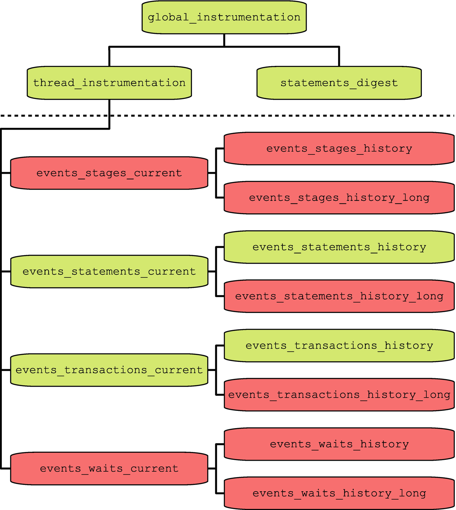
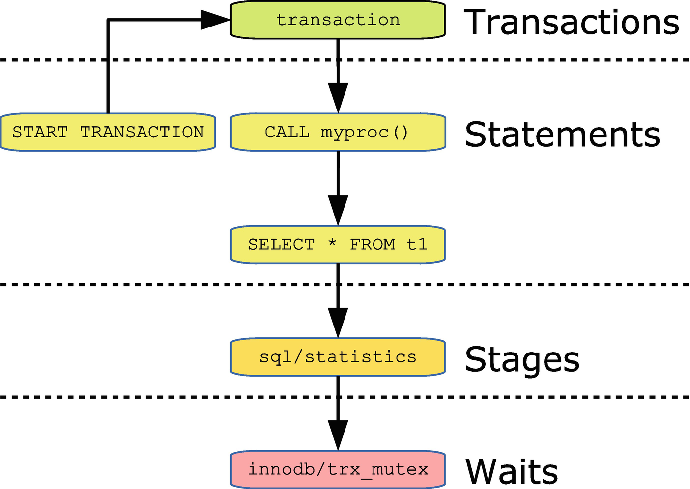

# Performance Schema

Performance Schema是与MySQL性能相关的诊断信息的主要来源。它最初是在MySQL 5.5版中引入的，然后在5.6版中对其当前结构进行了重大修改，此后在5.7和8中逐渐得到了改进。

本章介绍并概述了Performance Schema，因此，在本书剩余部分使用Performance Schema时，它的工作方式非常清晰。Performance Schema的近亲是下一章将讨论的 sys schema， Information Schema是第 7 章的主题。

本章讨论了Performance Schema特有的概念，特别关注 threads, instruments, consumers, events, digests和动态配置。 但是，首先，必须熟悉Performance Schema中使用的术语。

## 术语

在研究新学科时，可能很难的事情之一是术语，Performance Schema也不例外。由于术语之间几乎存在循环关系，因此没有明确的顺序来描述它们。相反，本节将简要概述本章中使用的最重要的术语，因此您可以了解这些术语的含义。在本章结束时，您应该更好地理解这些概念的含义以及它们之间的关系。

表5-1总结了Performance Schema中最重要的术语

| 术语                  | 描述信息                                                     |
| :-------------------- | ------------------------------------------------------------ |
| Actor                 | 用户名和主机名（帐户）的组合。                               |
| Consumer              | 收集仪器生成的数据的过程                                     |
| Digest                | 标准化查询的校验和。 摘要用于汇总类似查询的统计信息。        |
| Dynamic configuration | 可以在运行时配置性能模式，这称为动态配置。 这是通过设置表而不是通过更改系统变量来完成的。 |
| Event                 | 一个事件是消费者从仪器中收集数据的结果。 因此，事件包含度量标准以及有关何时何地收集度量标准的信息。 |
| Instrument            | 代码指向进行测量的地方。                                     |
| Object                | 表，事件，函数，过程或触发器。                               |
| Setup table           | 性能模式有几个用于动态配置的表。 这些称为设置表，表名以setup_开头。 |
| Summary table         | 具有汇总数据的表。 表名包含单词summary，名称的其余部分指示数据的类型及其分组依据。 |
| Thread                | 线程对应于连接或后台线程。 性能架构线程和操作系统线程之间存在一一对应的关系。 |

在阅读本章时，如果遇到不确定其含义的术语，请参考该表。

## 线程

线程是 Performance Schema中的基本概念。当 MySQL 中执行任何操作时，无论是处理连接还是执行后台工作，工作都是由线程完成的。MySQL 在任何给定时间都有多个线程，因为它允许 MySQL 并行执行工作。对于一个连接，就有一个线程。

------

**注意**：对 InnoDB 中群集索引和分区执行并行读取的支持引入，使一个线程的一个连接的图片变得有些混乱。但是，由于执行并行扫描的线程被视为后台线程，因此对于本讨论，您可以考虑连接单线程。

------

每个线程都有一个 ID，该 ID 是唯一标识线程的 ID，在性能架构表中存储此 ID 的列称为THREAD_ID。检查线程的主表是包含清单 5-1 的线程表，该表显示了 MySQL 8 中存在的线程类型的典型示例。线程数和确切的线程类型可用取决于在查询线程表时实例的配置和使用情况。

```
Listing 5-1. Threads in MySQL 8
mysql> SELECT THREAD_ID AS TID,
 SUBSTRING_INDEX(NAME, '/', -2) AS THREAD_NAME,
 IF(TYPE = 'BACKGROUND', '*', ") AS B,
 IFNULL(PROCESSLIST_ID, ") AS PID
 FROM performance_schema.threads;
+-----+--------------------------------------+---+-----+
| TID | THREAD_NAME                          | B | PID |
+-----+--------------------------------------+---+-----+
| 1   | sql/main                             | * |     |
| 2   | mysys/thread_timer_notifier          | * |     |
| 4   | innodb/io_ibuf_thread                | * |     |
| 5   | innodb/io_log_thread                 | * |     |
| 6   | innodb/io_read_thread                | * |     |
| 7   | innodb/io_read_thread                | * |     |
| 8   | innodb/io_read_thread                | * |     |
| 9   | innodb/io_read_thread                | * |     |
| 10  | innodb/io_write_thread               | * |     |
| 11  | innodb/io_write_thread               | * |     |
| 12  | innodb/io_write_thread               | * |     |
| 13  | innodb/io_write_thread               | * |     |
| 14  | innodb/page_flush_coordinator_thread | * |     |
| 15  | innodb/log_checkpointer_thread       | * |     |
| 16  | innodb/log_closer_thread             | * |     |
| 17  | innodb/log_flush_notifier_thread     | * |     |
| 18  | innodb/log_flusher_thread            | * |     |
| 19  | innodb/log_write_notifier_thread     | * |     |
| 20  | innodb/log_writer_thread             | * |     |
| 21  | innodb/srv_lock_timeout_thread       | * |     |
| 22  | innodb/srv_error_monitor_thread      | * |     |
| 23  | innodb/srv_monitor_thread            | * |     |
| 24  | innodb/buf_resize_thread             | * |     |
| 25  | innodb/srv_master_thread             | * |     |
| 26  | innodb/dict_stats_thread             | * |     |
| 27  | innodb/fts_optimize_thread           | * |     |
| 28  | mysqlx/worker                        |   | 9   |
| 29  | mysqlx/acceptor_network              | * |     |
| 30  | mysqlx/acceptor_network              | * |     |
| 31  | mysqlx/worker                        | * |     |
| 34  | innodb/buf_dump_thread               | * |     |
| 35  | innodb/clone_gtid_thread             | * |     |
| 36  | innodb/srv_purge_thread              | * |     |
| 37  | innodb/srv_purge_thread              | * |     |
| 38  | innodb/srv_worker_thread             | * |     |
| 39  | innodb/srv_worker_thread             | * |     |
| 40  | innodb/srv_worker_thread             | * |     |
| 41  | innodb/srv_worker_thread             | * |     |
| 42  | innodb/srv_worker_thread             | * |     |
| 43  | innodb/srv_worker_thread             | * |     |
| 44  | sql/event_scheduler                  |   | 4   |
| 45  | sql/compress_gtid_table              |   | 6   |
| 46  | sql/con_sockets                      | * |     |
| 47  | sql/one_connection                   |   | 7   |
| 48  | mysqlx/acceptor_network              | * |     |
| 49  | innodb/parallel_read_thread          | * |     |
| 50  | innodb/parallel_read_thread          | * |     |
| 51  | innodb/parallel_read_thread          | * |     |
| 52  | innodb/parallel_read_thread          | * |     |
+-----+--------------------------------------+---+-----+
49 rows in set (0.0615 sec)
```


TID 列是每个线程的 THREAD_ID，THREAD_NAME 列包括线程名称的最后两个组件（第一个组件是所有线程的线程），B 列具有背景线程的星号，PID 列具有前台线程的进程列表 ID。

------

**注意** 遗憾的是，术语线程在 MySQL 中过载，并位于用作连接同义词的某处。在本书中，连接是指用户连接，线程引用性能架构线程，即它可以是背景或前景（包括连接）线程。例外是讨论一个明显违反该约定的表时。

------

线程列表显示了线程的几个重要概念。进程列表 ID 和线程 ID 不相关。事实上，线程 ID = 28 的线程具有比线程 ID 44 （4） 的线程更高的进程列表 ID （9）。因此，它甚至不保证顺序是相同的（虽然对于非 mysqlx 线程，它一般情况下）。

对于 mysqlx/工作线程，一个是前景线程，另一个是背景线程。这反映了 MySQL 如何使用 X 协议处理连接，这与处理经典连接的方式大不相同。

也有"混合"线程不是完全的背景，也不是完全的前景线程。例如，sql/compress_gtid_table压缩表的mysql.gtid_executed线程。它是一个前景线程，但如果执行 SHOWPROCESSLIST，则它将被不包括。

------

**提示** performance_schema.threads 表非常有用，还包括 SHOW 流程列表显示的所有信息。由于与执行 SHOW 进程列表或查询查询表相比，查询此表的开销theinformation_schema。ProcessLIST 表，使用线程表以及 sys.processlist 和 sys.session 视图是获取连接列表的推荐方法。

------

有时获得连接的线程ID可能很有用。 为此，有两个功能：

- **PS_THREAD_ID()**: 获取作为参数提供的连接ID的性能架构线程ID。
- **PS_CURRENT_THREAD_ID()**: 获取当前连接的性能架构线程ID。

在MySQL 8.0.15和更早版本中，请改用sys.ps_thread_id()并提供NULL参数以获取当前连接的线程ID。 使用功能的一个例子是

```
mysql> SELECT CONNECTION_ID(),
 PS_THREAD_ID(13),
 PS_CURRENT_THREAD_ID()\G
*************************** 1. row ***************************
 CONNECTION_ID(): 13
 PS_THREAD_ID(13): 54
PS_CURRENT_THREAD_ID(): 54
1 row in set (0.0003 sec)
```

使用这些函数等效于查询 PROCESSLIST_ID.THREAD_IDcolumns表中的performance_schema和查询，以将连接 ID 与线程 ID 链接。清单 5-2 显示了使用 PS_CURRENT_THREAD_ID( )函数来查询当前连接的线程表的示例。

```
Listing 5-2. Querying the threads table for the current connection
mysql> SELECT *
 FROM performance_schema.threads
 WHERE THREAD_ID = PS_CURRENT_THREAD_ID()\G
*************************** 1. row ***************************
 THREAD_ID: 54
 NAME: thread/mysqlx/worker
 TYPE: FOREGROUND
 PROCESSLIST_ID: 13
 PROCESSLIST_USER: root
 PROCESSLIST_HOST: localhost
 PROCESSLIST_DB: performance_schema
PROCESSLIST_COMMAND: Query
 PROCESSLIST_TIME: 0
 PROCESSLIST_STATE: statistics
 PROCESSLIST_INFO: SELECT *
 FROM threads
 WHERE THREAD_ID = PS_CURRENT_THREAD_ID()
 PARENT_THREAD_ID: 1
 ROLE: NULL
 INSTRUMENTED: YES
 HISTORY: YES
 CONNECTION_TYPE: SSL/TLS
 THREAD_OS_ID: 31516
 RESOURCE_GROUP: SYS_default
1 row in set (0.0005 sec)
```


有几个列在性能调优的上下文中提供有用的信息，将在后几章中使用。值得注意的是，这里是他们的名字以PROCESSLIST_。这些等效于 SHOW ProcessLIST 返回的信息，但查询线程表对连接的影响较小。"仪器"和"历史记录"列指定是否为线程收集检测数据，以及是否为线程保留事件历史记录。您可以更新这两列以更改线程的行为，也可以根据 setup_threadstable 中的线程类型或使用 setup_actors 表定义线程的默认行为。这就引出了一个问题，什么是工具和事件。接下来的三节将讨论这一点，以及如何消耗这些仪器。

## 仪器

仪器是测量的代码点。有两种类型的仪器：可以定时的工具和不能定时的工具。时位仪器包括事件和空闲仪器（测量螺纹空闲时），而不时分仪器则计算错误和内存使用情况。

仪器按其名称分组，这些名称形成层次结构，组件以 / 分隔。对于名称有多少个组件没有规则，有些组件只有一个组件，而其他组件最多有五个组件。

仪器名称的示例是语句/sql/select，它表示直接执行的 aSELECT 语句（即，不是从存储过程中执行）。另一个仪器是语句/sp/stmt，它是在存储过程中执行的语句。

随着新功能的添加，仪器的数量不断增加，并且更多的仪器点入到现有代码中。在 MySQL 8.0.18 中，当没有安装额外的插件或组件时，有 1229 个仪器（仪器的确切数量也取决于平台）。这些仪器在表5-2中列出的顶级组件之间拆分。"定时"列显示仪器是否可以定时，Count 列显示该顶级组件的仪器总数，以及默认情况下在 8.0.18 中启用的仪器数量。

补充表5-2

| Component   | Timed | Count | Description |
| ----------- | ----- | ----- | ----------- |
| error       | No    |       |             |
| idle        | Yes   |       |             |
| memory      | No    |       |             |
| stage       | Yes   |       |             |
| statement   | Yes   |       |             |
| transaction | Yes   |       |             |
| wait        | Yes   |       |             |

命名方案使得确定仪器测量方法相对容易。您可以在"计算机"表中找到所有setup_instruments，这些仪器还允许您配置仪器是否启用和时间。对于一些仪器，还有一个简短的文档，说明仪器收集的数据。

如果要在 MySQL 启动时启用或禁用仪器，可以使用性能架构仪器选项。它的工作方式与大多数选项不同，因为您可以多次指定它来更改多个工具的设置，并且您可以使用 % 通配符来匹配模式。如何使用该选项的示例包括

```
[mysqld]
performance-schema-instrument = "stage/sql/altering table=ON"
performance-schema-instrument = "memory/%=COUNTED"
```

第一个选项允许对舞台/sql/更改表图进行计数和计时，而第二个选项允许计数所有内存仪器（这也是默认值）。

谨慎 启用所有工具（以及接下来讨论的消费者）可能看起来很诱人。但是，检测和消耗的量越大，开销越大。启用所有内容都可能导致中断（本书的作者已经看到这种情况发生）。特别是，等待/同步/% 的仪器andevents_waits_%的使用者增加了开销。根据经验，监视的粒度越细，它增加的开销也越高。在大多数情况下，MySQL 8 中的默认设置在可观察性和开销之间提供了很好的折衷。

必须使用仪器生成的数据，才能在性能架构表中使用数据。这是由消费者完成的。

## 消费者

消费者是处理仪器生成的数据并在性能架构表中提供的数据。消费者在一个thesetup_consumers中定义，除了消费者名称之外，该表还具有一列来指定是否启用了消费者。

消费者形成层次结构，如图 5-1 所示。该图分为两部分，高级使用者位于虚线上方，事件使用者位于虚线以下。默认情况下启用绿色（浅色）使用者，默认情况下禁用红色（深色）。



使用者形成层次结构意味着，只有在启用了层次结构中本身和层次结构中较高位置的所有使用者时，使用者才使用事件。因此，禁用global_instrumentation使用者会有效地禁用所有使用者。

可以使用 sys 架构函数 ps_is_consumer_enabled() 来确定是否启用了消费者及其依赖的使用者，例如：

```
mysql> SELECT sys.ps_is_consumer_enabled(
 'events_statements_history'
 ) AS IsEnabled;
+-----------+
| IsEnabled |
+-----------+
| YES       |
+-----------+
1 row in set (0.0005 sec)
```

消费者statements_digest是负责收集按语句摘要分组的数据的人，例如，这些数据通过报表表events_statements_summary_by_digest提供。对于查询性能调优，这可能是最重要的使用者。这仅取决于全球消费者。使用者thread_instrumentation确定线程是否正在收集特定于线程的仪器数据。它还控制任何事件使用者是否收集数据。

对于使用者，每个使用者有一个配置选项，选项名由性能架构使用者前缀组成，后跟使用者名，例如：

```
[mysqld]
performance-schema-consumer-events-statements-history-long = ON
```

这将启用events_statements_history_long使用者

您很少需要考虑禁用三个高级使用者中的任何一个。事件使用者更经常被具体配置，并将与事件概念讨论。

## Events

事件是使用者记录仪器收集的数据的结果，也是可用于观察 MySQL 中所发生内容的结果。有几种事件类型，并且事件是链接的，因此通常事件同时具有父级事件和一个或多个子事件。本节介绍事件的工作方式。

### 事件类型

有四种事件类型，涵盖从事务到等待的各种详细级别。事件类型还对类似类型的事件进行组，为事件收集的信息取决于其类型。例如，表示语句执行的事件包括查询和检查的行数，而事务事件具有请求的事务隔离级别等信息。图 5-2 显示了事件类型。


事件对应于不同级别的详细信息，事务级别最高（最低详细信息），等待事件级别最低（最高详细信息）：

- 事务：事件描述事务并包括尾部，如请求的事务隔离级别（但不必要地使用）、事务状态等。默认情况下，收集每个线程的当前和最后 10 个事务
- 语句：这是最常用的事件类型，用于执行的查询。它还包括有关在存储过程中执行的语句的信息。这包括检查的行数、返回的行数、是否使用索引和执行时间等信息。默认情况下，将收集每个线程的当前和最后 10 个语句。
- 阶段：这大致对应于 SHOWPROCESSLIST 报告状态。默认情况下未启用这些功能（InnoDB 进步信息部分为异常）。
- 等待：这些是低级事件，包括 I/O 和等待静音。这些都是非常具体和非常有用的低级性能调优，但他们也是最昂贵的。默认情况下，未启用任何等待事件使用者。

还有一个问题，就是要保留记录的事件多长时间。

## 事件范围

对于每种事件类型，有三个使用者指定所用事件的生存期。作用域为

- 当前：当前正在执行的事件和空闲线程的最后一个完成的事件。在某些情况下，可能同时发生多个同一级别的事件。例如，当一个存储过程在过程本身和当前在过程中执行的语句时执行。
- 历史记录：每个线程的最后十个（默认情况下）事件。当线程关闭时，将丢弃事件。
- history_long：最后 10，000 个事件（默认情况下），与生成事件的线程无关。即使在线程关闭后，事件也保留。

事件类型和范围组合在一起，形成 12 个事件使用者。有一个与每个事件使用者对应的"性能架构"表，表名与使用者名称相同，如清单 5-3 所示。

```
Listing 5-3. The correspondence between consumer and table names
mysql> SELECT TABLE_NAME
 FROM performance_schema.setup_consumers c
 INNER JOIN information_schema.TABLES t
 ON t.TABLE_NAME = c.NAME
 WHERE t.TABLE_SCHEMA = 'performance_schema'
 AND c.NAME LIKE 'events%'
 ORDER BY c.NAME;
+----------------------------------+
| TABLE_NAME                       |
+----------------------------------+
| events_stages_current            |
| events_stages_history            |
| events_stages_history_long       |
| events_statements_current        |
| events_statements_history        |
| events_statements_history_long   |
| events_transactions_current      |
| events_transactions_history      |
| events_transactions_history_long |
| events_waits_current             |
| events_waits_history             |
| events_waits_history_long        |
+----------------------------------+
12 rows in set (0.0323 sec)
```

如图 5-2 暗示了事件类型之间的箭头，类型之间存在超出它们表示的详细信息级别的关系。这种关系不是阿赫拉奇，而是由事件嵌套组成。

### 事件嵌套

通常，事件由其他事件生成，因此事件形成一个树，每个事件都有一个父事件，并且可能有许多子事件。虽然事件类型似乎形成层次结构，例如，事务是声明的元级，但关系比这更复杂，而且是双向的。以开始事务的START TRANSACTION 语句来说，该语句将成为事务的父级，而该语句又成为其他语句的父级。另一个例如调用调用存储过程的 CALL 语句，该语句将成为过程中执行的语句的父级。

嵌套可能会变得相当复杂。图 5-3 显示了包括所有四种事件类型在内的事件链的示例。



对于语句事件，将显示实际查询，而对于其他事件类型，将显示事件名称或事件名称的一部分。该链从启动事务的 STARTTRANSACTION 语句开始。在事务中，调用 myproc（） 过程，该过程使它成为 SELECT 语句的父级，该语句将执行多个阶段，包括阶段/sql/统计，而阶段又包括请求 InnoDB 中的 trx_mutex。

事件表有两列来跟踪事件之间的关系：

- **NESTING_EVENT_ID**：父事件ID
- **NESTING_EVENT_TYPE**：父事件的事件类型（TRANSACTION，STATEMENT，STAGE或WAIT）

语句事件表还有一些与嵌套语句事件相关的列：

- **OBJECT_TYPE**：父语句事件的对象类型。
- **OBJECT_SCHEMA**：父语句对象存储在的架构。
- **OBJECT_NAME**：父语句对象的名称。
- **NESTING_EVENT_LEVEL**：语句嵌套有多深。最顶层的语句具有级别 0，并且每次创建子级别时，NESTING_EVENT_LEVEL一个级别。

sys.ps_trace_thread() 过程是一个极好的示例，说明如何自动生成事件的树。第 20 章中ps_trace_thread() 示例。

### 事件属性

所有事件之间共享的事件有一些属性，而不考虑它们的类型。这些属性包括主键、事件 ID 以及事件的计时工作。

事件的当前和历史（但不是长历史）表的主要键与THREAD_IDEVENT_ID。当EVENT_ID创建更多事件时，列将递增，因此，如果要按顺序排列事件，则必须按EVENT_ID。每个线程都有自己的事件 ID 序列。每个事件表中有两个事件 idcolum：

- **EVENT_ID**：这是事件的主要事件 ID，并在事件开始时设置。
- **END_EVENT_ID**：此 ID 在事件结束时设置。这意味着您可以通过检查该列是否为 NULL 来确定END_EVENT_ID是否正在进行中。

此外，EVENT_NAME列具有负责事件的仪器的名称，语句、阶段和等待的源列具有触发仪器的源代码中的文件名和行号。

有三列与记录事件的开始、结束和迁移的事件的时间有关：

- **TIMER_START**：当 MySQL 启动时，内部计时器计数器设置为 0，并每秒递增一次。事件开始时，计数器的值将被取并分配给TIMER_START。

  但是，由于单位为 pico 秒，计数器可能会达到支持的值最大（大约 30.5 周后发生），在这种情况下，计数器将再次从 0 开始。

- **TIMER_END**：对于当前事件，这是当前时间，对于已完成的事件，它是事件完成的时间。

- **TIMER_WAIT**：这是事件的持续时间。对于仍在进行中的事件，它是自事件开始以来的时间量。

一个例外是不包含时间安排的交易。

------

**注意** 不同的事件类型使用不同的计时器，因此不能使用TIMER_STARTTIMER_END列来订购不同类型的事件。

------

计时以皮秒（10^-12 秒）为单位完成。该单元的选择是性能原因，因为它允许 MySQL 在尽可能多的情况下使用乘法（最便宜的数学运算和加法）。计时列是 64 位无符号整数，这意味着它们将在大约 30.5 周后溢出，此时值将再次从 0 开始。

虽然从计算角度使用皮秒是件好事，但对人类来说，它不太实用。因此，存在函数FORMAT_PICO_TIME（） 将秒转换为人类可读格式，例如：

```
SELECT FORMAT_PICO_TIME(111577500000);
+--------------------------------+
| FORMAT_PICO_TIME(111577500000) |
+--------------------------------+
| 111.58 ms                      |
+--------------------------------+
1 row in set (0.0004 sec)
```

该函数已添加到 MySQL 8.0.16 中。在较早的版本中，您需要使用thesys.format_time（） 函数。

## 演员和对象

性能架构允许您配置默认情况下应检测的用户帐户和架构对象。这些帐户通过表thesetup_actors通过表配置，对象通过setup_objects配置。默认情况下，将检测除 mysql、information_schema、andperformance_schema中的对象之外的所有帐户和所有架构对象。

## Digests

性能架构为基于语句摘要执行的语句生成统计信息。这是基于规范化查询的 SHA-256 哈希。具有相同摘要的语句被视为相同的查询。

规范化包括删除注释（但不是优化器提示）、将空格替换为单空格字符、将 WHERE 子句中的值替换为问号等。可以使用函数 STATEMENT_DIGEST_TEXT( ) 来访问规范化查询，例如：

```
mysql> SELECT STATEMENT_DIGEST_TEXT(
 'SELECT *
 FROM city
 WHERE ID = 130'
 ) AS DigestText\G
*************************** 1. row ***************************
DigestText: SELECT * FROM `city` WHERE `ID` = ?
1 row in set (0.0004 sec)
```

同样，您可以使用STATEMENT_DIGEST( ) 函数来获取查询的SHA-256哈希值：

```
mysql> SELECT STATEMENT_DIGEST(
 'SELECT *
 FROM city
 WHERE ID = 130'
 ) AS Digest\G

*************************** 1. row ***************************
Digest: 26b06a0b2f651e04e61751c55f84d0d721d31041ea57cef5998bc475ab9ef773
1 row in set (0.0004 sec)
```

例如，STATEMENT_DIGEST 如果要查询语句事件表（events_statements_histogram_by_digest 表或 events_statements_summary_by_digest 表）的一个events_statements_summary_by_digest，则函数非常有用，以查找有关具有相同摘要的查询的信息。

------

**注意：在升级 MySQL 时，不能保证给定查询的摘要保持不变。这意味着您不应比较不同 MySQL 版本摘要。**

------

当 MySQL 计算摘要时，查询是令牌化的，为了避免过度使用内存，此进程允许的每个连接的内存量是上限的。这意味着，如果您有大型查询（在查询文本方面），规范化查询（称为摘要文本）将被截断。您可以使用 max_digest_length 变量（默认值为 1024，需要重新启动 MySQL）配置在规范化期间允许连接用于令牌的内存。如果您有大型查询，则可能需要增加此避免查询之间的冲突，这些冲突时间超过max_digest_length字节。如果增加max_digest_length您可能还希望增加"performance_schema_max_digest_length选项，该选项指定存储在性能架构中的摘要文本的最大长度。但是，请注意，因为它会增加性能信息中存储的所有摘要文本值的大小，并且由于性能架构表存储在内存中，因此会导致内存使用量显著增加。作者看到几个支持票证，其中MySQL未能启动，因为摘要长度设置太高，所以MySQL用完了内存。

注意 不要盲目增加摘要长度选项，因为您可能会耗尽内存。

## Table Types

您已经遇到性能架构中提供一些表。表 5-3 总结了截至 MySQL 8.0.18 的可用表类型。

最常用的表是摘要表，因为它们提供了对数据的轻松访问，这些数据本身可以用作报告，类似于在sys模式视图的下一章中将看到的内容。

## Dynamic Configuration

除了可以使用SETPERSIST_ONLY或在配置文件中设置的传统MySQL配置选项外，性能模式还通过设置表提供了自己独特的动态配置。 本节说明动态配置的工作方式。

表5-4列出了MySQL 8中可用的设置表。对于允许插入和删除的表，可以更改所有列，但是仅将非关键列列出为可忘记列。

对于带有“历史记录”列的表，只有在还启用了仪器的情况下才能记录历史记录。 以与TIMED列相同的方式，仅在启用仪器或对象时才相关。 对于setup_instruments，请注意，并非所有仪器都支持计时，在这种情况下，TIMED列始终为NULL。

setup_actors和setup_objects表在设置表中是特殊的，因为您可以为其插入和删除行。 这包括使用TRUNCATE TABLE语句删除所有行。 由于表存储在内存中，因此您不能随意插入任意多的行。 相反，最大行数由performance_schema_setup_actors_size和performance_schema_setup_objects_size配置选项定义。 这两个选项默认情况下都是自动调整大小的。 它需要重新启动MySQL才能更改表大小才能生效。

您使用常规的UPDATE语句来操纵配置。 对于setup_actors和setup_objects表，还可以使用INSERT，DELETE和TRUNCATETABLE。 启用events_statements_history_long使用者的示例是

```
mysql> UPDATE performance_schema.setup_consumers
 SET ENABLED = 'YES'
 WHERE NAME = 'events_statements_history_long';
Query OK, 1 row affected (0.2674 sec)

Rows matched: 1 Changed: 1 Warnings: 0
```


重新启动MySQL时，此配置不是永久性的，因此，如果在没有配置选项的情况下要更改这些表的配置，请将所需的SQL语句添加到初始化文件中，并通过init_file选项执行它。

以上是对性能模式的介绍，但是在本书的其余部分中，您将看到许多使用表的示例。

## 总结

本章介绍了性能模式的最重要概念。 MySQL是一个多线程进程，性能模式包含有关所有线程的信息，包括前台线程（连接）和后台线程。

这些工具与源代码中的已检测代码点相对应，从而确定要收集哪些数据。启用仪器后，除存储器和错误仪器外，还可以选择对其计时。

使用者使用仪器收集的数据并对其进行处理，并通过Performance Schema表使其可用。十二个使用者表示四种事件类型，每种类型具有三个范围。

四种事件类型是事务，语句，阶段和等待，它们涵盖了不同的详细程度。这三个事件作用域是当前或最后完成的事件的当前作用域，每个仍然存在的线程的十个最后事件的历史记录以及最后10,000个事件，而与生成它们的线程无关。事件可以触发其他事件，因此它们形成一棵树。

一个重要的概念也是摘要，它允许MySQL通过归一化的查询聚合数据分组。当您要寻找查询调整的候选者时，此功能将特别有用。

最后，总结了性能模式中的各种类型的表。最常用的表组是摘要表，它们本质上是报告，可以轻松地\从“性能模式”中访问汇总数据。基于性能模式（在某些情况下是汇总表）的报告的另一个示例是sys模式中可用的信息，这是下一章的主题。