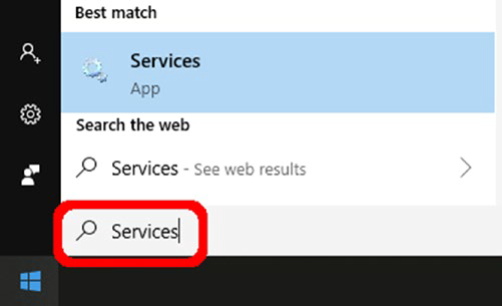
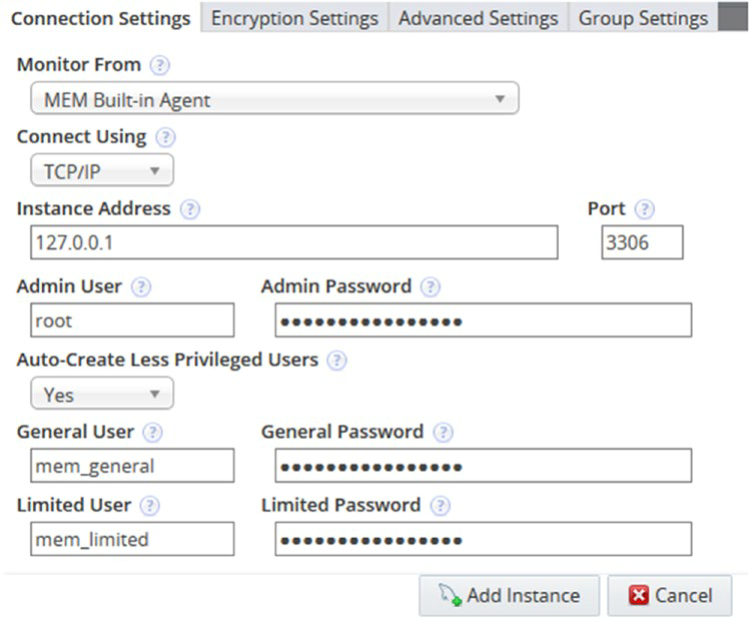
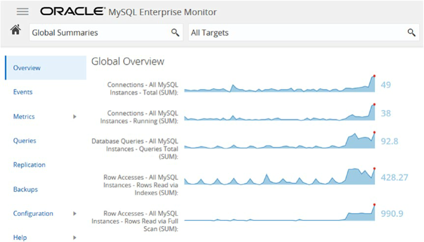
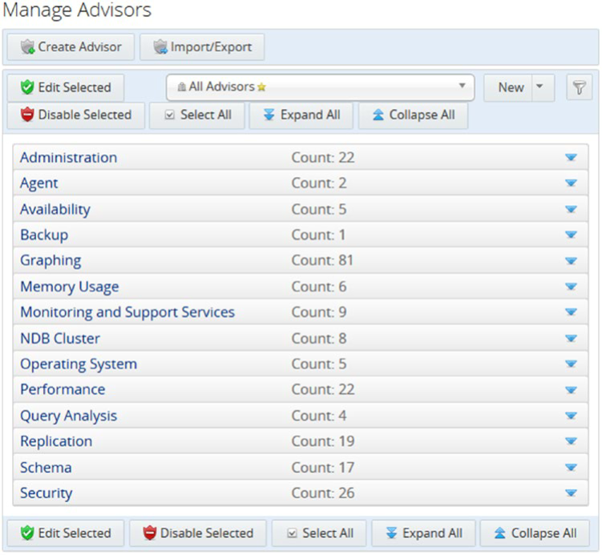
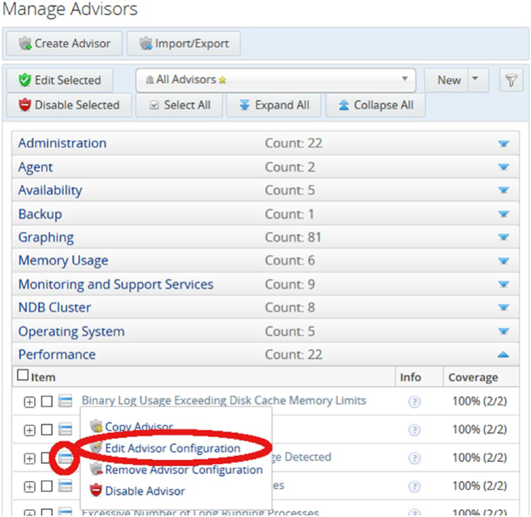
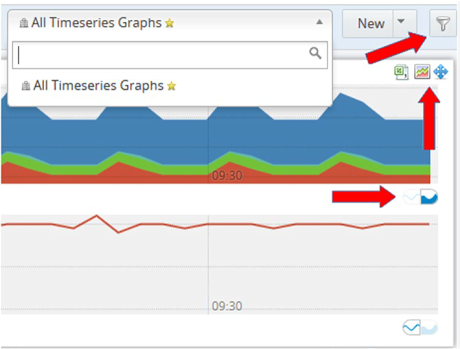
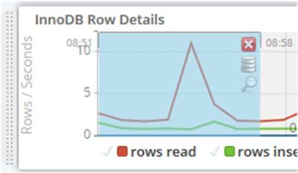
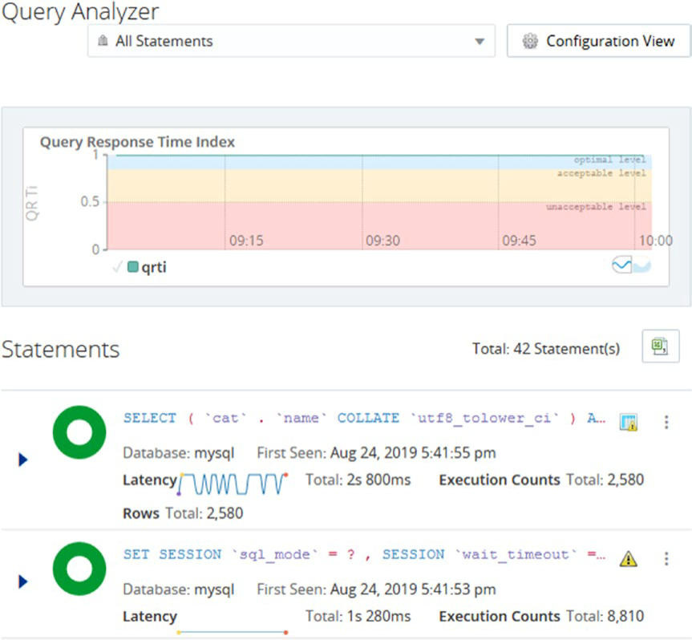

# MySQL企业监控器

监视是性能调整的基石之一，无论您是在系统还是查询级别查看性能。本章将介绍 MySQL、MySQL 企业监视器（也称为MEM）可用的监视解决方案之一。

本章首先概述MySQL企业监视器的体系结构和原则。然后有一个部分与安装说明，如果你想尝试 MySQL 企业监视器，然后讨论启动和停止服务管理器以及如何将 MySQL 实例添加到受监视的实例列表中。最后，还有用户界面的游览。

本书的其余部分使用 MySQL 企业监视器的图形和报告来分析监视工具的使用，但您也可以使用其他监视解决方案。如果您对 MySQL 企业监视器不感兴趣，可以跳过本章。

## Overview

MySQL 企业监视器是 Oracle 的监控解决方案，专用于 MySQL。它可作为 MySQL 服务器的配套提供给客户，由 MySQL 开发团队开发。

**注意 MySQL 企业监视器要求 MySQL 企业版或 MySQLCluster CGE（运营商级版）订阅在 30 天试用期之后使用（另请参阅下一节中的下载说明）。您可以在一个数据库查看MySQLwww.mysql.com/products/enterprise/。**

MySQL 企业监视器由组件组成，每个组件都在其整个监控解决方案中发挥作用。在版本 8 中，有两个主要组件：

- 服务管理器：此组件存储收集的指标，并提供前端界面来查看数据和管理配置。服务管理器由两部分组成，即 aTomcat 服务器，它是服务管理器的应用程序端，而存储库是存储数据的 MySQL 数据库。
- 代理：MySQL 企业监视器使用代理连接到受监视的 MySQL 实例。服务管理器包括一个内置代理，默认情况下，该代理监视存储库。代理可以监视本地操作系统以及本地和远程MySQL实例。

注意：本书遵循 MySQL 企业监视器 （https://dev.mysql.com/doc/mysql-monitor/en/） https://dev.mysql.com/doc/mysql-monitor/en/编写服务管理器和代理的约定。

由于代理只能监视它运行的操作系统（如 CPU 和内存使用情况、磁盘容量等指标），因此最好在监视 MySQL 实例的每个主机上安装 Agent。这将允许您将主机指标与 MySQL 活动关联。例如，如果您无法在本地安装 Agent，例如，如果您使用的云解决方案不允许您访问操作系统，可以使用安装在另一个主机上的代理来监视 MySQL 指标。在这种情况下，一个选项是使用服务管理器中的内置代理。图 10-1 显示了一个具有三个主机的设置示例，其中一个用于 ServiceManager，两个主机安装了受监视的 MySQL 实例。

顶部的主机是安装 MySQL 企业监视器服务管理器的主机。它由前端（此处用带图表的网页描述）以及内置的代理和存储库组成。内置代理监视存储库，并监视其他 MySQL 实例（图中未显示），如果您无法访问主机（某些云产品的情况），或者如果您正在测试并想要监视与安装服务管理器相同的主机上的第二个 MySQL 实例，则这些实例非常有用。

主机 1 和主机 2 是安装了 MySQL 服务器的两台主机。每个主机上都安装了 MySQL 企业监视器代理。代理查询 MySQL 实例的指标，然后将指标发送到服务管理器，服务管理器将指标存储到数据中。服务管理器还可以向代理发送请求，例如，运行临时报告或更改代理收集指标的频率。

对于服务管理器和代理以及 usesa 客户安装程序，安装过程类似。下一节介绍如何安装服务管理器。如果要尝试，该练习将留给读者安装 Agent。

## Installation

MySQL 企业监视器的安装非常简单，尽管与其他 MySQL 产品不同。如果您使用 MySQL 的社区版本，则下载软件与可能习惯的软件不同，并且安装始终通过专用安装程序完成。本节将指导您完成 MySQL 企业监视器的下载、安装过程和设置。

### Download

安装的第一步是下载 MySQL 企业监视器。有两个地方可以下载 MySQL 企业监视器。现有 MySQL 客户可以从"我的 Oracle 支持 （MOS）"中的"修补程序和更新"选项卡下载它。这是客户推荐的位置，因为修补程序和更新会更新得更频繁，并且包括自 2011 年以来的所有版本。另一个位置是位于此位置的 Oracle 软件交付云https://edelivery.oracle.com/它还允许注册用户下载 30 天的试用版。这些说明涵盖 Oracle 软件交付云。

**注意 有一段时间未使用的新帐户和帐户可能需要经过导出验证，可能需要几天时间。**

如果没有登录名，则需要使用"新用户"创建新用户？注册这里图标。登录后，您将进入搜索页面。图 10-3 显示了搜索表单的一部分。

选择文本字段左侧的拖放框中的"释放"。如果您也有兴趣使用其他产品，请将它留在包含软件包的所有类别的默认值上。在文本字段中，输入 MySQL 企业监视器，然后单击显示的搜索列表中的 MySQL 企业监视器，或单击文本字段右侧的"搜索"按钮（图中既不显示列表也不显示按钮）。然后单击 MySQL 企业监视器结果旁边的"添加到购物车"。

将产品添加到购物车后，可以单击页面右上右侧附近的结帐链接（图中未显示）。下一个屏幕显示在图10-4中，并允许您选择要下载的平台。

选择您感兴趣的平台。如果您计划在一个平台上使用 Agent 来监视另一个平台上安装的实例时，将 ServiceManager 放在一个平台上，则需要选择这两个平台。当您决定要下载哪些平台时，请单击"继续"。

下一步是接受许可协议。接受前请仔细阅读。Oracle 试用许可协议位于文档末尾。接受条款和条件后，单击"继续"。

**注意：您可能会被要求完成有关 Oracle 软件交付云可用性的调查，作为步骤之一。**

最后一步是选择要下载的 MySQL 企业监视器的哪些部分。如图 10-5 所示。

每个平台有两个包，服务管理器有一个包，代理有一个包。可选（推荐），您可以单击屏幕截图中心底部的"查看摘要详细信息"链接，以显示每个文件的 SHA-1 和 SHA-256 校验和。您可以使用这些来验证下载成功完成。

您可以通过两种方式下载文件。如果单击文件名，则一个下载文件。或者，检查所需的文件，然后单击下载按钮，使用下载管理器开始下载。如果您没有安装下载管理器，将在下载开始前完成安装。

**提示 Oracle 软件交付云使用通用文件名，如 V982880-01.zip。将文件重命名为包含有关您下载的产品、平台和版本的信息的名称非常有用。**

### Installation Process

MySQL 企业监视器使用自己的安装程序，该安装程序在所有平台上都工作相同。有人支持通过图形用户界面或文本模式使用向导模式执行安装，或者您可以在命令行上提供所有参数并使用无人值守模式。

下载的文件的名称取决于您下载的平台和 MySQL 企业监视器的版本。例如，Microsoft Windows 的服务管理器版本 8.0.17 被命名为 V982881-01.zip。其他文件的名称类似。如果解压缩 ZIP 文件，将找到多个文件：

```
PS> ls | select Length,Name
 Length Name
 ------ ----
 6367299 monitor.a4.pdf
 6375459 monitor.pdf
 5275639 mysql-monitor-html.tar.gz
 5300438 mysql-monitor-html.zip
281846252 mysqlmonitor-8.0.17.1195-windows64-installer.exe
281866739 mysqlmonitor-8.0.17.1195-windows64-update-installer.exe
 975 README_en.txt
 975 READ_ME_ja.txt
```

确切的文件名和大小取决于平台和 MySQL 企业监视器版本。请注意，有两个可执行文件，在此例中为 mysqlmonitor8.0.17.1195-windows64-安装程序.exe 和 mysqlmonitor-8.0.17.1195-windows64-更新安装程序.exe。前者用于从刮刮安装 MySQL 企业监视器，而另一个（有时也称为更新安装程序）用于执行现有安装的升级。PDF 和 HTML 文件是手册，但您通常最好在 https://dev.mysql.com/doc/mysqlmonitor/en/ 使用在线手册，因为定期更新。

**提示 如果要使用基于文本的向导或无人参与模式，请使用 --help 参数调用安装器以获取受支持的参数列表。**

此讨论将继续使用图形用户界面进行安装。通过执行安装程序以没有任何参数来启动安装。第一步是选择语言（提供英语、日语和简体中文）。然后，您被告知，您需要确保将安装过程中输入的用户名和密码保留在安全位置。

通过欢迎屏幕后，配置将按正确的方式开始，通过指定安装位置。在 Microsoft Windows 上，默认位置是 C：\Program FilesMySQL[企业]监视器，在 Linux 上，当作为根用户安装时，默认位置是 /opt/mysql/企业/监视器，当安装为非特权用户时，它是相对于主目录的 mysql/企业/监视器。

图 10-6 中显示的下一个屏幕要求您选择要监视的系统大小。

系统大小确定服务管理器内存配置等的默认设置。安装完成后，您可以手动调整内存设置，但选择正确的系统大小意味着您最初不必担心这些设置。除非只想尝试 MySQL 企业监视器与几个实例，选择中型或大型系统。

接下来，您需要指定要使用的端口号。MySQL 企业监视器使用前端的Tomcat服务器，端口18080作为默认未加密端口，18443作为默认SSL端口。您将始终使用 SSL 端口。（出于遗留原因，非 SSL 端口无法用于前端。

此时，如果您使用根帐户在 Linux 上安装，系统会询问要在哪个用户帐户下运行 Tomcat 进程（MySQL 服务器存储进程将使用 mysql 用户）。默认值为 mysqlmem。如果您使用非根帐户在 Linux 上安装，系统将通知您安装者无法设置自动启动。

服务管理器使用 MySQL 实例来存储数据，包括收集的计量。在使用与安装程序捆绑的 MySQL 实例和使用现有的 MySQL 实例之间，您有一个选择（参见图 10-7）。

除非您有充分的理由选择其他方法，否则建议使用捆绑的 MySQL 数据库。这不仅允许安装程序使用已知与服务管理器很好地工作的基本配置，还简化了升级。

注意 不要想使用要监视的 MySQL 实例作为服务管理器的存储库。MySQL 企业监视器确实会导致大量数据库活动，如果您使用生产数据库，如果该数据库应该监视关闭，则监视将停止工作。

现在，您可以选择 ServiceManager 使用到 MySQL 实例的连接的用户名和密码以及端口号和架构名称。如图 10-8 所示。

## 启动和停止服务管理器

服务管理器设计为作为服务启动和停止。在 Microsoft Windows 上，当您使用 Linux上的根帐户安装服务管理器时，安装程序将始终为你安装服务。如果在 Linux 上将其安装为非根用户，可以手动执行服务脚本以启动和停止服务管理器。

### 微软视窗

在上，安装程序始终要求管理员权限运行，这意味着它也可以将服务管理器进程安装为服务。默认情况下，服务设置为在启动和关闭计算机时自动启动和停止。

您可以通过打开服务应用程序来编辑服务的设置。在 Windows 10 上，最简单的方法是使用键盘上的 Windows 键（或者通过单击左下角的 Windows 图标打开"开始"菜单服务，如图。



与屏幕截图相比，搜索结果可能看起来会有所不同。单击""下的"服务这将打开您可以控制服务的应用程序。在服务应用程序中，您可以通过启动、停止、暂停或重新启动服务来控制服务。存储库服务名为服务名为如图。


单击服务时，获取服务列表左侧窗格中的基本控件操作。您还可以右键单击服务以获取操作以及编辑服务属性的选项。这些包括是否自动启动和停止服务。

### Linux

在上启动和停止 MySQL 企业监视器的方式取决于您是否使用根执行了安装。如果使用根用户使用服务启动和停止进程（没有对的本机支持）;否则，mysqlmonitorctl.sh底部的脚本。无论哪种方式，都可以添加或参数，以更改其中一个进程的状态。

清单显示了如何使用启动、重新启动和停止 MySQL 企业监视器。

```
Listing 10-1. Changing the status of the services with the service command
shell$ sudo service mysql-monitor-server start
Starting mysql service [ OK ]
2019-08-24T06:45:43.062790Z mysqld_safe Logging to '/opt/mysql/enterprise/
monitor/mysql/data/ol7.err'.
2019-08-24T06:45:43.168359Z mysqld_safe Starting mysqld daemon with
databases from /opt/mysql/enterprise/monitor/mysql/data
Starting tomcat service [ OK ]
shell$ sudo service mysql-monitor-server restart
Stopping tomcat service . [ OK ]
Stopping mysql service 2019-08-24T06:47:57.907854Z mysqld_safe mysqld from
pid file /opt/mysql/enterprise/monitor/mysql/runtime/mysqld.pid ended
. [ OK ]
Starting mysql service [ OK ]
2019-08-24T06:48:04.441201Z mysqld_safe Logging to '/opt/mysql/enterprise/
monitor/mysql/data/ol7.err'.
2019-08-24T06:48:04.544643Z mysqld_safe Starting mysqld daemon with
databases from /opt/mysql/enterprise/monitor/mysql/data
Starting tomcat service [ OK ]
shell$ sudo service mysql-monitor-server stop tomcat
Stopping tomcat service . [ OK ]
shell$ sudo service mysql-monitor-server stop mysql
Stopping mysql service 2019-08-24T06:48:54.707288Z mysqld_safe mysqld from
pid file /opt/mysql/enterprise/monitor/mysql/runtime/mysqld.pid ended
. [ OK ]
```


首先，启动两个服务，然后重新启动，最后一个停止服务。无需一个多个停止服务，但如果需要对存储库进行维护，则它非常有用。

清单显示了使用。

```
Listing 10-2. Changing the status of the services with mysqlmonitorctl.sh
shell $ ./mysqlmonitorctl.sh start
Starting mysql service [ OK ]
2019-08-24T06:52:34.245379Z mysqld_safe Logging to '/home/myuser/mysql/
enterprise/monitor/mysql/data/ol7.err'.
2019-08-24T06:52:34.326811Z mysqld_safe Starting mysqld daemon with
databases from /home/myuser/mysql/enterprise/monitor/mysql/data
Starting tomcat service [ OK ]
shell$ ./mysqlmonitorctl.sh restart
Stopping tomcat service . [ OK ]
Stopping mysql service 2019-08-24T06:53:08.292547Z mysqld_safe mysqld from
pid file /home/myuser/mysql/enterprise/monitor/mysql/runtime/mysqld.pid
ended
. [ OK ]
Starting mysql service [ OK ]
2019-08-24T06:53:15.310640Z mysqld_safe Logging to '/home/myuser/mysql/
enterprise/monitor/mysql/data/ol7.err'.
2019-08-24T06:53:15.397898Z mysqld_safe Starting mysqld daemon with
databases from /home/myuser/mysql/enterprise/monitor/mysql/data
Starting tomcat service [ OK ]
shell$ ./mysqlmonitorctl.sh stop tomcat
Stopping tomcat service . [ OK ]
shell$ ./mysqlmonitorctl.sh stop mysql
Stopping mysql service 2019-08-24T06:54:39.592847Z mysqld_safe mysqld from
pid file /home/myuser/mysql/enterprise/monitor/mysql/runtime/mysqld.pid
ended
. [ OK ]
```


步骤与 Service 命令的上一个。实际上，服务命令调用的脚本与 mysqlmonitorctl.sh 脚本，只是其中的路径和用户名取决于用于安装服务管理器和安装路径的操作用户。

## 添加 MySQL 实例

如果您只想使用 MySQL 企业监视器，则无需执行任何比现在更多的工作。服务管理器的内置代理将自动监视存储库实例，因此当您第一次登录到用户界面时，已经有可用的监视数据。如果您安装了代理，代理还将注册它自动监视的实例。本节将讨论的最后一个选项是从用户界面添加实例。

如果要添加监视的 MySQL 实例与服务管理器或现有代理安装在同一主机，则会自动检测到该实例，并且页面右上角的带有海豚和问号的图标将突出显示，如图。


请注意，它如何表示海豚的右侧有一个（黄色）圆圈中的问号。这是已找到但未受监视的 MySQL 实例数。将鼠标悬停在图标上时，将显示一个实例数。如果您单击海豚或数字，它将带您到 MySQL 实例配置屏幕，您也可以通过左侧窗格中的菜单访问该屏幕。

------

**注意**: 通过用户界面添加的实例将受到现有代理（如果您自己未安装任何代理的内置代理）的监视。 只有安装了代理的那些系统才会监视其操作系统。

------

实例配置屏幕都包括添加新实例的选项，由MySQL Enterprise Monitor找到的不受监视的实例的列表以及受监视的实例的列表。 图[10 15]（＃Fig15）显示了与开始监视新实例和不受监视实例有关的页面部分。


您可以使用页面顶部的"添加实例"或 来添加对任何 MySQL 实例的监视。如果要监视的实例列在"未监视的 MySQL 实例"列表中，您也可以选择该实例并单击"监视器实例该按钮将带您到与，其区别在于已知连接设置已预填充。该窗体有几个选项卡，其中""选项卡如图。



关于连接设置，需要注意的主要操作是，您可以选择让 MySQL 企业监视器自动创建具有比用于设置监视的管理员用户更少的权限的用户。建议允许创建这些用户，因为它允许代理使用具有尽可能少权限的用户执行其任务。

如果您有加密要求，您可以在"加密设置"选项卡中要求。很少需要"高级设置"选项卡。如果要设置多个实例的监视，则可能需要在"组设置"选项卡中为实例指定一个组。这些设置也可以在添加实例后更改。

添加实例需要一点时间。准备就绪后，您可以开始探索用户界面的其余部分。

## 图形用户界面

服务管理器的是您将花费大部分时间使用 MySQL 企业监视器的地方。如您已经看到，它可用于添加新实例。本节将进一步深入探讨用户界面，并讨论一般导航、顾问、时间序列图和查询分析器。

### 一般导航

MySQL 企业用户界面将功能划分为逻辑组，支持按组、主机、代理或实例进行筛选。本节将简要介绍界面，目的是在本书的稍后部分提及图形或报表时，如果您想要更仔细地探索图形或报表，可以在界面中找到它们。

图显示了用户界面中页面的左上角部分。这是选择要访问的功能以及要显示数据的目标。



要素的导航位于左侧窗格中，筛选器应用于页面顶部的两个搜索字段中。屏幕截图中标有"的搜索字段允许您选择一组实例。可以手动创建组，也可以为彼此之间复制的实例自动创建组。一个包含所有实例的特殊组。右侧搜索字段允许您限制组中包含的实例、代理或主机。

包括仪表板、图形、报表等。可用功能列表取决于您应用的筛选器。菜单项是

- 这是一个高级仪表板。
- 此选项仅在选择复制组时可用。它带您到显示组拓扑的图表，该图的状态为每个实例的复制。
- 返回实例的监视事件的报告。当满足顾问（更不久）设定的某些条件时，将引发事件。事件的严重程度从通知到紧急情况不等。
- 这将带您访问显示代理收集的指标的报表。无论筛选器如何，时间序列图始终可用（但哪些图表取决于筛选器）。对于单个实例，还有用于表统计信息、用户统计信息、内存使用情况、数据库文件 I/O、InnoDB 缓冲池、进程和锁定等待的报告。其中一些报告将在后几章中使用。
- 这是 MySQL 查询分析器，它允许您调查在实例上执行哪些查询。时间序列图链接到查询分析器，因此可以从检查图表到查看在所调查期间执行哪些查询。
- 复制仪表板和其他与复制相关的报表。
- 有关由 MySQL 企业备份 （MEB） 创建的备份的信息。
- 配置 MySQL 企业监视器的各个方面，包括实例和顾问。
- 文档包括您已查看的"更新"和下载可用于解决问题的诊断报告。如果您有 MySQL 支持合同，并且需要在支持票证中提供诊断，因此主要使用诊断报告。

一个需要进一步解释的术语是顾问。

### 顾问

是 MySQL 企业监视器用于定义收集数据的频率、哪些条件触发事件以及事件的严重性的规则的名称。这是一个重要的概念，您应该花一些时间来理解和配置。

获得有用的监视解决方案最重要的步骤之一是确保您及时获得正确的事件（警报），但避免不必要的事件。这包括确保将每个警报设置为适当的严重性。你一开始可能会认为事件越好越好，这样你就知道发生的一切。但是，这不是您最好使用监控系统的一种方式。如果您检查事件时有许多误报，或者在凌晨 3：00 被不必要地唤醒，因为问题很容易等到早上，那么您就开始忽略事件，这肯定是迟早会错过重要事件的秘诀。简言之，您与顾问的工作应该持续不断，以不断改进，以在"正确"的时间触发"正确的"事件。

可以在左侧窗格中的"项下配置顾问。顾问按组组织，如图。



每个组类似类型的顾问，例如，有 22 个顾问的绩效组，例如锁定进程数量过多和索引未得到有效使用。

默认情况下，所有顾问都启用了将严重性级别设置为在许多情况下工作良好的值的阈值。但是，由于没有两个系统是相同的，因此您需要通过展开组并单击顾问名称左侧的菜单图标来微调设置，如图。



您还可以使用顾问左侧的 + 图标展开顾问，该图标允许您编辑特定实例组或单个实例的顾问。？"信息列中的图标提供了其他信息，如评估的表达式或顾问的数据源。图中未显示其他可用信息。

### 时间序列图

是显示一段时间指标的图表。这是所有监控解决方案的标准功能。您可以筛选要显示的图形，并更改绘图的时间范围以及绘图样式。

图显示了时间序列图页面的一部分，该页面侧重于访问筛选和绘图样式的控件。



图表上方是选择要显示的图形和图形的时间范围的选项。屏幕截图中左侧的搜索字段允许您在保存的时间序列组之间进行选择。默认情况下，有一个名为组（名称建议）包括适合实例筛选的所有时间序列图形。

通过使用屏幕截图右上角图标，可以访问时间序列图形的选项。这将打开一个框架，允许您选择要显示的图形和覆盖的时间范围。

每个图形下方的两个小按钮允许您在使用线条和堆叠绘图模式之间切换。屏幕截图显示了最顶层图形中的堆叠模式和下图中的线模式的示例。行模式为默认模式。您还可以使用字段左侧的滑块（不包括在屏幕截图中）更改图形的高度，以在保存的图形组之间进行选择。

当您将鼠标悬停在图形上方时，图形上方的三个图标将变为可见，并允许您以 CSV 格式导出图形的数据，以 PNG 图像形式打开图形，或移动图形，以便您按最适合您的方式重新排列图形。在这种情况下，有两个图形分组在一起，这些控件适用于这两个图形。

更改图形的时间范围的另一种方法是突出显示感兴趣的图形部分并放大该部分。这还允许您转到查询以检查在此期间执行的查询。图显示了在图形中突出显示时间范围的示例。



请注意，在突出显示区域的右上角，有三个图标对所选内容的处理。框中的 X 将放弃所选内容，数据库圆柱体打开查询分析器中所选时间帧的图形，放大镜缩放时间序列图形以使用所选时间范围。

### 查询分析器

查询是使 MySQL 企业监视器脱颖而出的其他监视解决方案的功能。它允许您查看在给定期间中对实例执行哪些查询，这在调查性能问题时非常宝贵。

查询分析器页面分为三个方面。在顶部可以访问筛选选项，然后可选地有一个或多个图形，页面的其余部分是语句列表。图显示了这方面的示例。



在顶部的拖放框语句"显示屏幕截图中允许您选择要显示语句的类型。默认值是包括所有语句。右侧是"配置按钮，该按钮将带您到页面，您可以在其中配置如何配置查询分析器页面。这包括要覆盖的时间范围、要显示的图形、筛选选项以及每个语句要包含哪些信息。

默认情况下，查询分析器包括查询响应时间索引 （QRTi） 的图形。当查询分析器用于查找优化候选项时，查询响应时间索引的定义以及如何使用它将在章中介绍。

MySQL 企业监视器之旅结束。我们鼓励您自己进一步探索用户界面。

## 总结

本章简要介绍了 MySQL 企业监视器，旨在允许您安装和监视 MySQL 实例。首先，讨论了体系结构和原则的概述。MySQL 企业监视器由一个服务管理器组成，其中聚合了数据，您可以通过用户界面访问监控系统。主机和实例的监视由代理完成。服务管理器中有一个内置代理，您可以在 MySQL 实例的主机上安装其他代理。

概述后是下载和安装说明。由于 MySQL 企业监视器是仅商用产品，因此您可以从 Oracle 软件交付云或我的 Oracle 支持下载它。安装使用安装程序完成。本章展示了如何使用服务管理器安装程序中的图形用户界面。

启动和停止服务管理器基于将服务管理器安装为服务。在 Linux 和 Unix 上，还可以将服务管理器安装为非根用户，在这种情况下，调用服务命令使用的相同脚本。

有两种主要方法可以添加要监视的实例。如果安装代理来监视实例，则代理将注册实例。您还可以从服务管理器的用户界面添加实例。

最后，快速浏览了服务管理器的图形用户界面。重点是筛选您看到的数据的实例以及要素列表、时间序列图和查询分析器。其中一些功能将用于演示本书剩余部分的监视。

下一章将介绍后几章中使用的另一个有用工具：MySQL Workbench。