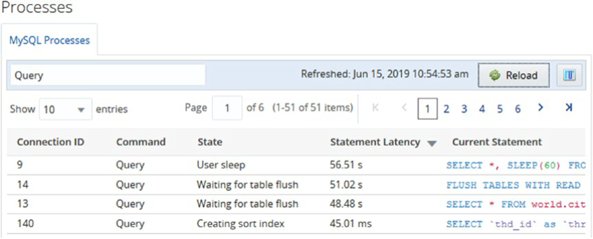
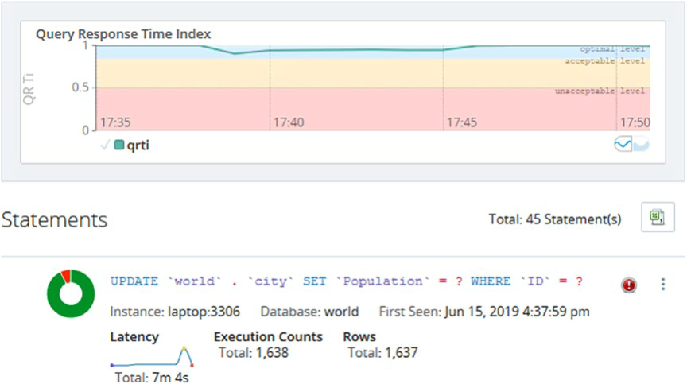
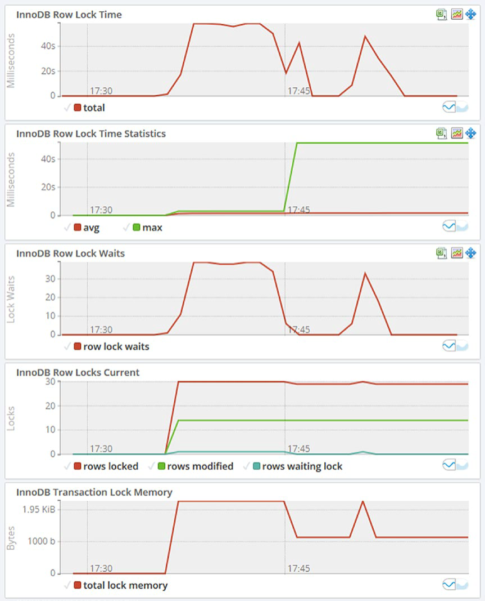
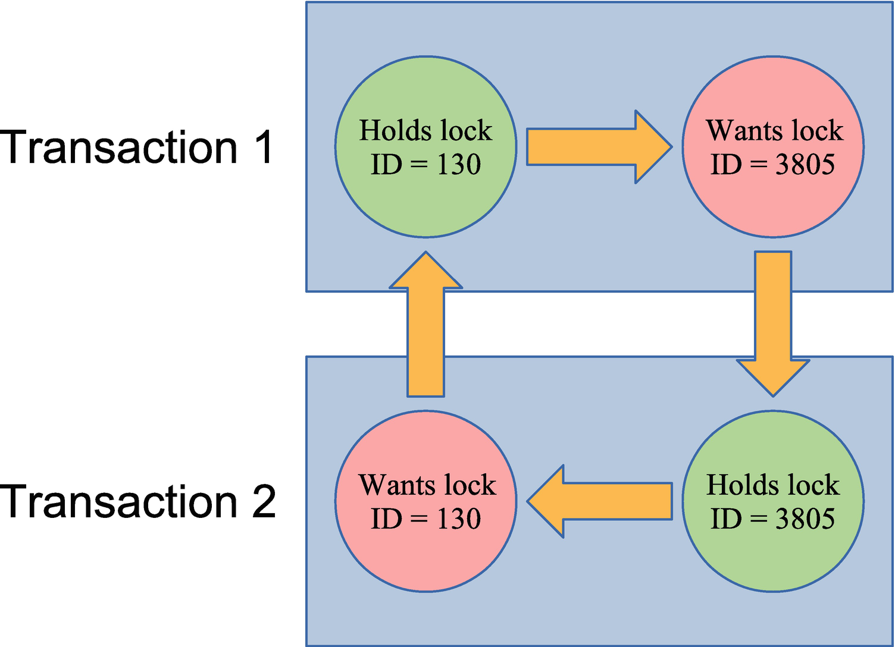

# 诊断锁争用

在第中，您被介绍给 MySQL 中的锁的世界。如果您尚未阅读第章，则强烈建议您现在阅读，因为本章密切相关。你甚至可能想要刷新你的记忆，如果这是一段时间，因为你可以读它。锁定问题是性能问题的常见原因之一，其影响可能很严重。在最坏的情况下，查询可能会失败，连接会堆积起来，因此无法建立新的连接。因此，知道如何调查锁问题和修复问题就很重要了。

本章将讨论四锁问题：

- 冲洗锁
- 元数据和架构锁
- 记录级锁，包括间隙锁
- 死锁

每个类别的锁使用不同的技术来确定锁争用的原因。阅读示例时，您应该记住，类似的技术可用于调查与示例不 100% 匹配的锁问题。

对于每个锁类别，讨论被分成六：

- 这描述了您如何识别您遇到此类锁问题。
- 您遇到此类锁问题的根本原因。这与第18章中对锁的一般性。
- 这包括设置锁定问题的步骤（如果您想要自己尝试）。由于锁争用需要多个连接，因此提示（）用于判断应使用哪个连接使用哪个语句。如果您想了解调查，但信息不会超过真实案例，可以跳过此部分，在完成调查后返回并查看。
- 调查的细节这借鉴了第18章的"监控。
- 如何解决即时锁定问题，从而最大限度地减少由它造成的中断。
- 讨论如何减少遇到问题的机会。这与第18章"减少锁定问题"。

足够的谈话， 将讨论的第一个锁类别是刷新锁。

## 冲洗锁

MySQL 中遇到的常见锁问题之一是刷新。当此问题发生时，用户通常会抱怨查询未返回，监视可能显示查询堆积，最终 MySQL 将耗尽连接。冲洗锁周围的问题有时也是最难调查的锁问题之一。

### 症状

刷新问题的主要症状是数据库进入磨削停止状态，其中使用部分或所有表的所有新查询最终都在等待刷新锁定。要查找的告密标志包括以下内容：

- 新查询的查询状态为"等待表刷新"。这可能发生在所有新查询或仅对于访问特定表的查询。
- 创建的连接会更多。
- 最终，由于 MySQL 连接不连接，新连接将失败。新连接收到的错误1040 （HY000）： 使用经典 MySQL 协议（默认端口 3306）或使用 X 协议时"MySQL 错误 5011：无法打开会话"时使用 X 协议（默认端口 33060）。
- 至少有一个查询运行的晚于最老的刷新锁请求。
- 流程列表中可能有语句，但情况并非总是如此。
- 当语句等待错误：。由于该值为 365 天，因此只有在超时减少时才可能发生此情况。
- 如果使用默认架构命令行客户端连接，则在到达提示符之前，连接可能似乎挂起。如果打开连接更改默认架构，则会发生同样的变化。

如果您看到这些，是时候了解导致锁定问题的原因了。

### 原因

当连接请求时，它要求关闭对表的所有引用，这意味着不能使用该表的活动查询。因此，当刷新请求到达时，它必须等待使用要刷新的表完成的所有查询。请注意，除非显式指定要刷新的表，否则必须完成只是查询而不是整个事务。显然，由于具有读取锁的 FLUSH 都刷新的情况是最严重的，因为这意味着所有活动查询都必须在 flush 语句继续之前完成。

当等待刷新锁成为问题时，这意味着有一个或多个查询阻止语句获取刷新锁。由于语句需要独占锁，因此它反过来又阻止后续查询获取所需的共享锁。

此问题通常与备份有关，备份过程需要刷新所有表并获取读取锁才能创建一致的备份。

当 FLUSH TABLES 语句时或已被杀死，但后续查询未继续时，可能会出现特殊情况。发生这种情况时，这是因为未释放低级版本锁。这种情况可能会导致混淆，因为后续刷新的原因并不明显。

### 设置

将调查的锁定情况涉及三个连接（不包括用于调查的连接）。第一连接执行慢速查询，第二个连接使用读取锁刷新所有表，最后一个连接执行快速查询。语句是

```
Connection 1> SELECT city.*, SLEEP(180) FROM world.city WHERE ID = 130;
Connection 2> FLUSH TABLES WITH READ LOCK;
Connection 3> SELECT * FROM world.city WHERE ID = 3805;
```


在第一个意味着您有三分钟（180 秒）的时间执行另外两个查询并执行调查。如果你想要更长的时间，你可以增加睡眠的持续时间。您现在已准备好开始调查。

### 调查

对刷新锁的调查要求您查看在查询列表。与其他锁争用不同，没有性能架构表或 InnoDB 监视器报告可用于直接查询阻塞查询。

清单显示了使用示例。类似的结果将采用其他方法来获取查询列表。线程和连接 ID 以及语句延迟将有所不同。

```
Listing 22-1. Investigating flush lock contention using sys.session
mysql> SELECT thd_id, conn_id, state,
 current_statement,
 statement_latency
 FROM sys.session
 WHERE command = 'Query'\G
*************************** 1. row ***************************
 thd_id: 30
 conn_id: 9
 state: User sleep
current_statement: SELECT city.*, SLEEP(180) FROM city WHERE ID = 130
statement_latency: 49.97 s
*************************** 2. row ***************************
 thd_id: 53
 conn_id: 14
 state: Waiting for table flush
current_statement: FLUSH TABLES WITH READ LOCK
statement_latency: 44.48 s
*************************** 3. row ***************************
 thd_id: 51
 conn_id: 13
 state: Waiting for table flush
current_statement: SELECT * FROM world.city WHERE ID = 3805
statement_latency: 41.93 s
*************************** 4. row ***************************
 thd_id: 29
 conn_id: 8
 state: NULL
current_statement: SELECT thd_id, conn_id, state, ... ession WHERE command
= 'Query'
statement_latency: 56.13 ms
4 rows in set (0.0644 sec)
```


输出中有四个查询。默认情况下 视图按降序根据对查询进行排序。这使得调查一些问题（如在刷新锁周围的争用）变得容易，其中查询时间是查找原因时要考虑的主要事项。

您开始查找 FLUSH 语句（没有 FLUSH TABLES 语句将很快讨论）。在这种情况下，这是一第二行）。请注意语句的状态为"等待表刷新"。然后查找已运行较长时间的查询。在这种情况下，只有一个查询：具有 thd_id 的查询。这是阻止具有读取锁的。通常，可能有多个查询。

剩下的两个查询是被具有读取锁的，查询是获取输出的查询。这三个前查询共同构成了一个长时间运行的查询的典型示例，该查询阻止，而 FLUSH TABLES 语句又又阻止其他查询。

您还可以从 MySQL 工作台获取流程列表，在某些情况下还可以从监视解决方案获取流程列表。图显示了如何从 MySQL 工作台获取流程列表。


若要在 MySQL 工作台中获取流程列表报告，请选择器窗格中的"管理"下的"客户端连接"项。您不能选择要包括哪些列，并且若要使文本可读，则屏幕截图中仅包含报表的一部分。Id对应于输出中的最右边的列）。完整的截图包含在这本书的GitHub存储库中

图显示了关于相同锁定情况的进程报告的示例。



""报表位于各个"指标"菜单项下。您可以选择要在输出中包括的列。报告的例子，有更多详细信息，可以在书的GitHub存储库中找到

像 MySQL 工作台和 MySQL 企业监视器中的报表这样的报表的优点是它们使用现有连接来创建报表。如果锁问题导致使用所有连接，则使用监视解决方案获取查询列表可能非常宝贵。

如前所述语句可能并不总是出现在查询列表中。仍有查询等待刷新表的原因是低级 TDC 版本锁定。调查的原则保持不变，但看起来可能令人困惑。清单显示了使用相同设置的此类示例，但在调查之前杀死执行刷新语句的连接（Ctrl+C 可以在 MySQL Shell 中用于使用的 FLUSH TABLES 的连接）。

```
Listing 22-2. Flush lock contention without a FLUSH TABLES statement
mysql> SELECT thd_id, conn_id, state,
 current_statement,
 statement_latency
 FROM sys.session
 WHERE command = 'Query'\G
*************************** 1. row ***************************
 thd_id: 30
 conn_id: 9
 state: User sleep
current_statement: SELECT *, SLEEP(180) FROM city WHERE ID = 130
statement_latency: 24.16 s
*************************** 2. row ***************************
 thd_id: 51
 conn_id: 13
 state: Waiting for table flush
current_statement: SELECT * FROM world.city WHERE ID = 3805
statement_latency: 20.20 s
*************************** 3. row ***************************
 thd_id: 29
 conn_id: 8
 state: NULL
current_statement: SELECT thd_id, conn_id, state, ... ession WHERE command
= 'Query'
statement_latency: 47.02 ms
3 rows in set (0.0548 sec)
```


这种情况与上一个相同，但已消失。在这种情况下，找到等待时间最长的查询，状态为"等待表刷新"。运行时间超过此查询的查询是阻止发布 TDC 版本锁的查询。在这种情况下，这意味着thd_id 是阻塞查询。

确定问题并涉及主要查询后，您需要决定对该问题执行哪些操作。

### 解决方案

解决问题有两个层次。首先，您需要解决查询未执行的直接问题。其次避免将来出现此问题。本小节将讨论立即解决的解决方案，下一小节将考虑如何减少问题发生的机会。

若要解决当前问题，您可以选择等待查询完成或开始终止查询。如果可以在刷新锁争用进行期间将应用程序重定向到使用另一个实例，则可以通过让长时间运行的查询完成，让这种情况自行解决。如果运行或等待的查询之间存在数据更改查询，则在这种情况下，您需要考虑系统是否会在所有查询完成后保持一致状态。一个选项可能是继续只读模式，在不同的实例上执行读取查询。

如果您决定终止查询，可以尝试终止语句。如果成功，这是最简单的解决方案。但是，正如所讨论的，这并不总是有帮助的，在这种情况下，唯一的解决方案是终止阻止完成查询。如果长时间运行的查询看起来像失控的查询，并且执行它们的应用程序/客户端不再等待它们，则可能需要杀死它们，而无需尝试先语句。

要终止查询时，一个重要的考虑因素是数据更改量。对于纯查询（不涉及存储例程），这始终不是什么，而且从完成的工作的角度来看，可以安全地终止它。但是对于、删除和类似的查询，如果查询被杀死，则必须回滚已更改的数据。回滚更改通常比最初更改需要更长的时间，因此，如果有许多更改，请很长时间的回滚。您可以使用表，通过查看"一个"列来量。如果有很多工作要回滚，通常最好让查询完成。

当然，最好地防止问题发生。

### 预防

由于长时间运行查询和 FLUSH TABLES 语句的组合，因此会发生刷新。因此，为了防止此问题，您需要查看您可以做什么来避免同时存在这两个条件。

在本书的其他章节中，将讨论查找、分析和处理长时间运行的查询。特别感兴趣的一个选项是为查询设置超时。这支持使用变量和的 SELECT 语句，是防止失控查询的一个很好的方法。 某些连接器还支持计时查询。

无法阻止某些长时间运行的查询。它可以是报告作业、生成缓存表或其他必须访问大量数据的任务。在这种情况下，您能做的最好的是尽量避免它们运行，同时还需要刷新表。一个选项是将长时间运行的查询安排在与需要刷新表时不同的时间运行。另一个选项是让长时间运行的查询在需要刷新表的作业不同的实例上运行。

需要刷新表任务是进行备份。在 MySQL 8 中，您可以使用备份和日志锁来避免此问题。例如，MySQL 企业备份 （MEB） 在版本 8.0.16 及更晚版本中执行此操作，因此永远不会刷新 InnoDB 表。或者，您可以在使用率较低的时间段执行备份，因此冲突的可能性较低，或者您甚至可以在系统处于只读模式时执行备份，并

另一种经常导致混淆的锁类型是元数据锁。

## 元数据和架构锁

在 MySQL 5.7 和更早版本元数据锁通常是混淆的根源。问题是谁持有元数据锁并不明显。在 MySQL 5.7 中，元数据锁的检测已添加到性能架构中，在 MySQL 8.0 中，默认情况下启用该工具。启用检测后，很容易确定谁在阻止连接尝试获取锁。

### 症状

锁争用的症状类似于刷新锁争用的症状。在典型情况下，将有一个长时间运行的查询或事务，一个等待元数据锁的 DDL 语句，以及可能的查询。需要注意的症状如下：

- DDL 语句和可能的其他查询卡在"等待表元数据锁定"状态中。
- 查询可能正在启动。等待的查询都使用相同的表。（如果有多个表的 DDL 语句等待元数据锁，可能会有多个查询组等待。
- 当 DDL 语句出现错误：。由于该值为 365 天，因此只有在超时减少时才可能发生此情况。
- 有长时间运行的查询或长时间运行的事务。在后一种情况下，事务可能处于空闲状态或执行不使用 DDL 语句操作的表的查询。

使情况令人困惑的是最后一点：可能没有任何长时间运行的查询是导致锁问题明确候选的查询。那么元数据锁争用的原因是什么？

### 原因

请记住，元数据的存在是为了保护架构定义（以及与显式锁一起使用）。只要事务处于活动状态，架构保护就会存在，因此当事务查询表时，元数据锁将持续到事务结束。因此，您可能看不到任何长时间运行的查询。事实上，持有元数据锁的事务可能没有任何操作。

简而言之，元数据锁存在，因为一个或多个连接可能依赖于未更改的给定表的架构，或者它们已使用表或带 READ LOCK 语句的 FLUSH TABLE 显式。

### 设置

元数据锁的示例调查使用三如上一示例中所示。第一个连接位于事务中间，第二个连接尝试向事务使用的表添加索引，第三个连接尝试对同一个表执行查询。查询是

```
Connection 1> START TRANSACTION;
Query OK, 0 rows affected (0.0003 sec)
Connection 1> SELECT * FROM world.city WHERE ID = 3805\G
*************************** 1. row ***************************
 ID: 3805
 Name: San Francisco
CountryCode: USA
 District: California
 Population: 776733
1 row in set (0.0006 sec)
Connection 1> SELECT Code, Name FROM world.country WHERE Code = 'USA'\G
*************************** 1. row ***************************
Code: USA
Name: United States
1 row in set (0.0020 sec)
Connection 2> ALTER TABLE world.city ADD INDEX (Name);
Connection 3> SELECT * FROM world.city WHERE ID = 130;
```


此时，您可以开始调查。这种情况不会自行解决（除非你的准备等待一年），所以你有你想要的所有的时间。当您要解析块可以开始终止连接 2 中的 ALTER 语句，以避免修改表。然后在连接 1 中提交或回滚事务。

### 调查

如果启用了性能架构工具（MySQL 8 中的默认值），则调查元数据锁定问题非常简单。可以使用性能中的"模型"表列出已授予的锁和挂起的锁。但是，获取锁情况摘要的更简单的方法是使用中的。

例如，考虑在清单中可以看到涉及三个连接的元数据锁等待问题。选择 WHERE 子句只是为了包括此调查感兴趣的行。

```
Listing 22-3. A metadata lock wait issue
mysql> SELECT thd_id, conn_id, state,
 current_statement,
 statement_latency
 FROM sys.session
 WHERE command = 'Query' OR trx_state = 'ACTIVE'\G
*************************** 1. row ***************************
 thd_id: 30
 conn_id: 9
 state: NULL
current_statement: SELECT Code, Name FROM world.country WHERE Code = 'USA'
statement_latency: NULL
*************************** 2. row ***************************
 thd_id: 7130
 conn_id: 7090
 state: Waiting for table metadata lock
current_statement: ALTER TABLE world.city ADD INDEX (Name)
statement_latency: 19.92 m
*************************** 3. row ***************************
 thd_id: 51
 conn_id: 13
 state: Waiting for table metadata lock
current_statement: SELECT * FROM world.city WHERE ID = 130
statement_latency: 19.78 m
*************************** 4. row ***************************
 thd_id: 107
 conn_id: 46
 state: NULL
current_statement: SELECT thd_id, conn_id, state, ... Query' OR trx_state =
'ACTIVE'
statement_latency: 56.77 ms
3 rows in set (0.0629 sec)
```


两个连接正在等待元数据锁（在表上）。包含第三个连接 （）， 这是空闲的， 可以从中看到语句延迟 （在某些版本早于 8.0.18， 您也可能看到当前语句是）。在这种情况下，查询列表仅限于具有活动查询或活动事务的查询列表，但通常从完整进程列表开始。但是，为了便于专注于重要部件，对输出进行过滤。

一旦您知道存在元数据锁问题，可以使用视图来获取有关锁争用的信息。清单显示了与刚才讨论的进程列表对应的输出示例。

```
Listing 22-4. Finding metadata lock contention
mysql> SELECT *
 FROM sys.schema_table_lock_waits\G
*************************** 1. row ***************************
 object_schema: world
 object_name: city
 waiting_thread_id: 7130
 waiting_pid: 7090
 waiting_account: root@localhost
 waiting_lock_type: EXCLUSIVE
 waiting_lock_duration: TRANSACTION
 waiting_query: ALTER TABLE world.city ADD INDEX (Name)
 waiting_query_secs: 1219
 waiting_query_rows_affected: 0
 waiting_query_rows_examined: 0
 blocking_thread_id: 7130
 blocking_pid: 7090
 blocking_account: root@localhost
 blocking_lock_type: SHARED_UPGRADABLE
 blocking_lock_duration: TRANSACTION
 sql_kill_blocking_query: KILL QUERY 7090
sql_kill_blocking_connection: KILL 7090
*************************** 2. row ***************************
 object_schema: world
 object_name: city
 waiting_thread_id: 51
 waiting_pid: 13
 waiting_account: root@localhost
 waiting_lock_type: SHARED_READ
 waiting_lock_duration: TRANSACTION
 waiting_query: SELECT * FROM world.city WHERE ID = 130
 waiting_query_secs: 1210
 waiting_query_rows_affected: 0
 waiting_query_rows_examined: 0
 blocking_thread_id: 7130
 blocking_pid: 7090
 blocking_account: root@localhost
 blocking_lock_type: SHARED_UPGRADABLE
 blocking_lock_duration: TRANSACTION
 sql_kill_blocking_query: KILL QUERY 7090
sql_kill_blocking_connection: KILL 7090
*************************** 3. row ***************************
 object_schema: world
 object_name: city
 waiting_thread_id: 7130
 waiting_pid: 7090
 waiting_account: root@localhost
 waiting_lock_type: EXCLUSIVE
 waiting_lock_duration: TRANSACTION
 waiting_query: ALTER TABLE world.city ADD INDEX (Name)
 waiting_query_secs: 1219
 waiting_query_rows_affected: 0
 waiting_query_rows_examined: 0
 blocking_thread_id: 30
 blocking_pid: 9
 blocking_account: root@localhost
 blocking_lock_type: SHARED_READ
 blocking_lock_duration: TRANSACTION
 sql_kill_blocking_query: KILL QUERY 9
sql_kill_blocking_connection: KILL 9
*************************** 4. row ***************************
 object_schema: world
 object_name: city
 waiting_thread_id: 51
 waiting_pid: 13
 waiting_account: root@localhost
 waiting_lock_type: SHARED_READ
 waiting_lock_duration: TRANSACTION
 waiting_query: SELECT * FROM world.city WHERE ID = 130
 waiting_query_secs: 1210
 waiting_query_rows_affected: 0
 waiting_query_rows_examined: 0
 blocking_thread_id: 30
 blocking_pid: 9
 blocking_account: root@localhost
 blocking_lock_type: SHARED_READ
 blocking_lock_duration: TRANSACTION
 sql_kill_blocking_query: KILL QUERY 9
sql_kill_blocking_connection: KILL 9
4 rows in set (0.0024 sec)
```


输出显示有四个查询等待和阻塞的情况。这可能令人惊讶，但它的发生，因为涉及几个锁，有一个等待链。每一行是一对等待和阻塞连接。输出对进程列表 ID 使用"pid"，该 ID 与早期输出中使用的连接 ID 相同。该信息包括锁定的是什么、有关等待连接的详细信息、有关阻塞连接的详细信息以及可用于终止阻塞查询或连接的两个查询。

第一行显示进程列表 ID 7090 等待本身。这听起来像是僵局，但却不是。原因是 ALTER TABLE了可升级的共享锁，然后尝试获取正在等待的独占锁。因为没有关于哪些现有锁实际上阻止新锁的显式信息，因此最终包含此信息。

第二行显示语句正在等待进程列表 ID 7090，即。这就是为什么连接可以开始堆积，因为 DDL 语句需要独占锁，因此它将阻止对共享锁的请求。

第三行和第四行是显示锁争用基础问题的地方。进程列表 ID 9 是阻止其他两个连接，这表明这是阻止 DDL 语句的罪魁祸首。因此，当您调查这样的问题时，请查找等待被另一个连接阻止的独占元数据锁的连接。如果输出中有大量的行，还可以查找导致最多块的连接，并使用它作为起点。清单显示了如何做到这一点的示例。

```
Listing 22-5. Looking for the connection causing the metadata lock block
mysql> SELECT *
 FROM sys.schema_table_lock_waits
 WHERE waiting_lock_type = 'EXCLUSIVE'
 AND waiting_pid <> blocking_pid\G
*************************** 1. row ***************************
 object_schema: world
 object_name: city
 waiting_thread_id: 7130
 waiting_pid: 7090
 waiting_account: root@localhost
 waiting_lock_type: EXCLUSIVE
 waiting_lock_duration: TRANSACTION
 waiting_query: ALTER TABLE world.city ADD INDEX (Name)
 waiting_query_secs: 4906
 waiting_query_rows_affected: 0
 waiting_query_rows_examined: 0
 blocking_thread_id: 30
 blocking_pid: 9
 blocking_account: root@localhost
 blocking_lock_type: SHARED_READ
 blocking_lock_duration: TRANSACTION
 sql_kill_blocking_query: KILL QUERY 9
sql_kill_blocking_connection: KILL 9
1 row in set (0.0056 sec)
mysql> SELECT blocking_pid, COUNT(*)
 FROM sys.schema_table_lock_waits
 WHERE waiting_pid <> blocking_pid
 GROUP BY blocking_pid
 ORDER BY COUNT(*) DESC;
+--------------+----------+
| blocking_pid | COUNT(*) |
+--------------+----------+
| 9 | 2 |
| 7090 | 1 |
+--------------+----------+
2 rows in set (0.0028 sec)
```


第一个查询将寻找等待阻塞进程列表 ID 本身的独占元数据锁。在这种情况下，这将立即给出主块争用。第二个查询确定每个进程列表 ID 触发的阻塞查询数。它可能不像本示例所示那么简单，但使用此处所示的查询将有助于缩小锁争用范围。

确定锁争用的来源后，需要确定事务正在做什么。在这种情况下，锁争用的根是连接 9。回到进程列表输出，您可以看到它在这种情况下没有执行任何活动：

```
*************************** 1. row ***************************
 thd_id: 30
 conn_id: 9
 state: NULL
current_statement: SELECT Code, Name FROM world.country WHERE Code = 'USA'
statement_latency: NULL
```


此连接对获取元数据锁做了哪些操作？目前没有涉及 World. 表的声明表明，该连接具有打开的活跃事务。在这种情况下，事务处于空闲所示），但也可能存在与 world.city 表上的元数据锁无关。在这两种情况下，都需要确定事务在当前状态之前执行什么操作。您可以为此使用性能架构和信息架构。清单显示了调查事务的状态和最近历史记录的示例。

```
Listing 22-6. Investigating a transaction
mysql> SELECT *
 FROM information_schema.INNODB_TRX
 WHERE trx_mysql_thread_id = 9\G
*************************** 1. row ***************************
 trx_id: 283529000061592
 trx_state: RUNNING
 trx_started: 2019-06-15 13:22:29
 trx_requested_lock_id: NULL
 trx_wait_started: NULL
 trx_weight: 0
 trx_mysql_thread_id: 9
 trx_query: NULL
 trx_operation_state: NULL
 trx_tables_in_use: 0
 trx_tables_locked: 0
 trx_lock_structs: 0
 trx_lock_memory_bytes: 1136
 trx_rows_locked: 0
 trx_rows_modified: 0
 trx_concurrency_tickets: 0
 trx_isolation_level: REPEATABLE READ
 trx_unique_checks: 1
 trx_foreign_key_checks: 1
trx_last_foreign_key_error: NULL
 trx_adaptive_hash_latched: 0
 trx_adaptive_hash_timeout: 0
 trx_is_read_only: 0
trx_autocommit_non_locking: 0
1 row in set (0.0006 sec)
mysql> SELECT *
 FROM performance_schema.events_transactions_current
 WHERE THREAD_ID = 30\G
*************************** 1. row ***************************
 THREAD_ID: 30
 EVENT_ID: 113
 END_EVENT_ID: NULL
 EVENT_NAME: transaction
 STATE: ACTIVE
 TRX_ID: NULL
 GTID: AUTOMATIC
 XID_FORMAT_ID: NULL
 XID_GTRID: NULL
 XID_BQUAL: NULL
 XA_STATE: NULL
 SOURCE: transaction.cc:219
 TIMER_START: 12849615560172160
 TIMER_END: 18599491723543808
 TIMER_WAIT: 5749876163371648
 ACCESS_MODE: READ WRITE
 ISOLATION_LEVEL: REPEATABLE READ
 AUTOCOMMIT: NO
 NUMBER_OF_SAVEPOINTS: 0
NUMBER_OF_ROLLBACK_TO_SAVEPOINT: 0
 NUMBER_OF_RELEASE_SAVEPOINT: 0
 OBJECT_INSTANCE_BEGIN: NULL
 NESTING_EVENT_ID: 112
 NESTING_EVENT_TYPE: STATEMENT
1 row in set (0.0008 sec)
mysql> SELECT EVENT_ID, CURRENT_SCHEMA,
 SQL_TEXT
 FROM performance_schema.events_statements_history
 WHERE THREAD_ID = 30
 AND NESTING_EVENT_ID = 113
 AND NESTING_EVENT_TYPE = 'TRANSACTION'\G
*************************** 1. row ***************************
 EVENT_ID: 114
CURRENT_SCHEMA: world
 SQL_TEXT: SELECT * FROM world.city WHERE ID = 3805
*************************** 2. row ***************************
 EVENT_ID: 115
CURRENT_SCHEMA: world
 SQL_TEXT: SELECT * FROM world.country WHERE Code = 'USA'
2 rows in set (0.0036 sec)
mysql> SELECT ATTR_NAME, ATTR_VALUE
 FROM performance_schema.session_connect_attrs
 WHERE PROCESSLIST_ID = 9;
+-----------------+------------+
| ATTR_NAME | ATTR_VALUE |
+-----------------+------------+
| _pid | 23256 |
| program_name | mysqlsh |
| _client_name | libmysql |
| _thread | 20164 |
| _client_version | 8.0.18 |
| _os | Win64 |
| _platform | x86_64 |
+-----------------+------------+
7 rows in set (0.0006 sec)
```


第一个查询架构中的表。例如，它显示事务何时启动，因此您可以确定其处于活动状态的时间。列还有助于了解事务更改的数据量，以防决定回滚事务。请注意，InnoDB 调用 MySQL 线程列）实际上是连接 ID。

第二个查询性能架构中的表来获取更多的事务信息。您可以使用列来确定交易记录的平均年龄。该值以皮秒为单位，因此通过使用是什么：

```
mysql> SELECT FORMAT_PICO_TIME(5749876163371648) AS Age;
+--------+
| Age |
+--------+
| 1.60 h |
+--------+
1 row in set (0.0003 sec)
```


如果您使用的是 MySQL 8.0.15 或更早版本函数。

第三个表查找在事务中执行的以前查询。NESTING_EVENT_ID设置为 EVENT_ID中的 events_transactions_current EVENT_ID 的值列设置为与事务匹配。这可确保仅返回作为当前事务的子事件。结果由）的顺序排序，以便按其执行顺序获取语句。默认情况下最多包括连接的十个最新查询。

在此示例中，调查显示事务执行了两个查询：一个从中选择，另一个从。这是导致元数据锁争用的这些查询中的第一个。

第四个表查找连接提交的属性。并非所有客户端和连接器都提交属性，或者它们可能已禁用，因此此信息并非始终可用。当属性可用时，它们可用于找出违规事务的执行地点。在此示例中，您可以看到连接来自 MySQL 外壳）。如果要提交空闲事务，这非常有用。

### 解决方案

对于元数据锁争用，您基本上有两个选项可以解决此问题：使阻塞事务或终止 DDL 语句。要完成阻塞事务，您需要提交或回滚。如果终止连接，它会触发事务的回滚，因此需要考虑需要回滚多少工作。为了提交事务，您必须找到连接的执行地点，并这样提交。不能提交由其他连接拥有的事务。

杀死 DDL 语句将允许其他查询继续，但如果锁由已放弃但仍处于活动状态的事务持有，则从长远来看，它无法解决问题。对于存在保留元数据锁的已放弃事务的情况，可以同时终止 DDL 语句事务的连接。这样，您就避免了 DDL 语句在事务回滚时继续阻止后续查询。然后，回滚完成后，您可以重试 DDL 语句。

### 预防

避免元数据锁争用的关键是避免长时间运行的事务，同时需要为事务表执行 DDL 语句。例如，当您知道没有长时间运行的事务时，可以执行 DDL 语句。您还可以将设置为低值，这使 DDL 语句在虽然这不能避免锁问题，但它通过避免 DDL 语句阻止执行其他查询来缓解问题。然后，您可以找到根本原因，而不用强调应用程序大部分不工作。

您还可以减少事务的活动时间。一种选择是将大型事务拆分为几个较小的事务，如果不需要所有操作都作为原子单元执行。还应确保事务在事务处于活动状态时不会不必要地长时间保持打开状态，例如，您没有执行交互式工作、提交 I/O、将数据传输到最终用户等。

长时间运行的事务的一个常见原因是应用程序或客户端不提交或回滚事务。禁用自动提交选项时可能发生。禁用时，任何查询（即使是纯读的语句）都将在尚未激活事务时启动新事务。这意味着一个看起来无辜的查询可能会启动事务，如果开发人员不知道提交被禁用，那么开发人员可能不会考虑显式结束事务。默认情况下服务器中启用自动提交设置，但某些连接器默认禁用它。

调查元数据锁的讨论到此结束。要查看的下一级锁是记录锁。

## 记录级锁

争用是最常遇到的，但通常也是侵入性最小的，因为默认的锁等待超时只有 50 秒，因此查询掠夺的可能性并不相同。话虽如此，在某些情况下（如图所示）记录锁可能导致 MySQL 陷入磨合停止。本节将研究 InnoDB 记录锁定问题，并更详细地讨论锁定等待超时问题。调查死锁的具体细节将推迟到下一节。

### 症状

记录锁争用的症状通常非常微妙且不容易识别。在严重的情况下，你会得到锁定等待超时或死锁错误，但在许多情况下，可能不会有直接的症状。相反，症状是查询比正常查询慢。这可能从慢一秒到慢几秒。

对于存在锁等待超时的情况，您会看到一错误，如以下示例中的错误：

```
ERROR: 1205: Lock wait timeout exceeded; try restarting transaction
```


当查询比没有锁争用的速度慢时，检测问题的最可能的方法是监视，或者使用类似于 MySQL 企业监视器中的查询分析器，或者使用。图显示了查询分析器中的查询示例。在锁争用调查时，将使用系统架构视图。在这本书的GitHub存储库中，该图也以全尺寸提供



在图中，请注意查询的延迟图在周期结束时如何增加，然后突然再次下降。规范化查询右侧还有一个红色图标 - 该图标表示查询已返回错误。在这种情况下，错误是锁定等待超时，但从图中看不到。规范化查询左侧的圆圆形图表还显示一个红色区域，指示查询的查询响应时间索引有时被视为较差。顶部的大图显示小下降，显示实例中有足够的问题导致实例性能的一般下降。

还有几个实例级显示实例的锁定量。这些对于监视一般锁争用一段时间非常有用。清单显示了使用指标。

```
Listing 22-7. InnoDB lock metrics
mysql> SELECT Variable_name,
 Variable_value AS Value,
 Enabled
 FROM sys.metrics
 WHERE Variable_name LIKE 'innodb_row_lock%'
 OR Type = 'InnoDB Metrics - lock';
Figure 22-3. Example of a lock contention detected in the Query Analyzer
+-------------------------------+--------+---------+
| Variable_name | Value | Enabled |
+-------------------------------+--------+---------+
| innodb_row_lock_current_waits | 0 | YES |
| innodb_row_lock_time | 595876 | YES |
| innodb_row_lock_time_avg | 1683 | YES |
| innodb_row_lock_time_max | 51531 | YES |
| innodb_row_lock_waits | 354 | YES |
| lock_deadlocks | 0 | YES |
| lock_rec_lock_created | 0 | NO |
| lock_rec_lock_removed | 0 | NO |
| lock_rec_lock_requests | 0 | NO |
| lock_rec_lock_waits | 0 | NO |
| lock_rec_locks | 0 | NO |
| lock_row_lock_current_waits | 0 | YES |
| lock_table_lock_created | 0 | NO |
| lock_table_lock_removed | 0 | NO |
| lock_table_lock_waits | 0 | NO |
| lock_table_locks | 0 | NO |
| lock_timeouts | 1 | YES |
+-------------------------------+--------+---------+
17 rows in set (0.0203 sec)
```


对于本讨论指标是最有趣的。三个时间变量以毫秒为单位。可以看到，有一个锁等待超时，这本身不一定是一个令人担忧的原因。您还可以看到有 354 种情况，即无法立即授予并且等待时间超过 51 秒）。当锁争用的一般级别增加时，您会看到这些指标也会增加。

甚至比手动监视指标更好，确保您的监视解决方案记录指标，并可以随着时间的推移在时间序列图中绘制它们。图显示了图中为同一事件绘制的指标示例。



图表显示锁定增加。锁等待数有两个周期，锁等待增加，然后再次下降。行锁定时间图显示了类似的模式。这是间歇性锁问题的典型迹象。

### 原因

InnoDB 使用行、索引记录、间隙和插入意图锁上的共享锁和独占锁。当有两个事务尝试以冲突方式访问数据时，一个查询必须等待，直到所需的锁可用。简而言之，可以同时授予两个共享锁请求，但一旦存在独占锁，任何连接都无法获取同一记录上的锁。

由于最可能导致锁争用的独占锁，因此更改数据通常是 DML 查询导致 InnoDB 记录锁争用的原因。另一个语句，通过添加共享或"更新。

### 设置

此示例只需要两个连接来设置正在调查的方案，第一个事务，第二个连接尝试更新第一个连接持有锁的行。由于等待 InnoDB 锁的默认超时为 50 秒，您可以选择增加第二个连接的此超时，该连接将阻止该连接，以便有更多的时间执行调查。设置为

```
Connection 1> START TRANSACTION;
Query OK, 0 rows affected (0.0002 sec)
Connection 1> UPDATE world.city
 SET Population = 5000000
 WHERE ID = 130;
Query OK, 1 row affected (0.0005 sec)
Rows matched: 1 Changed: 1 Warnings: 0
Connection 2> SET SESSION innodb_lock_wait_timeout = 300;
Query OK, 0 rows affected (0.0003 sec)
Connection 2> START TRANSACTION;
Query OK, 0 rows affected (0.0003 sec)
Connection 2> UPDATE world.city SET Population = Population * 1.10 WHERE
CountryCode = 'AUS';
```


在此示例中，连接设置为 300 秒。连接的启动事务不是必需的，但允许您在完成这两个事务时回滚，以避免对数据进行更改。

### 调查

记录锁的调查与调查元数据锁非常相似。您可以查询性能和表，这些表将分别显示原始锁数据和挂起锁。还有一个查询两个表以查找锁对，其中一个被另一个表阻塞。

在大多数情况下，使用"分析"视图开始调查并仅根据需要深入到性能架构表中。清单显示了来自的输出示例。

```
Listing 22-8. Retrieving lock information from the innodb_lock_waits view
mysql> SELECT * FROM sys.innodb_lock_waits\G
*************************** 1. row ***************************
 wait_started: 2019-06-15 18:37:42
 wait_age: 00:00:02
 wait_age_secs: 2
 locked_table: `world`.`city`
 locked_table_schema: world
 locked_table_name: city
 locked_table_partition: NULL
 locked_table_subpartition: NULL
 locked_index: PRIMARY
 locked_type: RECORD
 waiting_trx_id: 3317978
 waiting_trx_started: 2019-06-15 18:37:42
 waiting_trx_age: 00:00:02
 waiting_trx_rows_locked: 2
 waiting_trx_rows_modified: 0
 waiting_pid: 4172
 waiting_query: UPDATE city SET Population = P ... 1.10 WHERE
CountryCode = 'AUS'
 waiting_lock_id: 1999758099664:525:6:131:1999728339632
 waiting_lock_mode: X,REC_NOT_GAP
 blocking_trx_id: 3317977
 blocking_pid: 9
 blocking_query: NULL
 blocking_lock_id: 1999758097920:525:6:131:1999728329336
 blocking_lock_mode: X,REC_NOT_GAP
 blocking_trx_started: 2019-06-15 18:37:40
 blocking_trx_age: 00:00:04
 blocking_trx_rows_locked: 1
 blocking_trx_rows_modified: 1
 sql_kill_blocking_query: KILL QUERY 9
sql_kill_blocking_connection: KILL 9
1 row in set (0.0145 sec)
```


根据列名称的前缀，输出中的列可以分为五个部分。组是

- 这些列显示有关锁等待年龄的一些常规信息。
- 这些列显示从架构到索引以及锁类型所锁定的
- 这些列显示等待授予锁的事务的详细信息，包括请求的查询和锁模式。
- 这些列显示阻止锁定请求的事务的详细信息。请注意，在示例中，阻塞查询为。这意味着在生成输出时事务处于空闲状态。即使列出了阻塞查询，查询也可能与有争用的锁没有任何关系 ，但查询由持有锁的同一事务执行。
- 这两列终止阻塞查询或连接的 KILL 查询。

列为很常见。这意味着阻塞事务当前未执行查询。这可能是因为它是在两个查询之间。如果此时间段是较长的期间，则表明应用程序正在执行理想情况下应在事务之外完成的工作。更常见的情况是，事务之所以没有执行查询，是因为它被遗忘了，在交互式会话中，人类忘记了结束事务，或者应用程序流无法确保事务提交或回滚。

### 解决方案

取决于锁等待的范围。如果是几个查询有短锁等待，则让受影响的查询等待锁可用很可能是可以接受的。请记住，锁是为了确保数据的完整性，所以锁本质上不是问题。当锁对性能产生重大影响或导致查询无法重试时，锁才是个问题。

如果锁定情况持续较长时间（尤其是已放弃阻塞事务时）可以考虑杀死阻塞事务。与一如既往，您需要考虑，如果阻塞事务执行了大量工作，回滚可能需要大量时间。

对于由于锁定等待超时错误而失败的查询，应用程序应重试它们。请记住，默认情况下，锁等待超时只会回滚超时发生时正在执行的查询。事务的其余部分将像查询前一样。因此，如果无法处理超时，可能会将未完成的事务留给自己的锁，从而导致进一步的锁定问题。是否只是查询或整个事务将回滚由"innodb_rollback_on_timeout

### 预防

防止重大的记录级锁争用主要遵循第 18 章"减少锁定问题"一节。为了重新概括讨论，减少用的方法主要是减少事务的大小和持续时间，使用索引来减少访问的记录数，并可能将事务隔离级别切换到以更早地释放锁并减少间隙锁的数量。

## 僵局

导致数据库管理员最关心的问题之一是死锁。这部分是因为名称，部分原因是它们不同于讨论的其他锁问题总是会导致错误。但是，与其他锁定问题相比，对于死锁问题没有什么特别担心的。相反，它们会导致错误，这意味着您更快地了解它们，并且锁问题自行解决。

### 症状

症状。死锁的受害者收到错误，并且递增。InnoDB 选择作为受害者的将返回到事务的错误

```
ERROR: 1213: Deadlock found when trying to get lock; try restarting
transaction
```


lock_deadlocks对于关注死锁发生的情况非常有用。跟踪系统值的lock_deadlocks使用视图：

```
mysql> SELECT *
 FROM sys.metrics
 WHERE Variable_name = 'lock_deadlocks'\G
*************************** 1. row ***************************
 Variable_name: lock_deadlocks
Variable_value: 42
 Type: InnoDB Metrics - lock
 Enabled: YES
1 row in set (0.0087 sec)
```


您还可以检查 InnoDB输出中的最新检测到的死锁部分，例如，通过执行 SHOW 引擎这将显示上次死锁发生的时间，因此您可以使用它来判断死锁发生的频率。如果启用了则错误锁将具有许多死锁信息的。在讨论了死锁的原因和设置之后，"调查"中将介绍死锁的 InnoDB 监视器输出的详细信息。

### 原因

死锁在两个或多个事务的不同订单中获取锁引起的。每个事务最终都持有其他事务需要的锁。此锁可能是记录锁、间隙锁、谓词锁或插入意图锁。图显示了触发死锁的循环依赖项的示例。



图中显示的死表主键上的两个记录锁。这是可能发生的最简单死锁之一。如调查死锁时所示，圆可能比此复杂。

### 设置

此示例使用两个一示例，但这次两者都在 Connection 1 结束阻塞之前进行更改，直到 Connection 2 回滚其更改时出现错误。连接 1 更新澳大利亚及其城市的人口 10%，而连接 2 更新澳大利亚人口与达尔文市的人口，并添加城市。语句是

```
Connection 1> START TRANSACTION;
Query OK, 0 rows affected (0.0001 sec)
Connection 1> UPDATE world.city SET Population = Population * 1.10 WHERE
CountryCode = 'AUS';
Query OK, 14 rows affected (0.0010 sec)
Rows matched: 14 Changed: 14 Warnings: 0
Figure 22-5. A circular lock dependency triggering a deadlock
Connection 2> START TRANSACTION;
Query OK, 0 rows affected (0.0003 sec)
Connection 2> UPDATE world.country SET Population = Population + 146000
WHERE Code = 'AUS';
Query OK, 1 row affected (0.0317 sec)
Rows matched: 1 Changed: 1 Warnings: 0
-- Blocks
Connection 1> UPDATE world.country SET Population = Population * 1.1 WHERE
Code = 'AUS';
Connection 2> INSERT INTO world.city VALUES (4080, 'Darwin', 'AUS',
'Northern Territory', 146000);
ERROR: 1213: Deadlock found when trying to get lock; try restarting transaction
Connection 2> ROLLBACK;
Query OK, 0 rows affected (0.0003 sec)
Connection 1> ROLLBACK;
Query OK, 0 rows affected (0.3301 sec)
```


关键是，这两个更新但顺序相反。通过显式回滚两个事务来完成设置，以确保表不会更改。

### 调查

分析死锁的主要工具是包含监视器输出中最新检测到死锁的信息的部分。如果已启用默认情况下为 OFF），则也可能具有错误日志中的死锁信息;如果已启用"已打开"选项（默认情况下为则可能还具有错误日志中的死锁信息。但是，信息是相同的，因此它不会更改分析。

死锁信息包含描述死锁和结果的四个部分。零件是

- 死锁发生时。
- 死锁中涉及的第一个事务的信息。
- 死锁中涉及的第二个事务的信息。
- 回滚的事务中哪一个。启用此项操作时，此信息日志中。

两个事务的编号是任意的，主要目的是能够引用一个事务或另一个事务。具有事务信息的两个部分是最重要的部分。它们包括事务处于活动状态的时间长短、有关已获取锁和撤消日志条目等事务的事务大小的一些统计信息、阻止等待锁的查询以及有关死锁中涉及的锁的信息。

锁定信息不像使用表和视图时容易解释 但是，一旦尝试执行几次分析，就不难了。

对于此死锁调查，请考虑清单中显示的 InnoDB 监视器中死锁部分。列表相当长，行宽，所以信息也可以在这本书的 GitHub 存储库， 因此您可以在您选择的文本编辑器中打开输出。

```
Listing 22-9. Example of a detected deadlock
mysql> SHOW ENGINE INNODB STATUS\G
...
------------------------
LATEST DETECTED DEADLOCK
------------------------
2019-11-06 18:29:07 0x4b78
*** (1) TRANSACTION:
TRANSACTION 6260, ACTIVE 62 sec starting index read
mysql tables in use 1, locked 1
LOCK WAIT 6 lock struct(s), heap size 1136, 30 row lock(s), undo log
entries 14
MySQL thread id 61, OS thread handle 22592, query id 39059 localhost ::1
root updating
UPDATE world.country SET Population = Population * 1.1 WHERE Code = 'AUS'
*** (1) HOLDS THE LOCK(S):
RECORD LOCKS space id 160 page no 14 n bits 1368 index CountryCode of table
`world`.`city` trx id 6260 lock_mode X locks gap before rec
Record lock, heap no 652 PHYSICAL RECORD: n_fields 2; compact format; info
bits 0
 0: len 3; hex 415554; asc AUT;;
 1: len 4; hex 800005f3; asc ;;
*** (1) WAITING FOR THIS LOCK TO BE GRANTED:
RECORD LOCKS space id 161 page no 5 n bits 128 index PRIMARY of table
`world`.`country` trx id 6260 lock_mode X locks rec but not gap waiting
Record lock, heap no 16 PHYSICAL RECORD: n_fields 17; compact format; info
bits 0
 0: len 3; hex 415553; asc AUS;;
 1: len 6; hex 000000001875; asc u;;
 2: len 7; hex 0200000122066e; asc " n;;
 3: len 30; hex 4175737472616c6961202020202020202020202020202020202020202020;
asc Australia ; (total 52 bytes);
 4: len 1; hex 05; asc ;;
 5: len 26; hex 4175737472616c696120616e64204e6577205a65616c616e6420; asc
Australia and New Zealand ;;
 6: len 4; hex 483eec4a; asc H> J;;
 7: len 2; hex 876d; asc m;;
 8: len 4; hex 812267c0; asc "g ;;
 9: len 4; hex 9a999f42; asc B;;
 10: len 4; hex c079ab48; asc y H;;
 11: len 4; hex e0d9bf48; asc H;;
 12: len 30; hex 4175737472616c6961202020202020202020202020202020202020202020;
asc Australia ; (total 45 bytes);
 13: len 30; hex 436f6e737469747574696f6e616c204d6f6e61726368792c204665646572;
asc Constitutional Monarchy, Feder; (total 45 bytes);
 14: len 30; hex 456c69736162657468204949202020202020202020202020202020202020;
asc Elisabeth II ; (total 60 bytes);
 15: len 4; hex 80000087; asc ;;
 16: len 2; hex 4155; asc AU;;
*** (2) TRANSACTION:
TRANSACTION 6261, ACTIVE 37 sec inserting
mysql tables in use 1, locked 1
LOCK WAIT 4 lock struct(s), heap size 1136, 2 row lock(s), undo log entries 2
MySQL thread id 62, OS thread handle 2044, query id 39060 localhost ::1
root update
INSERT INTO world.city VALUES (4080, 'Darwin', 'AUS', 'Northern Territory', 146000)
*** (2) HOLDS THE LOCK(S):
RECORD LOCKS space id 161 page no 5 n bits 128 index PRIMARY of table
`world`.`country` trx id 6261 lock_mode X locks rec but not gap
Record lock, heap no 16 PHYSICAL RECORD: n_fields 17; compact format; info bits 0
 0: len 3; hex 415553; asc AUS;;
 1: len 6; hex 000000001875; asc u;;
 2: len 7; hex 0200000122066e; asc " n;;
 3: len 30; hex 4175737472616c6961202020202020202020202020202020202020202020;
asc Australia ; (total 52 bytes);
 4: len 1; hex 05; asc ;;
 5: len 26; hex 4175737472616c696120616e64204e6577205a65616c616e6420; asc
Australia and New Zealand ;;
 6: len 4; hex 483eec4a; asc H> J;;
 7: len 2; hex 876d; asc m;;
 8: len 4; hex 812267c0; asc "g ;;
 9: len 4; hex 9a999f42; asc B;;
 10: len 4; hex c079ab48; asc y H;;
 11: len 4; hex e0d9bf48; asc H;;
 12: len 30; hex 4175737472616c6961202020202020202020202020202020202020202020;
asc Australia ; (total 45 bytes);
 13: len 30; hex 436f6e737469747574696f6e616c204d6f6e61726368792c204665646572;
asc Constitutional Monarchy, Feder; (total 45 bytes);
 14: len 30; hex 456c69736162657468204949202020202020202020202020202020202020;
asc Elisabeth II ; (total 60 bytes);
 15: len 4; hex 80000087; asc ;;
 16: len 2; hex 4155; asc AU;;
*** (2) WAITING FOR THIS LOCK TO BE GRANTED:
RECORD LOCKS space id 160 page no 14 n bits 1368 index CountryCode of table
`world`.`city` trx id 6261 lock_mode X locks gap before rec insert intention waiting
Record lock, heap no 652 PHYSICAL RECORD: n_fields 2; compact format; info bits 0
 0: len 3; hex 415554; asc AUT;;
 1: len 4; hex 800005f3; asc ;;
*** WE ROLL BACK TRANSACTION (2)
```


死锁发生在 2019 年 11 月 6 日服务器时区的 18：29：07。您可以使用此信息查看该信息是否与用户报告死锁的锁死相同。

有趣的部分是这两个事务的信息。您可以看到，事务 1 正在使用代码 + ：

```
UPDATE world.country SET Population = Population * 1.1 WHERE Code = 'AUS'
```


事务2 正在尝试插入一个新城市：

```
INSERT INTO world.city VALUES (4080, 'Darwin', 'AUS', 'Northern Territory', 146000)
```


这是死锁涉及多个表的情况。虽然这两个查询在不同的表上工作，但它本身无法证明涉及的查询更多，因为外键可以触发一个查询来对两个表进行锁定。但是，在这种情况下，"列是国家，并且所涉及的唯一外键是城市列（显示此内容是留给使用世界示例数据库）。 因此，两个查询本身不太可能死锁。

接下来要观察的是等待什么锁。事务 1 等待国家/地区表主键上的独：

```
RECORD LOCKS space id 161 page no 5 n bits 128 index PRIMARY of table
`world`.`country` trx id 6260 lock_mode X locks rec but not gap waiting
```


主键的值可以在此信息之后的信息中找到。它似乎有点压倒性，因为 InnoDB 包括与记录相关的所有信息。由于它是主键记录，因此包括整个行。这对于了解行中的数据非常有用，特别是当主键本身不携带该信息时，但当您第一次看到它时可能会感到困惑。国家/地区键是表的第一列，因此它是记录信息的第一行，其中包含锁请求的主要键的值：

```
 0: len 3; hex 415553; asc AUS;;
```


InnoDB 包括十六进制表示法中的值，但也尝试将它解码为字符串，因此这里很清楚该值是"AUS"，这并不奇怪，因为这也是子句中。它并不总是那么明显，因此应始终确认锁输出的值。您还可以从信息中看到列在索引中的升序排序。

事务 2 等待城市表的国家代码索引插入锁定：

```
RECORD LOCKS space id 160 page no 14 n bits 1368 index CountryCode of
table `world`.`city` trx id 6261 lock_mode X locks gap before rec insert
intention waiting
```


您可以看到锁定请求涉及记录前的间隙。在这种情况下，锁定信息更简单，因为国家代码索引中只有-代码列和主键列），因为索引是非唯一的次要索引。索引有效（记录前间隙的值如下所示：

```
 0: len 3; hex 415554; asc AUT;;
 1: len 4; hex 800005f3; asc ;;
```


这表明，国家代码"AUT"，这并不奇怪，因为它是"AUS"之后的下一个值，当按字母升序排序时。ID 列的值是六进制值 0x5f3，十进制为 1523。如果您查询使用国家/地区，并按国家对它们进行排序，则是第一个找到的城市：

```
mysql> SELECT *
 FROM world.city
 WHERE CountryCode = 'AUT'
 ORDER BY CountryCode, ID
 LIMIT 1;
+------+------+-------------+----------+------------+
| ID | Name | CountryCode | District | Population |
+------+------+-------------+----------+------------+
| 1523 | Wien | AUT | Wien | 1608144 |
+------+------+-------------+----------+------------+
1 row in set (0.0006 sec)
```


目前为止，一切都好。由于事务正在等待这些锁，因此当然可以推断出其他事务持有锁。在版本 8.0.18 及更晚版本中，InnoDB 包括两个事务持有的锁的完整列表;在较早的版本中，InnoDB 仅为其中一个事务显式包括此查询，因此您需要确定事务执行的其他查询。

从现有信息中，您可以做出一些有根据的猜测。例如被国家代码索引上的间隙阻止。采用该间隙锁的查询示例是使用条件。死锁信息还包括有关拥有事务的两个连接的信息，这些信息可以帮助您：

```
MySQL thread id 61, OS thread handle 22592, query id 39059 localhost ::1
root updating
MySQL thread id 62, OS thread handle 2044, query id 39060 localhost ::1
root update
```


您可以看到这两个连接都是。如果您确保每个应用程序和角色具有不同的用户，则该帐户可以帮助您缩小执行事务的人范围。

如果连接仍然存在，还可以使用性能中的"索引"表来查找连接执行的最新查询。这可能不是死锁中涉及的那些，具体取决于连接是否用于更多查询，但可能提供连接用于什么的线索。如果连接不再存在，原则上您可能能够在 events_statements_history_long 表中找到但您需要将"MySQL 线程 ID"（连接 ID）映射到性能架构线程 ID，没有简单的方法。此外未启用使用者的"策略"。

在此特定情况下，这两个连接仍然存在，除了回滚事务，它们没有执行任何其他工作。清单显示了如何查找事务中涉及的查询。请注意，查询返回的行数可能超过此处显示的行数，具体取决于您使用的客户端以及在连接中执行了哪些其他查询。

```
Listing 22-10. Finding the queries involved in the deadlock
mysql> SELECT SQL_TEXT, NESTING_EVENT_ID,
 NESTING_EVENT_TYPE
 FROM performance_schema.events_statements_history
 WHERE THREAD_ID = PS_THREAD_ID(61)
 ORDER BY EVENT_ID\G
*************************** 1. row ***************************
 SQL_TEXT: START TRANSACTION
 NESTING_EVENT_ID: NULL
NESTING_EVENT_TYPE: NULL
*************************** 2. row ***************************
 SQL_TEXT: UPDATE world.city SET Population = Population * 1.10
WHERE CountryCode = 'AUS'
 NESTING_EVENT_ID: 37
NESTING_EVENT_TYPE: TRANSACTION
*************************** 3. row ***************************
 SQL_TEXT: UPDATE world.country SET Population = Population * 1.1
WHERE Code = 'AUS'
 NESTING_EVENT_ID: 37
NESTING_EVENT_TYPE: TRANSACTION
*************************** 4. row ***************************
 SQL_TEXT: ROLLBACK
 NESTING_EVENT_ID: 37
NESTING_EVENT_TYPE: TRANSACTION
4 rows in set (0.0007 sec)
mysql> SELECT SQL_TEXT, MYSQL_ERRNO,
 NESTING_EVENT_ID,
 NESTING_EVENT_TYPE
 FROM performance_schema.events_statements_history
 WHERE THREAD_ID = PS_THREAD_ID(62)
 ORDER BY EVENT_ID\G
*************************** 1. row ***************************
 SQL_TEXT: START TRANSACTION
 MYSQL_ERRNO: 0
 NESTING_EVENT_ID: NULL
NESTING_EVENT_TYPE: NULL
*************************** 2. row ***************************
 SQL_TEXT: UPDATE world.country SET Population = Population +
146000 WHERE Code = 'AUS'
 MYSQL_ERRNO: 0
 NESTING_EVENT_ID: 810
NESTING_EVENT_TYPE: TRANSACTION
*************************** 3. row ***************************
 SQL_TEXT: INSERT INTO world.city VALUES (4080, 'Darwin', 'AUS',
'Northern Territory', 146000)
 MYSQL_ERRNO: 1213
 NESTING_EVENT_ID: 810
NESTING_EVENT_TYPE: TRANSACTION
*************************** 4. row ***************************
 SQL_TEXT: SHOW WARNINGS
 MYSQL_ERRNO: 0
 NESTING_EVENT_ID: NULL
NESTING_EVENT_TYPE: NULL
*************************** 5. row ***************************
 SQL_TEXT: ROLLBACK
 MYSQL_ERRNO: 0
 NESTING_EVENT_ID: NULL
NESTING_EVENT_TYPE: NULL
10 rows in set (0.0009 sec)
```


请注意，对于连接 ID 62（第二个事务），包含 MySQL 错误编号，第三行已设置为 1213 — 死锁。当遇到错误（即第 4语句）时，MySQL 命令行自动执行 SHOW 警告语句。另请注意，对于事务 2 的为 NULL，但事务 1不是 NULL。 这是因为死锁触发了要回滚的整个事务（因此事务 2 的没有执行任何操作）。

死锁是由事务 1 首先更新城市表的人口然后更新国家表的。交易 2 首先更新了国家/地区的人口，然后尝试将一个新城市插入表。这是两个工作流以不同顺序更新记录的典型示例，因此容易死锁。

总结调查，它包括两个步骤：

1. 1.

   分析 InnoDB 中的死锁信息，以确定死锁中涉及的锁，并获取尽可能多的有关连接的信息。

    

2. 2.

   使用其他源（如性能架构）查找有关事务中查询的更多信息。通常，有必要分析应用程序以获得查询列表。

    

现在您知道是什么触发了死锁，需要什么来解决这个问题？

### 解决方案

死锁是最容易解决的锁定情况，因为 InnoDB 会自动选择其中一个事务作为受害者在上一次讨论中审查的死锁中，事务 2 被选为从死锁输出中可以看到的受害者：

```
*** WE ROLL BACK TRANSACTION (2)
```


这意味着对于事务 1，无事可做。回滚事务 2 后，事务 1 可以继续并完成其工作。

对于事务 2，InnoDB 已回滚整个事务，因此您只需要重试事务。请记住再次执行所有查询，而不是依赖于第一次尝试时返回的值;否则，您可能正在使用过时的值。

如果死锁发生，则不需要执行更多操作。死锁是生活的事实，所以不要因为遇到其中几个而惊慌。如果死锁造成重大影响，您需要查看进行更改，以防止某些死锁。

### 预防

减少死锁与减少锁争用非常相似，同时增加了在整个应用程序中以相同的顺序获取锁非常重要。建议再次阅读第 18 章中的"减少部分。减少死锁的主要点是减少锁的数量和锁的持有时间，并按相同的顺序使用：

- 通过将大型事务拆分为几个较小的事务并添加索引来减少所用锁数，减少每个事务完成的工作。
- 如果，则考虑读取提交事务隔离级别，以减少锁的数量和锁的持有时间。
- 确保交易记录仅保持尽可能短的时间打开。
- 以相同的顺序访问记录，如有必要，通过执行或查询抢占锁。

结束关于如何调查锁您可能会遇到与本章中讨论的案例不完全匹配的锁案例;然而，调查这些问题的技术将类似。

## 总结

本章已介绍如何使用 MySQL 中可用的资源来调查与锁相关的问题。本章包括调查四种不同类型的锁问题的示例：刷新锁、元数据锁、记录锁和死锁。每种问题类型都使用了 MySQL 的不同功能，包括进程列表、性能架构中的锁表和 InnoDB 监视器输出。

还有许多其他锁类型可能会导致锁等待问题。本章中讨论的方法也对于调查其他锁类型引起的问题大有作为。最后，成为调查锁专家的唯一方法就是经验，但本章的技术提供了一个良好的起点。

查询分析第五部分到此结束。第六部分是关于改进查询，从讨论通过配置提高性能开始。