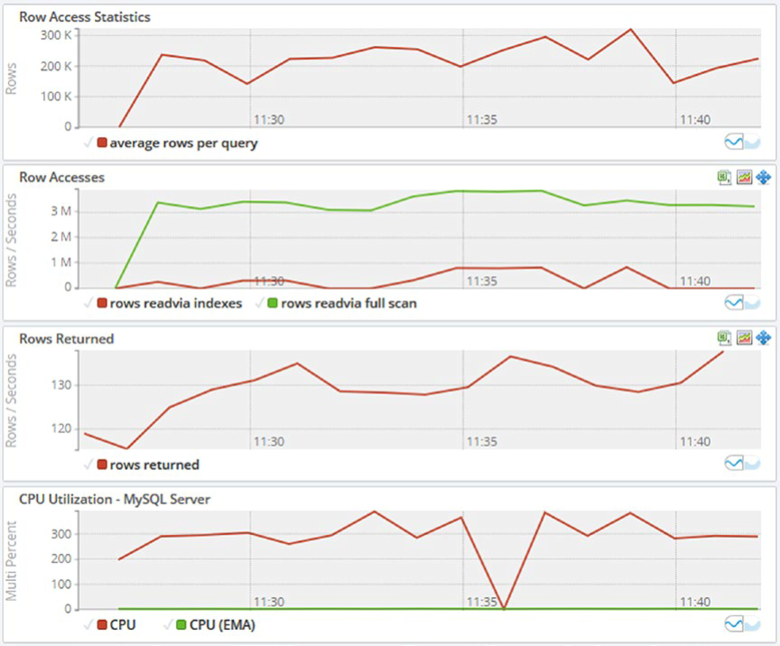
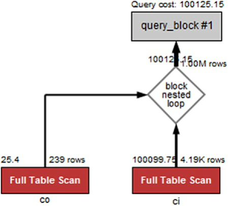
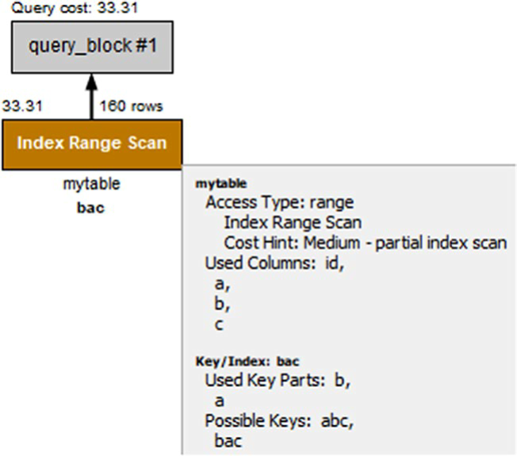
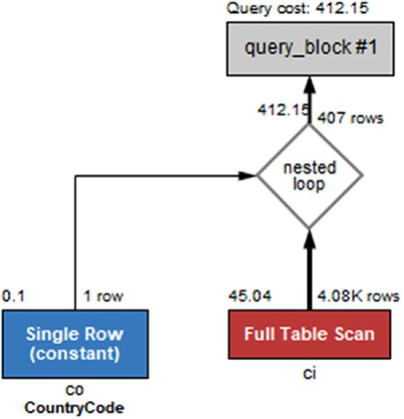
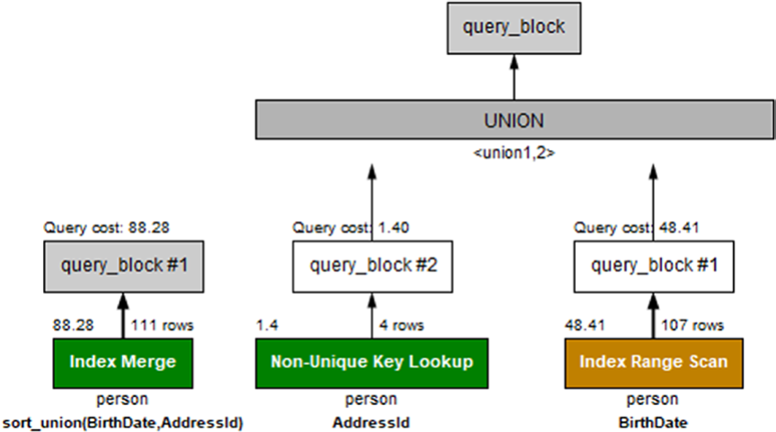
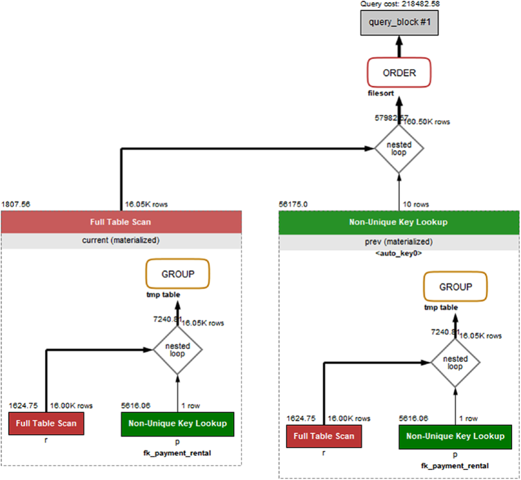
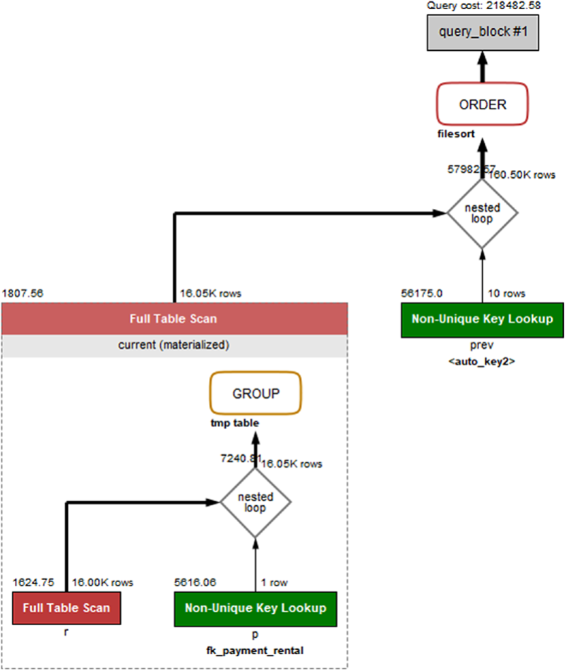

# 更改查询计划

有几个可能的原因，为什么性能不佳的查询不能按预期工作。这范围从查询明显错误在不良架构到低级原因，如非优查询计划或资源争用。本章将讨论一些常见的案例和解决方案。

本章首先介绍本章中大多数示例中使用的测试数据，并讨论过度完整表扫描的症状。然后介绍查询中的错误如何导致严重的性能问题，以及为什么索引不能始终使用，即使它们存在。本章的中间部分通过改进索引使用或重写复杂查询来改进查询。最后一部分讨论如何使用子句实现队列系统，以及如何处理具有许多条件的查询或具有许多子句。

## 测试数据

本章主要本章中的示例创建的测试数据。如果您尝试示例，则本书的 GitHub 存储库中的文件包含必要的表定义和数据。该脚本将删除并创建它与表。

您可以使用 MySQL 命令中的命令或命令行客户端中的命令执行脚本。例如：

```sql
mysql shell> \source chapter_24.sql
...
mysql shell> SHOW TABLES FROM chapter_24;
+----------------------+
| Tables_in_chapter_24 |
+----------------------+
| address              |
| city                 |
| country              |
| jobqueue             |
| language             |
| mytable              |
| payment              |
| person               |
+----------------------+
8 rows in set (0.0033 sec)
```


该脚本要求在采购数据库。

## 过度完整表扫描的症状

导致最严重的性能问题原因之一是特别是当涉及联接且查询块中的第一个表中未出现完整表扫描时。它可能导致 MySQL 的很多工作，以使之影响其他连接。当 MySQL 不能对查询使用索引时，将发生完整表扫描，因为不存在筛选条件或存在的条件没有索引。完整表扫描的副作用是，大量数据被拉入缓冲池，可能永远不会返回到应用程序。这会使磁盘 I/O 数量急剧增加，从而导致进一步的性能问题。

当查询执行过多的表扫描时，需要查找的症状包括 CPU 使用率增加、访问行数增加、索引使用率低，以及磁盘 I/O 可能增加，以及 InnoDB 缓冲池的效率降低。

检测过多的完整表扫描的最佳方法就是转向监视。直接的方法是查找在性能架构中标记为使用完整表扫描的查询，并将已检查的行与返回的行数或受影响的行数进行比较，如第章 中讨论。您还可以查看时间序列图，以发现被访问的行太多或 CPU 使用率太大的模式。图显示了在 MySQL 实例上进行完整表扫描的期间内监视图形的示例。（模拟这样的情况，则员工数据库非常有用，因为它具有足够大的表，可以允许一些相对较大的扫描。



请注意，在图形的左侧，访问完全扫描读取行的行访问率以及 CPU 使用率的增加。另一方面，返回的行数与访问行数相比变化很少（百分比）。特别是显示速率行通过索引读取与完整扫描相比的第二个图形，以及读取的行与返回的行之间的比率表明有问题。

最大的问题是，当 CPU 使用率太多行太多时，不幸的是，答案是"这取决于"。如果考虑 CPU 使用率，那么真正要说明的是，正在完成工作，对于正在访问的行数和速率，这些指标只是告诉应用程序正在请求数据。问题是，当太多的工作正在完成，并且访问太多的行时，应用程序需要回答的问题。在某些情况下，优化查询可能会增加其中一些指标，而不是减少它们，只是因为具有优化查询的 MySQL 能够执行更多工作。

这是一个为什么基线如此重要的示例。通常，考虑对指标的更改比查看指标的快照更多。同样，与单独查看指标相比，您从组合查看指标（例如将返回的行与访问中的行进行比较）中得到的更多。

接下来的两节将讨论访问过多行的查询示例以及如何改进它们。

## 查询错误

执行最差的查询的常见原因之一是查询写。这似乎是一个不太可能的原因，但在实践中，它可能发生比你想象的更容易。通常，问题是联接或筛选器条件缺失或引用错误的表。例如，如果使用框架（例如，使用对象关系映射 （ORM），框架中的 Bug 也可能成为罪魁祸首。

在极端情况下，缺少筛选器条件的查询会使应用程序停止查询（但不会终止查询）并重试它，因此 MySQL 会继续执行越来越多的执行效果很差的查询。这反过来又会使 MySQL 耗尽连接。

另一种可能性是，提交的查询中的第一个开始从磁盘将数据拉取到缓冲池。然后，每个后续查询将越来越快，因为它们可以从缓冲池中读取某些行，然后在到达尚未从磁盘读取的行时减慢速度。最后，查询的所有副本都将在短时间内完成，并开始向应用程序返回大量数据，使网络饱和。饱和网络可能导致连接尝试失败，因为握手错误中的 COUNT_HANDSHAKE_ERRORS 列），并且来自的主机最终可能会被阻止。

这看起来可能很极端，而且在大多数情况下，它不会变得那么糟糕。但是，本书的作者确实经历过这种情况的发生，因为生成查询的框架中出现一个错误。鉴于 MySQL 实例现在通常生活在云中的虚拟机中，资源量可能有限，例如 CPU 和网络，因此糟糕的查询最终也可能耗尽资源。

作为缺少联接条件的查询和查询计划的示例，请考虑加入城市和国家表的清单

```
Listing 24-1. Query that is missing a join condition
mysql> EXPLAIN
 SELECT ci.CountryCode, ci.ID, ci.Name,
 ci.District, co.Name AS Country,
 ci.Population
 FROM world.city ci
 INNER JOIN world.country co\G
*************************** 1. row ***************************
 id: 1
 select_type: SIMPLE
 table: co
 partitions: NULL
 type: ALL
possible_keys: NULL
 key: NULL
 key_len: NULL
 ref: NULL
 rows: 239
 filtered: 100
 Extra: NULL
*************************** 2. row ***************************
 id: 1
 select_type: SIMPLE
 table: ci
 partitions: NULL
 type: ALL
possible_keys: NULL
 key: NULL
 key_len: NULL
 ref: NULL
 rows: 4188
 filtered: 100
 Extra: Using join buffer (Block Nested Loop)
2 rows in set, 1 warning (0.0008 sec)
mysql> EXPLAIN ANALYZE
 SELECT ci.CountryCode, ci.ID, ci.Name,
 ci.District, co.Name AS Country,
 ci.Population
 FROM world.city ci
 INNER JOIN world.country co\G ************ 1. row *********
EXPLAIN:
-> Inner hash join (cost=100125.15 rows=1000932) (actual time=0.194..80.427
rows=974881 loops=1)
 -> Table scan on ci (cost=1.78 rows=4188) (actual time=0.025..2.621
rows=4079 loops=1)
 -> Hash
 -> Table scan on co (cost=25.40 rows=239) (actual time=0.041..0.089
rows=239 loops=1)
1 row in set (0.4094 sec)
```


请注意，这两个表如何将访问类型并且联接在块嵌套循环中使用联接缓冲区。通常有类似症状的一个原因是正确的查询，但查询不能使用索引。解释输出显示 8.0.18 版使用哈希联接。它还显示，总共返回了近 100 万行！查询的可视化解释图如图。



请注意，两个（红色）完整表扫描如何脱颖而出，查询成本如何估计超过 100，000。

多个完整表扫描、返回行的估计值非常高以及成本估计非常高的组合是您需要查找的告密符号。

出现类似症状的查询性能不佳的一个原因，是 MySQL 无法对筛选器和联接条件使用索引。

## 未使用索引

当查询需要查找表中的行时，它基本上可以通过两种方式实现：直接在完整表扫描中访问行或浏览索引。在存在高度选择性的筛选器的情况下，通过索引访问行通常比通过表扫描快得多。

显然，如果筛选器应用于的列上没有索引，MySQL 别无选择，只能使用表扫描。您可能会发现，即使有索引，也不能使用。三个常见原因是，列不是多列索引中的第一列，数据类型与比较不匹配，并且在列上使用函数与索引匹配。本节将讨论其中的每一个原因。

### 不是索引的左前缀

要使用索引，必须的左前缀。例如，如果索引包含则上的条件只能使用筛选器，如果列 a 上也有相等。

可以使用索引的条件示例包括：

```
WHERE a = 10 AND b = 20 AND c = 30
WHERE a = 10 AND b = 20 AND c > 10
WHERE a = 10 AND b = 20
WHERE a = 10 AND b > 20
WHERE a = 10
```


索引不能有效地使用的示例是 WHERE b 。在 MySQL 8.0.13 及更晚，如果 a 是列，MySQL 可以使用跳过扫描范围优化使用索引。如果 值，则无法使用索引。条件在任何情况下都无法使用索引。

同样，对于索引将仅用于对筛选。当查询仅使用索引中列的子集时，索引的顺序与应用筛选器的顺序相对应非常重要。如果其中一列具有范围条件，请确保该列是索引中使用的最后一个列。例如，考虑清单。

```
Listing 24-2. Query that cannot use the index effectively due to column order
mysql> SHOW CREATE TABLE chapter_24.mytable\G
*************************** 1. row ***************************
 Table: mytable
Create Table: CREATE TABLE `mytable` (
 `id` int(10) unsigned NOT NULL AUTO_INCREMENT,
 `a` int(11) NOT NULL,
 `b` int(11) DEFAULT NULL,
 `c` int(11) DEFAULT NULL,
 PRIMARY KEY (`id`),
 KEY `abc` (`a`,`b`,`c`)
) ENGINE=InnoDB AUTO_INCREMENT=16385 DEFAULT CHARSET=utf8mb4
COLLATE=utf8mb4_0900_ai_ci
1 row in set (0.0004 sec)
mysql> EXPLAIN
 SELECT *
 FROM chapter_24.mytable
 WHERE a > 10 AND b = 20\G
*************************** 1. row ***************************
 id: 1
 select_type: SIMPLE
 table: mytable
 partitions: NULL
 type: range
possible_keys: abc
 key: abc
 key_len: 4
 ref: NULL
 rows: 8326
 filtered: 10
 Extra: Using where; Using index
1 row in set, 1 warning (0.0007 sec)
```


请注意，输出只有 4 个字节，而如果索引同时用于 a 和 b 列， 输出还显示，估计只包含 10% 的检查行。图显示了视觉解释中的相同示例。


请注意"（靠近包含其他详细信息的框的底部）只是列出。但是，如果更改索引中列的顺序，以便在列之前对列进行索引，则索引可用于两列的条件。清单显示了添加新索引（b、a、c）。

```
Listing 24-3. Query plan with the index in optimal order
mysql> ALTER TABLE chapter_24.mytable
 ADD INDEX bac (b, a, c);
Query OK, 0 rows affected (1.4098 sec)
Records: 0 Duplicates: 0 Warnings: 0
mysql> EXPLAIN
 SELECT *
 FROM chapter_24.mytable
 WHERE a > 10 AND b = 20\G
*************************** 1. row ***************************
 id: 1
 select_type: SIMPLE
 table: mytable
 partitions: NULL
 type: range
possible_keys: abc,bac
 key: bac
 key_len: 9
 ref: NULL
 rows: 160
 filtered: 100
 Extra: Using where; Using index
1 row in set, 1 warning (0.0006 sec)
```


请注意列9 个字节，列显示 100% 的检查行将从表中包含在表中。如图。



在图中，您可以看到要行数从 8000 多行减少到 160 行，并且"已使用的关键部分"现在包括 列。估计查询成本也从 1683.84 降低到 33.31。

### 数据类型不匹配

您需要处理的另一件事是，条件两侧使用相同的数据类型和使用相同的排序。如果不是这样，MySQL 可能无法使用索引。

当查询由于数据类型或排序规则不匹配而无法以最佳方式工作时，首先可能很难理解问题出在哪里。查询是正确的，但 MySQL 拒绝使用您期望的索引。除了查询计划不是您所期望的，查询结果也可能是错误的。这可能是由于强制转换，例如：

```
mysql> SELECT ('a130' = 0), ('130a131' = 130);
+--------------+-------------------+
| ('a130' = 0) | ('130a131' = 130) |
+--------------+-------------------+
| 1            | 1                 |
+--------------+-------------------+
1 row in set, 2 warnings (0.0004 sec)
```


请注意，字符串"a130"如何被视为等于整数 0。这是因为字符串以非数字字符开头，因此被强制转换到值 0。同样，字符串"130a131"被视为等于整数130，因为字符串的前导数部分被转换到整数130。当将强制转换用于子句或联接条件时，也可能发生相同的意外匹配。这也是检查查询的警告有时可以帮助解决问题的情况。

如果本中考虑国家/地区表和 World 表（在讨论示例期间将显示表定义），则当使用 CountryId 列联接两个表时，可以看到不使用索引示例。清单显示了查询及其查询计划的示例。

```
Listing 24-4. Query not using an index due to mismatching data types
mysql> EXPLAIN
 SELECT ci.ID, ci.Name, ci.District,
 co.Name AS Country, ci.Population
 FROM chapter_24.city ci
 INNER JOIN chapter_24.country co
 USING (CountryId)
 WHERE co.CountryCode = 'AUS'\G
*************************** 1. row ***************************
 id: 1
 select_type: SIMPLE
 table: co
 partitions: NULL
 type: const
possible_keys: PRIMARY,CountryCode
 key: CountryCode
 key_len: 12
 ref: const
 rows: 1
 filtered: 100
 Extra: NULL
*************************** 2. row ***************************
 id: 1
 select_type: SIMPLE
 table: ci
 partitions: NULL
 type: ALL
possible_keys: CountryId
 key: NULL
 key_len: NULL
 ref: NULL
 rows: 4079
 filtered: 10
 Extra: Using where
2 rows in set, 3 warnings (0.0009 sec)
Warning (code 1739): Cannot use ref access on index 'CountryId' due to type
or collation conversion on field 'CountryId'
Warning (code 1739): Cannot use range access on index 'CountryId' due to
type or collation conversion on field 'CountryId'
Note (code 1003): /* select#1 */ select `chapter_24`.`ci`.`ID` AS
`ID`,`chapter_24`.`ci`.`Name` AS `Name`,`chapter_24`.`ci`.`District` AS
`District`,'Australia' AS `Country`,`chapter_24`.`ci`.`Population` AS
`Population` from `chapter_24`.`city` `ci` join `chapter_24`.`country` `co`
where ((`chapter_24`.`ci`.`CountryId` = '15'))
```


请注意城市）表为。此查询既不使用块嵌套循环，也不会使用哈希联接，因为 （） 表是常量。警告（如果您未启用了 MySQL Shell，则需要执行来获取警告）已包含此处，因为它们提供了有价值的提示，说明为什么无法使用索引，例如：由于字段"CountryId"上的类型或排序规则转换，无法使用的 ref 访问。因此，有一个索引是候选项，但无法使用，因为数据类型或排序规则已更改。图显示了使用可视化解释的相同查询计划。



这是需要基于文本的输出来获取所有详细信息的情况，因为 Visual Explain 不包含警告。当您看到这样的警告时，请返回并检查表定义。清单。

```
Listing 24-5. The table definitions for the city and country tables
CREATE TABLE `chapter_24`.`city` (
 `ID` int unsigned NOT NULL AUTO_INCREMENT,
 `Name` varchar(35) NOT NULL DEFAULT ",
 `CountryCode` char(3) NOT NULL DEFAULT ",
 `CountryId` char(3) NOT NULL,
 `District` varchar(20) NOT NULL DEFAULT ",
 `Population` int unsigned NOT NULL DEFAULT '0',
 PRIMARY KEY (`ID`),
 KEY `CountryCode` (`CountryCode`),
 KEY `CountryId` (`CountryId`)
) ENGINE=InnoDB DEFAULT CHARSET=utf8mb4 COLLATE=utf8mb4_general_ci;
Figure 24-5. Visual Explain where the data types do not match
CREATE TABLE `chapter_24`.`country` (
 `CountryId` int unsigned NOT NULL AUTO_INCREMENT,
 `CountryCode` char(3) NOT NULL,
 `Name` varchar(52) NOT NULL,
 `Continent` enum('Asia','Europe','North America','Africa','Oceania',
'Antarctica','South America') NOT NULL DEFAULT 'Asia',
 `Region` varchar(26) DEFAULT NULL,
 PRIMARY KEY (`CountryId`),
 UNIQUE INDEX `CountryCode` (`CountryCode`)
) ENGINE=InnoDB DEFAULT CHARSET=utf8mb4 COLLATE=utf8mb4_0900_ai_ci;
```


这里很明显，城市列是列是一个整数。这就是为什么在城市的表是联接中的第时，无法使用"国家/地区 Id"列。

另请注意，两个表的排序规则。城市使用排序规则（MySQL 5.7 及更早的默认排序规则），而 排序规则）。不同的字符集或排序规则甚至可以阻止查询完全执行：

```
SELECT ci.ID, ci.Name, ci.District,
 co.Name AS Country, ci.Population
 FROM chapter_24.city ci
 INNER JOIN chapter_24.country co
 USING (CountryCode)
 WHERE co.CountryCode = 'AUS';
ERROR: 1267: Illegal mix of collations (utf8mb4_general_ci,IMPLICIT) and
(utf8mb4_0900_ai_ci,IMPLICIT) for operation '='
```


如果在 MySQL 8 中创建一个表，并在查询中使用它以及早期 MySQL 版本中创建的表，请注意这一点。在这种情况下，您需要确保所有表使用相同的排序规则。

数据类型不匹配的问题是在筛选器中使用函数的特殊情况，就像 MySQL 执行隐式强制转换一样。通常，在筛选器中使用函数可以防止使用索引。

### 功能依赖关系

不使用索引的最后个常见原因是函数应用于列，例如。在这种情况下，您需要重写条件以避免函数，或者需要添加函数索引。

如果可能，处理使用函数阻止使用索引的情况的最佳方法就是重写查询以避免该函数。虽然也可以使用功能索引，除非它有助于创建覆盖索引，否则该索引会增加开销，这可以通过重写来避免。考虑一个查询，它想要查找 1970 年出生的人的详细信息，如清单 。

```
Listing 24-6. The person table and finding persons born in 1970
mysql> SHOW CREATE TABLE chapter_24.person\G
*************************** 1. row ***************************
 Table: person
Create Table: CREATE TABLE `person` (
 `PersonId` int(10) unsigned NOT NULL AUTO_INCREMENT,
 `FirstName` varchar(50) DEFAULT NULL,
 `Surname` varchar(50) DEFAULT NULL,
 `BirthDate` date NOT NULL,
 `AddressId` int(10) unsigned DEFAULT NULL,
 `LanguageId` int(10) unsigned DEFAULT NULL,
 PRIMARY KEY (`PersonId`),
 KEY `BirthDate` (`BirthDate`),
 KEY `AddressId` (`AddressId`),
 KEY `LanguageId` (`LanguageId`)
) ENGINE=InnoDB AUTO_INCREMENT=1001 DEFAULT CHARSET=utf8mb4
COLLATE=utf8mb4_0900_ai_ci
1 row in set (0.0012 sec)
mysql> EXPLAIN
 SELECT *
 FROM chapter_24.person
 WHERE YEAR(BirthDate) = 1970\G
*************************** 1. row ***************************
 id: 1
 select_type: SIMPLE
 table: person
 partitions: NULL
 type: ALL
possible_keys: NULL
 key: NULL
 key_len: NULL
 ref: NULL
 rows: 1000
 filtered: 100
 Extra: Using where
1 row in set, 1 warning (0.0006 sec)
```


此查询使用函数来确定人出生地。另一种选择是寻找1970年1月1日至1971年12月31日（包括两天）之间出生的每个人，这等于一样。清单显示，在这种情况下，索引。

```
Listing 24-7. Rewriting the YEAR() function to a date range condition
mysql> EXPLAIN
 SELECT *
 FROM chapter_24.person
 WHERE BirthDate BETWEEN '1970-01-01'
 AND '1970-12-31'\G
*************************** 1. row ***************************
 id: 1
 select_type: SIMPLE
 table: person
 partitions: NULL
 type: range
possible_keys: BirthDate
 key: BirthDate
 key_len: 3
 ref: NULL
 rows: 6
 filtered: 100
 Extra: Using index condition
1 row in set, 1 warning (0.0009 sec)
```


此重写减少了查询，从使用表扫描检查 1000 行到索引范围扫描只是检查 6 行。类似的重写通常是可能的，因为函数用于有效提取一系列值的日期。

并不总是能够重写以刚才演示的方式使用函数的条件。条件不映射到单个范围，或者查询由框架或第三方应用程序生成，因此无法更改它。在这种情况下，您可以添加功能索引。

例如，考虑查找给定中所有具有生日的人员的查询，例如，因为您希望向他们发送生日问候语。原则上，可以使用范围，但它将需要每年一个范围，既不实用，也不非常有效。相反，您可以使用该月份的数值（1 月是 1 月 1 和 12 月 12 日）。清单显示了如何添加功能索引，该索引可与表中在当月有生日的每个人。

```
Listing 24-8. Using a functional index
mysql> ALTER TABLE chapter_24.person
 ADD INDEX ((MONTH(BirthDate)));
Query OK, 0 rows affected (0.4845 sec)
Records: 0 Duplicates: 0 Warnings: 0
mysql> EXPLAIN
 SELECT *
 FROM chapter_24.person
 WHERE MONTH(BirthDate) = MONTH(NOW())\G
*************************** 1. row ***************************
 id: 1
 select_type: SIMPLE
 table: person
 partitions: NULL
 type: ref
possible_keys: functional_index
 key: functional_index
 key_len: 5
 ref: const
 rows: 88
 filtered: 100
 Extra: NULL
1 row in set, 1 warning (0.0006 sec)
```


添加月（计划显示使用的索引

结束关于如何添加当前不使用索引的查询的索引支持的讨论结束。还有其他几个与使用索引相关的重写。下一节将介绍这些内容。

## 改进索引使用

上一节考虑了未用于联接或 WHERE 子句的索引查询。在某些情况下，使用索引，但您可以改进索引，或者另一个索引提供更好的性能，或者索引由于筛选器的复杂性而无法有效地使用。本节将介绍一些改进已使用索引的查询的示例。

### 添加覆盖索引

在某些情况下，当您查询表时，筛选由索引执行，但随后您请求了几列，因此 MySQL 需要检索整个行。在这种情况下，将这些额外的列会更加高效，因此索引包含查询所需的所有列。

考虑数据库中的城市

创建表"城市" （

```
CREATE TABLE `city` (
 `ID` int unsigned NOT NULL AUTO_INCREMENT,
 `Name` varchar(35) NOT NULL DEFAULT ",
 `CountryCode` char(3) NOT NULL DEFAULT ",
 `CountryId` char(3) NOT NULL,
 `District` varchar(20) NOT NULL DEFAULT ",
 `Population` int unsigned NOT NULL DEFAULT '0',
 PRIMARY KEY (`ID`),
 KEY `CountryCode` (`CountryCode`),
 KEY `CountryId` (`CountryId`)
) ENGINE=InnoDB DEFAULT CHARSET=utf8mb4 COLLATE=utf8mb4_general_ci;
```


如果要查找使用国家/地区代码 = 的所有城市的名称和区，则可以使用索引查找行。这非常有效，如清单。

```
mysql> EXPLAIN
 SELECT Name, District
 FROM chapter_24.city
 WHERE CountryCode = 'USA'\G
*************************** 1. row ***************************
 id: 1
 select_type: SIMPLE
 table: city
 partitions: NULL
 type: ref
possible_keys: CountryCode
 key: CountryCode
 key_len: 12
 ref: const
 rows: 274
 filtered: 100
 Extra: NULL
1 row in set, 1 warning (0.0376 sec)
```


请注意，索引使用 12 个字节（每个字符最多 4 个字节宽），不包括"使用如果创建一个新索引，/地区代码"作为第列，将""名称"作为其余列，则索引中具有查询所需的所有列。选择"区域"的顺序，因为最有可能将它们与筛选器中的国家/地区，子句。如果同样可能将列用于筛选器，请选择索引名称"，因为城市名称比区域更具选择性。清单显示了此示例以及新的查询计划。

```
Listing 24-10. Querying cities by a covering index
mysql> ALTER TABLE chapter_24.city
 ALTER INDEX CountryCode INVISIBLE,
 ADD INDEX Country_District_Name
 (CountryCode, District, Name);
Query OK, 0 rows affected (1.6630 sec)
Records: 0 Duplicates: 0 Warnings: 0
mysql> EXPLAIN
 SELECT Name, District
 FROM chapter_24.city
 WHERE CountryCode = 'USA'\G
*************************** 1. row ***************************
 id: 1
 select_type: SIMPLE
 table: city
 partitions: NULL
 type: ref
possible_keys: Country_District_Name
 key: Country_District_Name
 key_len: 12
 ref: const
 rows: 274
 filtered: 100
 Extra: Using index
1 row in set, 1 warning (0.0006 sec)
```


添加新索引时，仅覆盖"国家代码"列索引将不可见。这是因为新索引也可用于使用旧索引的所有用途，因此通常没有理由保留这两个索引。（鉴于"国家代码上的索引小于新索引，某些查询可能受益于旧索引。通过使其不可见，您可以在删除之前验证它不需要。

密钥长度仍返回为 12 字节，因为这就是用于筛选的字节。但是，"列现在索引"，以显示正在使用覆盖索引。

### 索引错误

当 MySQL多个索引之间进行选择时，优化器必须根据两个查询计划的估计成本决定使用哪个索引。由于索引统计信息和成本估算不精确，因此 MySQL 选择错误的索引可能会发生。特殊情况是，优化器选择不使用索引，即使可以使用索引，或者优化器选择使用索引，而索引执行表扫描的速度更快。无论采用哪种方式，都需要使用索引提示。

当您怀疑使用了错误的索引时，您需要查看 EXPLAIN以确定哪些索引是候选索引。清单显示了一个在2020年20岁到20岁并说英语的日本人的信息的例子。（假设您想给他们寄一张生日贺卡。树格式的输出的一部分已被省略号所取代，通过将大部分行保留到书页的宽度内，以提高可读性。

```
Listing 24-11. Finding information about the countries where English is spoken
mysql> SHOW CREATE TABLE chapter_24.person\G
*************************** 1. row ***************************
 Table: person
Create Table: CREATE TABLE `person` (
 `PersonId` int(10) unsigned NOT NULL AUTO_INCREMENT,
 `FirstName` varchar(50) DEFAULT NULL,
 `Surname` varchar(50) DEFAULT NULL,
 `BirthDate` date NOT NULL,
 `AddressId` int(10) unsigned DEFAULT NULL,
 `LanguageId` int(10) unsigned DEFAULT NULL,
 PRIMARY KEY (`PersonId`),
 KEY `BirthDate` (`BirthDate`),
 KEY `AddressId` (`AddressId`),
 KEY `LanguageId` (`LanguageId`),
 KEY `functional_index` ((month(`BirthDate`)))
) ENGINE=InnoDB AUTO_INCREMENT=1001 DEFAULT CHARSET=utf8mb4
COLLATE=utf8mb4_0900_ai_ci
1 row in set (0.0007 sec)
mysql> SHOW CREATE TABLE chapter_24.address\G
*************************** 1. row ***************************
 Table: address
Create Table: CREATE TABLE `address` (
 `AddressId` int(10) unsigned NOT NULL AUTO_INCREMENT,
 `City` varchar(35) NOT NULL,
 `District` varchar(20) NOT NULL,
 `CountryCode` char(3) NOT NULL,
 PRIMARY KEY (`AddressId`),
 KEY `CountryCode` (`CountryCode`,`District`,`City`)
) ENGINE=InnoDB AUTO_INCREMENT=4096 DEFAULT CHARSET=utf8mb4
COLLATE=utf8mb4_0900_ai_ci
1 row in set (0.0007 sec)
mysql> SHOW CREATE TABLE chapter_24.language\G
*************************** 1. row ***************************
 Table: language
Create Table: CREATE TABLE `language` (
 `LanguageId` int(10) unsigned NOT NULL AUTO_INCREMENT,
 `Language` varchar(35) NOT NULL,
 PRIMARY KEY (`LanguageId`),
 KEY `Language` (`Language`)
) ENGINE=InnoDB AUTO_INCREMENT=512 DEFAULT CHARSET=utf8mb4
COLLATE=utf8mb4_0900_ai_ci
1 row in set (0.0005 sec)
mysql> UPDATE mysql.innodb_index_stats
 SET stat_value = 1000
 WHERE database_name = 'chapter_24'
 AND table_name = 'person'
 AND index_name = 'LanguageId'
 AND stat_name = 'n_diff_pfx01';
Query OK, 1 row affected (0.0920 sec)
Rows matched: 1 Changed: 1 Warnings: 0
mysql> FLUSH TABLE chapter_24.person;
Query OK, 0 rows affected (0.0686 sec)
mysql> EXPLAIN
 SELECT PersonId, FirstName,
 Surname, BirthDate
 FROM chapter_24.person
 INNER JOIN chapter_24.address
 USING (AddressId)
 INNER JOIN chapter_24.language
 USING (LanguageId)
 WHERE BirthDate BETWEEN '2000-01-01'
 AND '2000-12-31'
 AND CountryCode = 'JPN'
 AND Language = 'English'\G
*************************** 1. row ***************************
 id: 1
 select_type: SIMPLE
 table: language
 partitions: NULL
 type: ref
possible_keys: PRIMARY,Language
 key: Language
 key_len: 142
 ref: const
 rows: 1
 filtered: 100
 Extra: Using index
*************************** 2. row ***************************
 id: 1
 select_type: SIMPLE
 table: person
 partitions: NULL
 type: ref
possible_keys: BirthDate,AddressId,LanguageId
 key: LanguageId
 key_len: 5
 ref: chapter_24.language.LanguageId
 rows: 1
 filtered: 5
 Extra: Using where
*************************** 3. row ***************************
 id: 1
 select_type: SIMPLE
 table: address
 partitions: NULL
 type: eq_ref
possible_keys: PRIMARY,CountryCode
 key: PRIMARY
 key_len: 4
 ref: chapter_24.person.AddressId
 rows: 1
 filtered: 6.079921722412109
 Extra: Using where
3 rows in set, 1 warning (0.0008 sec)
mysql> EXPLAIN FORMAT=TREE
 SELECT PersonId, FirstName,
 Surname, BirthDate
 FROM chapter_24.person
 INNER JOIN chapter_24.address
 USING (AddressId)
 INNER JOIN chapter_24.language
 USING (LanguageId)
 WHERE BirthDate BETWEEN '2000-01-01'
 AND '2000-12-31'
 AND CountryCode = 'JPN'
 AND Language = 'English'\G
*************************** 1. row ***************************
EXPLAIN:
-> Nested loop inner join (cost=0.72 rows=0)
 -> Nested loop inner join (cost=0.70 rows=0)
 -> Index lookup on language using Language...
Chapter 24 Change the Query Plan
820
 -> Filter: ((person.BirthDate between '2000-01-01' and '2000-12-31')
and (person.AddressId is not null))...
 -> Index lookup on person using LanguageId...
 -> Filter: (address.CountryCode = 'JPN') (cost=0.37 rows=0)
 -> Single-row index lookup on address using PRIMARY...
1 row in set (0.0006 sec)
```


此示例的关键表是表和地址表。UPDATE 和语句用于通过更新 mysql.innodb_index_stats 表统计信息生效来模拟索引统计信息已过期。

查询可以使用出生日期语言索引。三个 WHERE每个表上一个子句）的有效性非常精确地确定，因为优化器要求存储引擎计算每个条件的行数。优化器的难点在于根据联接条件的有效性以及每个联接使用的索引确定最佳联接顺序。根据，优化器选择从语言表，并使用 索引加入人员表，最后加入表。

如果您怀疑查询使用了错误的索引（在这种情况下，使用在人员的，并且之所以选择，只是因为索引统计信息"错误"），则要做的第一件事是更新索引统计信息。结果在清单。

```
Listing 24-12. Updating the index statistics to change the query plan
mysql> ANALYZE TABLE
 chapter_24.person,
 chapter_24.address,
 chapter_24.language;
+---------------------+---------+----------+----------+
| Table               | Op      | Msg_type | Msg_text |
+---------------------+---------+----------+----------+
| chapter_24.person   | analyze | status   | OK       |
| chapter_24.address  | analyze | status   | OK       |
| chapter_24.language | analyze | status   | OK       |
+---------------------+---------+----------+----------+
3 rows in set (0.2634 sec)
mysql> EXPLAIN
 SELECT PersonId, FirstName,
 Surname, BirthDate
 FROM chapter_24.person
 INNER JOIN chapter_24.address
 USING (AddressId)
 INNER JOIN chapter_24.language
 USING (LanguageId)
 WHERE BirthDate BETWEEN '2000-01-01'
 AND '2000-12-31'
 AND CountryCode = 'JPN'
 AND Language = 'English'\G
*************************** 1. row ***************************
 id: 1
 select_type: SIMPLE
 table: language
 partitions: NULL
 type: ref
possible_keys: PRIMARY,Language
 key: Language
 key_len: 142
 ref: const
 rows: 1
 filtered: 100
 Extra: Using index
*************************** 2. row ***************************
 id: 1
 select_type: SIMPLE
 table: person
 partitions: NULL
 type: range
possible_keys: BirthDate,AddressId,LanguageId
 key: BirthDate
 key_len: 3
 ref: NULL
 rows: 8
 filtered: 10
 Extra: Using index condition; Using where; Using join buffer (Block
Nested Loop)
*************************** 3. row ***************************
 id: 1
 select_type: SIMPLE
 table: address
 partitions: NULL
 type: eq_ref
possible_keys: PRIMARY,CountryCode
 key: PRIMARY
 key_len: 4
 ref: chapter_24.person.AddressId
 rows: 1
 filtered: 6.079921722412109
 Extra: Using where
3 rows in set, 1 warning (0.0031 sec)
mysql> EXPLAIN FORMAT=TREE
 SELECT PersonId, FirstName,
 Surname, BirthDate
 FROM chapter_24.person
 INNER JOIN chapter_24.address
 USING (AddressId)
 INNER JOIN chapter_24.language
 USING (LanguageId)
 WHERE BirthDate BETWEEN '2000-01-01'
 AND '2000-12-31'
 AND CountryCode = 'JPN'
 AND Language = 'English'\G
*************************** 1. row ***************************
EXPLAIN:
-> Nested loop inner join (cost=7.01 rows=0)
 -> Inner hash join...
 -> Filter: (person.AddressId is not null)...
 -> Index range scan on person using BirthDate...
 -> Hash
 -> Index lookup on language using Language...
 -> Filter: (address.CountryCode = 'JPN')...
 -> Single-row index lookup on address using PRIMARY...
1 row in set (0.0009 sec)
```


这极大地改变了查询计划（仅包含树格式查询计划的一部分，以进行可读性），这是通过比较树格式查询计划最容易看到的。这些表仍按相同的顺序联接，但现在使用哈希联接来联接语言和人员表。这非常有效，因为语言表中只需要一行，因此在人员表扫描和在出生日期上筛选是不错的选择。在大多数情况下，使用错误的索引，更新索引统计信息将解决问题，可能是在更改 InnoDB 为表编制的索引潜水数之后。

在某些情况下，无法通过更新索引统计信息来解决性能问题。在这种情况下，您可以使用索引提示（忽略索引）来影响 MySQL 将使用的索引。清单显示了在将索引统计信息更改回过时后，对与以前相同的查询执行此项操作的示例。

```
Listing 24-13. Improving the query plan using an index hint
mysql> UPDATE mysql.innodb_index_stats
 SET stat_value = 1000
 WHERE database_name = 'chapter_24'
 AND table_name = 'person'
 AND index_name = 'LanguageId'
 AND stat_name = 'n_diff_pfx01';
Query OK, 1 row affected (0.0920 sec)
Rows matched: 1 Changed: 1 Warnings: 0
mysql> FLUSH TABLE chapter_24.person;
Query OK, 0 rows affected (0.0498 sec)
mysql> EXPLAIN
 SELECT PersonId, FirstName,
 Surname, BirthDate
 FROM chapter_24.person USE INDEX (BirthDate)
 INNER JOIN chapter_24.address
 USING (AddressId)
 INNER JOIN chapter_24.language
 USING (LanguageId)
 WHERE BirthDate BETWEEN '2000-01-01'
 AND '2000-12-31'
 AND CountryCode = 'JPN'
 AND Language = 'English'\G
*************************** 1. row ***************************
 id: 1
 select_type: SIMPLE
 table: language
 partitions: NULL
 type: ref
possible_keys: PRIMARY,Language
 key: Language
 key_len: 142
 ref: const
 rows: 1
 filtered: 100
 Extra: Using index
*************************** 2. row ***************************
 id: 1
 select_type: SIMPLE
 table: person
 partitions: NULL
 type: range
possible_keys: BirthDate
 key: BirthDate
 key_len: 3
 ref: NULL
 rows: 8
 filtered: 0.625
 Extra: Using index condition; Using where; Using join buffer (Block
Nested Loop)
*************************** 3. row ***************************
 id: 1
 select_type: SIMPLE
 table: address
 partitions: NULL
 type: eq_ref
possible_keys: PRIMARY,CountryCode
 key: PRIMARY
 key_len: 4
 ref: chapter_24.person.AddressId
 rows: 1
 filtered: 6.079921722412109
 Extra: Using where
3 rows in set, 1 warning (0.0016 sec)
```


这一，该表提供与更新索引统计信息时相同的查询计划。请注意，人表的可能仅包括此方法的缺点是，如果数据发生更改，优化器没有灵活性更改查询计划，索引不再是最佳索引。

此示例在人员表上有条件（出生日期的日期范围和两个联接条件）。在某些情况下，当表上有多个条件时，对查询进行一些更广泛的重写是有益的。

### 重写复杂的索引条件

在某些情况下，查询变得非常复杂，优化器无法想出一个好的查询计划，因此有必要重写查询。重写可以帮助在同一表上包含多个其中索引合并算法无法有效使用的示例。

请考虑以下查询：

```
mysql> EXPLAIN FORMAT=TREE
 SELECT *
 FROM chapter_24.person
 WHERE BirthDate < '1930-01-01'
 OR AddressId = 3417\G
*************************** 1. row ***************************
EXPLAIN:
-> Filter: ((chapter_24.person.BirthDate < DATE'1930-01-01') or
(chapter_24.person.AddressId = 3417)) (cost=88.28 rows=111)
 -> Index range scan on person using sort_union(BirthDate,AddressId)
(cost=88.28 rows=111)
1 row in set (0.0006 sec)
```


有"出生日期"和 索引，但没有跨两个列的索引。一种可能性是使用索引合并，如果优化器认为好处足够大，则默认情况下会选择索引合并。通常这是执行查询的首选方法，但对于某些查询（尤其是本例中的复杂），它可以帮助将这两个拆分为两个查询，并使用联合组合结果：

```
mysql> EXPLAIN FORMAT=TREE
 (SELECT *
 FROM chapter_24.person
 WHERE BirthDate < '1930-01-01'
 ) UNION DISTINCT (
 SELECT *
 FROM chapter_24.person
 WHERE AddressId = 3417
 )\G
*************************** 1. row ***************************
EXPLAIN:
-> Table scan on <union temporary> (cost=2.50 rows=0)
 -> Union materialize with deduplication
 -> Index range scan on person using BirthDate, with index
condition: (chapter_24.person.BirthDate < DATE'1930-01-01')
(cost=48.41 rows=107)
 -> Index lookup on person using AddressId
(AddressId=3417) (cost=1.40 rows=4)
1 row in set (0.0006 sec)
```


联合（也是默认联合）用于确保满足这两个条件的行两次。图并排显示了两个查询计划。



左侧是使用索引合并（使用索引算法查询），右侧是手动写入联合。

## 重写复杂查询

优化器由 MySQL 8 添加了多个转换规则，因此它可以将查询重写为性能更好的窗体。这意味着，随着优化器知道越来越多的转换，重写复杂查询需求不断减少。例如，在 8.0.l7 版本发布之前，添加了支持以重写入"（子查询）、（子查询子"不为并且（子查询）为反子查询未为 TRUE，这意味着子查询将被删除。

也就是说，考虑如何重写查询还是不错的，因此，对于查询未到达最佳解决方案或不知道如何自己重写的情况，您可以帮助优化器进行编写。还有一些情况下，您可以利用对公共表表达式（CT+，也称为带语法）和窗口函数的支持，使查询更有效、更易于阅读。本节将开始考虑常见的表表达式和窗口函数，然后完成使用查询）重写查询到联接并使用两个查询。

通用表表达式和窗口函数

本书超出了使用常用表表达式和窗口函数的详细信息的范围。本章将包含几个示例，介绍如何使用这些功能。一个一般概述的一个很好的通用表表达式和窗口函数，由丹尼尔·巴塞洛缪揭示，。

Guilhem Bichot（在 MySQL 中实现通用表表达式的 MySQL 开发人员）还撰写了一篇博客系列，内容是首次开发该功能时，有关公共表表达式的。其他 MySQL 开发人员还就窗口函数编写了两个。

有关最新信息，最佳来源是 MySQL 参考手册。公共表表达式在 https://dev.mysql.com/doc/refman/en/with.html。窗口函数由两部分组成，根据函数是常规函数还是还包括对窗口函数的一聚合窗口函数。

### 通用表表达式

公共表功能允许您在查询开始时定义子查询，并使用它作为查询主要部分中的普通表。使用通用表表达式而不是内联子表达式有几个优点，包括更好的性能和可读性。更好的性能部分来自支持在查询中多次引用公共表表达式，而内部标记只能引用一次。

例如，考虑针对查询，该数据库计算处理租赁的工作人员每月的销售额：

```
SELECT DATE_FORMAT(r.rental_date,
 '%Y-%m-01'
 ) AS FirstOfMonth,
 r.staff_id,
 SUM(p.amount) as SalesAmount
 FROM sakila.payment p
 INNER JOIN sakila.rental r
 USING (rental_id)
 GROUP BY FirstOfMonth, r.staff_id;
```


如果您想知道每月的销售额多少，则需要将一个月的销售额与上个月的销售额进行比较。若要在不使用公共表表达式的情况下实现此功能，您需要将查询结果存储在临时表中，或者将其复制为两个子查询。清单显示了后者的一个例子。

```
Listing 24-14. The monthly sales and change in sales without CTEs
SELECT current.staff_id,
 YEAR(current.FirstOfMonth) AS Year,
 MONTH(current.FirstOfMonth) AS Month,
 current.SalesAmount,
 (current.SalesAmount
 - IFNULL(prev.SalesAmount, 0)
 ) AS DeltaAmount
 FROM (
 SELECT DATE_FORMAT(r.rental_date,
 '%Y-%m-01'
 ) AS FirstOfMonth,
 r.staff_id,
 SUM(p.amount) as SalesAmount
 FROM sakila.payment p
 INNER JOIN sakila.rental r
 USING (rental_id)
 GROUP BY FirstOfMonth, r.staff_id
 ) current
 LEFT OUTER JOIN (
 SELECT DATE_FORMAT(r.rental_date,
 '%Y-%m-01'
 ) AS FirstOfMonth,
 r.staff_id,
 SUM(p.amount) as SalesAmount
 FROM sakila.payment p
 INNER JOIN sakila.rental r
 USING (rental_id)
 GROUP BY FirstOfMonth, r.staff_id
 ) prev ON prev.FirstOfMonth
 = current.FirstOfMonth
 - INTERVAL 1 MONTH
 AND prev.staff_id = current.staff_id
 ORDER BY current.staff_id,
 current.FirstOfMonth;
```


这很难使查询符合最容易阅读和理解的查询。这两个子会议与用于查找每个员工每月的销售额的子会议相同。通过比较同一工作人员的当前和前几个月，将两个派生表联接在一起。最后，结果由工作人员和当月排序。结果显示在清单。

```
Listing 24-15. The result of the monthly sales query
+----------+------+-------+-------------+-------------+
| staff_id | Year | Month | SalesAmount | DeltaAmount |
+----------+------+-------+-------------+-------------+
| 1        | 2005 | 5     | 2340.42     | 2340.42     |
| 1        | 2005 | 6     | 4832.37     | 2491.95     |
| 1        | 2005 | 7     | 14061.58    | 9229.21     |
| 1        | 2005 | 8     | 12072.08    | -1989.50    |
| 1        | 2006 | 2     | 218.17      | 218.17      |
| 2        | 2005 | 5     | 2483.02     | 2483.02     |
| 2        | 2005 | 6     | 4797.52     | 2314.50     |
| 2        | 2005 | 7     | 14307.33    | 9509.81     |
| 2        | 2005 | 8     | 11998.06    | -2309.27    |
| 2        | 2006 | 2     | 296.01      | 296.01      |
+----------+------+-------+-------------+-------------+
10 rows in set (0.1406 sec)
```


从结果中可以注意到的是，2005 年 9 月至 2006 年 1 月没有销售数据。查询假定该期间的销售金额为 0。重写此查询以使用窗口函数时，将显示如何添加缺少的月份。

图显示了此版本的查询的查询计划。



查询计划显示子查询计算两次;然后，使用名为"当前"的子查询上的完整表扫描执行联接，并使用嵌套循环中的索引（和自动生成的索引）联接，以形成按文件排序排序的结果。

如果使用公共表表达式只需定义一次子查询，然后引用它两次。这样可以简化查询，使其性能更好。使用公共表表达式的查询版本显示在清单。

与monthly_sales作为 （

```
Listing 24-16. The monthly sales and change in sales using CTE
WITH monthly_sales AS (
 SELECT DATE_FORMAT(r.rental_date,
 '%Y-%m-01'
 ) AS FirstOfMonth,
 r.staff_id,
 SUM(p.amount) as SalesAmount
 FROM sakila.payment p
 INNER JOIN sakila.rental r
 USING (rental_id)
 GROUP BY FirstOfMonth, r.staff_id
)
SELECT current.staff_id,
 YEAR(current.FirstOfMonth) AS Year,
 MONTH(current.FirstOfMonth) AS Month,
 current.SalesAmount,
 (current.SalesAmount
 - IFNULL(prev.SalesAmount, 0)
 ) AS DeltaAmount
 FROM monthly_sales current
 LEFT OUTER JOIN monthly_sales prev
 ON prev.FirstOfMonth
 = current.FirstOfMonth
 - INTERVAL 1 MONTH
 AND prev.staff_id = current.staff_id
 ORDER BY current.staff_id,
 current.FirstOfMonth;
```


常用表表达式首先使用关键字定义，并给出名称 。然后，查询的主要部分中的表列表可以仅。查询在原始查询的一半时间中执行。另一个好处是，如果业务逻辑发生更改，您只需在一个位置更新它，从而减少了在查询中出现 Bug 的可能性。图 公共表表达式查询版本的查询计划。



查询计划显示子一次，然后作为常规表重用。否则，查询计划保持不变。

您也可以使用窗口函数解决此问题。

### 窗口功能

窗口函数允许您定义一个框架，其中窗口函数返回依赖于框架中其他行的值。您可以使用它生成行数和总计百分比，将行与上一行或下一行进行比较，等等。这里将探讨之前查找每月销售数字并将其与上月进行比较的示例。

可以使用函数获取上一行中的列的值。清单显示了如何使用它重写每月销售查询以使用窗口功能以及添加没有销售的月份。

```
Listing 24-17. Combing CTEs and the LAG() window function
WITH RECURSIVE
 month AS
 (SELECT MIN(DATE_FORMAT(rental_date,
 '%Y-%m-01'
 )) AS FirstOfMonth,
 MAX(DATE_FORMAT(rental_date,
 '%Y-%m-01'
 )) AS LastMonth
 FROM sakila.rental
 UNION
 SELECT FirstOfMonth + INTERVAL 1 MONTH,
 LastMonth
 FROM month
 WHERE FirstOfMonth < LastMonth
),
 staff_member AS (
 SELECT staff_id
 FROM sakila.staff
),
 monthly_sales AS (
 SELECT month.FirstOfMonth,
 s.staff_id,
 IFNULL(SUM(p.amount), 0) as SalesAmount
 FROM month
 CROSS JOIN staff_member s
 LEFT OUTER JOIN sakila.rental r
 ON r.rental_date >=
 month.FirstOfMonth
 AND r.rental_date < month.FirstOfMonth
 + INTERVAL 1 MONTH
 AND r.staff_id = s.staff_id
 LEFT OUTER JOIN sakila.payment p
 USING (rental_id)
 GROUP BY FirstOfMonth, s.staff_id
)
SELECT staff_id,
 YEAR(FirstOfMonth) AS Year,
 MONTH(FirstOfMonth) AS Month,
 SalesAmount,
 (SalesAmount
 - LAG(SalesAmount, 1, 0) OVER w_month
 ) AS DeltaAmount
 FROM monthly_sales
WINDOW w_month AS (ORDER BY staff_id, FirstOfMonth)
 ORDER BY staff_id, FirstOfMonth;
```


这个查询起初似乎相当复杂;但是，这样做的原因是，前两个通用表表达式用于添加第一个和最后几个月之间的每个月的销售数据以及租金数据。跨产品（请注意，在月份和 staff_member 表之间如何使用显式 CROSS 来明确表 。

主查询现在变得简单，因为所需的所有信息都可以在。窗口通过按"第一个月排序，并在此 窗口函数。清单显示了结果。

```
Listing 24-18. The result of the sales query using the LAG() function
+----------+------+-------+-------------+-------------+
| staff_id | Year | Month | SalesAmount | DeltaAmount |
+----------+------+-------+-------------+-------------+
| 1        | 2005 | 5 | 2340.42 | 2340.42 |
| 1        | 2005 | 6 | 4832.37 | 2491.95 |
| 1        | 2005 | 7 | 14061.58 | 9229.21 |
| 1        | 2005 | 8 | 12072.08 | -1989.50 |
| 1 | 2005 | 9 | 0.00 | -12072.08 |
| 1 | 2005 | 10 | 0.00 | 0.00 |
| 1 | 2005 | 11 | 0.00 | 0.00 |
| 1 | 2005 | 12 | 0.00 | 0.00 |
| 1 | 2006 | 1 | 0.00 | 0.00 |
| 1 | 2006 | 2 | 218.17 | 218.17 |
| 2 | 2005 | 5 | 2483.02 | 2264.85 |
| 2 | 2005 | 6 | 4797.52 | 2314.50 |
| 2 | 2005 | 7 | 14307.33 | 9509.81 |
| 2 | 2005 | 8 | 11998.06 | -2309.27 |
| 2 | 2005 | 9 | 0.00 | -11998.06 |
| 2 | 2005 | 10 | 0.00 | 0.00 |
| 2 | 2005 | 11 | 0.00 | 0.00 |
| 2 | 2005 | 12 | 0.00 | 0.00 |
| 2 | 2006 | 1 | 0.00 | 0.00 |
| 2 | 2006 | 2 | 296.01 | 296.01 |
+----------+------+-------+-------------+-------------+
```


请注意，没有销售数据的月份是如何为 0 的。

### 将子查询重写为联接

当您有子查询时，可以选择将子查询更改为联接。优化器通常会在可能执行此类重写，但偶尔帮助优化器进行操作会很有用。

作为示例，请考虑以下查询：

```
SELECT *
 FROM chapter_24.person
 WHERE AddressId IN (
 SELECT AddressId
 FROM chapter_24.address
 WHERE CountryCode = 'AUS'
 AND District = 'Queensland');
```


此查询查找居住在澳大利亚昆士兰州的所有人员。它也可以作为人表和地址表编写：

```
SELECT person.*
 FROM chapter_24.person
 INNER JOIN chapter_24.address
 USING (AddressId)
 WHERE CountryCode = 'AUS'
 AND District = 'Queensland';
```


事实上会进行此精确重写（除了优化器选择地址表是第一个，因为那是筛选器的位）。这是半连体优化的示例。如果遇到优化器无法重写查询的查询，可以记住这样的重写。通常，您越接近仅包含联接的查询，查询的性能越好。但是，查询调优的生命周期比这更复杂，有时相反的方式会提高查询性能。教训总是要测试。

可以使用的另一个选项是将查询拆分为多个部分，然后按步骤执行它们。

### 将查询拆分为零件

最后一个选项是将查询两个或多个部分。由于 MySQL 8 中对常见表表达式和窗口函数的支持，因此不需要像旧版本的 MySQL 那样频繁地进行这种重写。然而，记住这一点是有用的。

例如，考虑与之前讨论中的查询相同的查询，您可以在其中找到居住在澳大利亚昆士兰州的所有人员。您可以将子查询作为自己的查询执行，然后将结果放回。这种重写在应用程序以编程方式可以生成下一个查询的应用程序中效果最佳。为简单起见，此讨论将只显示所需的 SQL。清单显示了两个查询。

```
Listing 24-19. Splitting a query into two steps
mysql> SET SESSION transaction_isolation = 'REPEATABLE-READ';
Query OK, 0 rows affected (0.0002 sec)
mysql> START TRANSACTION;
Query OK, 0 rows affected (0.0400 sec)
mysql> SELECT AddressId
 FROM chapter_24.address
 WHERE CountryCode = 'AUS'
 AND District = 'Queensland';
+-----------+
| AddressId |
+-----------+
| 132       |
| 143       |
| 136       |
| 142       |
+-----------+
4 rows in set (0.0008 sec)
mysql> SELECT *
 FROM chapter_24.person
 WHERE AddressId IN (132, 136, 142, 143)\G
*************************** 1. row ***************************
 PersonId: 79
 FirstName: Dimitra
 Surname: Turner
 BirthDate: 1937-11-16
 AddressId: 132
LanguageId: 110
*************************** 2. row ***************************
 PersonId: 356
 FirstName: Julian
 Surname: Serrano
 BirthDate: 2017-07-30
 AddressId: 132
LanguageId: 110
2 rows in set (0.0005 sec)
mysql> COMMIT;
Query OK, 0 rows affected (0.0003 sec)
```


使用具有事务隔离级别的事务执行查询，这意味着两个 查询将使用相同的读取视图，从而以与执行问题为一个查询的方式对应于相同的时间点。对于这么简单的查询，使用多个查询不会获得任何收益;但是，对于非常复杂的查询，拆分部分查询（可能包括一些联接）可能是一种优势。将查询拆分为多个部分的一个好处还包括在某些情况下，您可以提高缓存效率。对于此示例，如果您有其他查询使用相同的子查询来查找昆士兰州的地址，缓存可以允许您将结果重新用于多种用途。

## 队列系统：跳过锁定

与数据库相关的常见任务是处理存储在队列中的一些任务列表。例如，处理商店的订单。处理所有任务并且只处理一次非常重要，但哪个应用程序线程处理每个任务并不重要。跳过子句非常适合此类方案。

考虑如 。

```
Listing 24-20. The jobqueue table and data
mysql> SHOW CREATE TABLE chapter_24.jobqueue\G
*************************** 1. row ***************************
 Table: jobqueue
Create Table: CREATE TABLE `jobqueue` (
 `JobId` int(10) unsigned NOT NULL AUTO_INCREMENT,
 `SubmitDate` datetime NOT NULL DEFAULT CURRENT_TIMESTAMP,
 `HandledDate` datetime DEFAULT NULL,
 PRIMARY KEY (`JobId`),
 KEY `HandledDate` (`HandledDate`,`SubmitDate`)
) ENGINE=InnoDB AUTO_INCREMENT=7 DEFAULT CHARSET=utf8mb4
COLLATE=utf8mb4_0900_ai_ci
1 row in set (0.0004 sec)
mysql> SELECT *
 FROM chapter_24.jobqueue;
+-------+---------------------+-------------+
| JobId | SubmitDate | HandledDate |
+-------+---------------------+-------------+
| 1 | 2019-07-01 19:32:30 | NULL |
| 2 | 2019-07-01 19:32:33 | NULL |
| 3 | 2019-07-01 19:33:40 | NULL |
| 4 | 2019-07-01 19:35:12 | NULL |
| 5 | 2019-07-01 19:40:24 | NULL |
| 6 | 2019-07-01 19:40:28 | NULL |
+-------+---------------------+-------------+
6 rows in set (0.0005 sec)
```


当日期为时，任务尚未处理，并且是抓取的。如果应用程序设置为获取最早的未处理任务，并且希望依赖 InnoDB 行锁来防止两个线程执行相同的任务，那么您可以使用对于 UPDATE，（在现实世界中，语句将是较大事务的一部分）：

```
SELECT JobId
 FROM chapter_24.jobqueue
 WHERE HandledDate IS NULL
 ORDER BY SubmitDate
 LIMIT 1
 FOR UPDATE;
```


这适用于第一个请求，但下一个请求将阻塞，直到发生锁定等待超时或处理第一个任务，因此任务处理被序列化。诀窍是确保筛选和排序的列上有一个索引，然后使用 SKIP 句。然后，第二个连接将跳过锁定的行，并找到满足搜索条件的第一个未锁定行。清单显示了两个连接的示例，每个连接从获取作业。

```
Listing 24-21. Fetching tasks with SKIP LOCKED
Connection 1> START TRANSACTION;
Query OK, 0 rows affected (0.0002 sec)
Connection 1> SELECT JobId
 FROM chapter_24.jobqueue
 WHERE HandledDate IS NULL
 ORDER BY SubmitDate
 LIMIT 1
 FOR UPDATE
 SKIP LOCKED;
+-------+
| JobId |
+-------+
| 1 |
+-------+
1 row in set (0.0004 sec)
Connection 2> START TRANSACTION;
Query OK, 0 rows affected (0.0003 sec)
Connection 2> SELECT JobId
 FROM chapter_24.jobqueue
 WHERE HandledDate IS NULL
 ORDER BY SubmitDate
 LIMIT 1
 FOR UPDATE
 SKIP LOCKED;
+-------+
| JobId |
+-------+
| 2 |
+-------+
1 row in set (0.0094 sec)
```


现在，这两个提取任务并同时处理它们。任务完成后，可以将任务标记为已完成。与连接设置的锁列相比，此方法的优点是，如果连接由于某种原因失败，则将自动释放锁。

您可以使用性能的"模型"表来查看哪个连接具有每个锁（锁的顺序取决于线程 ID，而线程 ID 将有所不同）：

```
mysql> SELECT THREAD_ID, INDEX_NAME, LOCK_DATA
 FROM performance_schema.data_locks
 WHERE OBJECT_SCHEMA = 'chapter_24'
 AND OBJECT_NAME = 'jobqueue'
 AND LOCK_TYPE = 'RECORD'
 ORDER BY THREAD_ID, EVENT_ID;
+-----------+------------+-----------------------+
| THREAD_ID | INDEX_NAME | LOCK_DATA             |
+-----------+------------+-----------------------+
| 21705     | PRIMARY | 1 |
| 21705     | SubmitDate | NULL, 0x99A383381E, 1 |
| 25101     | PRIMARY | 2 |
| 25101     | SubmitDate | NULL, 0x99A3833821, 2 |
+-----------+------------+-----------------------+
4 rows in set (0.0008 sec)
```


十六进制值是"提交日期"列的值。从输出中可以看到，每个连接在辅助索引中保留一个记录锁，在主键中保留一个记录锁，与值一样。

## 许多或或或在条件

在性能方面可能导致的查询类型是具有许多范围条件的查询。当存在许多 OR 条件或运算符具有许多这通常是个问题。在某些情况下，对条件进行小更改可能会完全更改查询计划。

当优化器在索引列上遇到范围条件时，它有两个选项：它可以假定索引中的所有值都同时频繁发生，或者它可以要求存储引擎执行索引跳加以确定每个范围的频率。前者是最便宜的，但后者要准确到远。要决定使用哪种方法，请使用默认值为 200）。如果存在范围，则优化器将只查看索引的基数，并假设所有值都以相同的频率发生。如果范围较少，将要求每个范围存储引擎。

当假设每个值发生同样频繁时，可能会出现性能问题。在这种情况下，当通过，与条件匹配的估计行数可能会突然发生显著变化，从而导致完全不同的查询计划。（如果值，真正重要的是与包含的值匹配的行数与从索引统计信息中获得的估计值接近。因此，列表中的值越多，包含代表性示例的可能性就越小。

清单显示了具有的"联系人 Id"表的示例。大多数行的设置为索引的基数为 21。

```
Listing 24-22. Query with many range conditions
mysql> SHOW CREATE TABLE chapter_24.payment\G
*************************** 1. row ***************************
 Table: payment
Create Table: CREATE TABLE `payment` (
 `PaymentId` int(10) unsigned NOT NULL AUTO_INCREMENT,
 `Amount` decimal(5,2) NOT NULL,
 `ContactId` int(10) unsigned DEFAULT NULL,
 PRIMARY KEY (`PaymentId`),
 KEY `ContactId` (`ContactId`)
) ENGINE=InnoDB AUTO_INCREMENT=32798 DEFAULT CHARSET=utf8mb4
COLLATE=utf8mb4_0900_ai_ci
1 row in set (0.0004 sec)
mysql> SELECT COUNT(ContactId), COUNT(*)
 FROM chapter_24.payment;
+------------------+----------+
| COUNT(ContactId) | COUNT(*) |
+------------------+----------+
| 20               | 20000    |
+------------------+----------+
1 row in set (0.0060 sec)
mysql> SELECT CARDINALITY
 FROM information_schema.STATISTICS
 WHERE TABLE_SCHEMA = 'chapter_24'
 AND TABLE_NAME = 'payment'
 AND INDEX_NAME = 'ContactId';
+-------------+
| CARDINALITY |
+-------------+
| 21 |
+-------------+
1 row in set (0.0009 sec)
mysql> SET SESSION eq_range_index_dive_limit=5;
Query OK, 0 rows affected (0.0003 sec)
mysql> EXPLAIN
 SELECT *
 FROM chapter_24.payment
 WHERE ContactId IN (1, 2, 3, 4)\G
*************************** 1. row ***************************
 id: 1
 select_type: SIMPLE
 table: payment
 partitions: NULL
 type: range
possible_keys: ContactId
 key: ContactId
 key_len: 5
 ref: NULL
 rows: 4
 filtered: 100
 Extra: Using index condition
1 row in set, 1 warning (0.0006 sec)
```


在示例中设置为 5，以避免需要指定一长串值。使用四个值，优化器已请求四个值中每个值的统计信息，估计行数为 4。但是，如果将值列表变长，则情况开始发生变化：

```
mysql> EXPLAIN
 SELECT *
 FROM chapter_24.payment
 WHERE ContactId IN (1, 2, 3, 4, 5)\G
*************************** 1. row ***************************
...
 key: ContactId
 key_len: 5
 ref: NULL
 rows: 4785
...
```


突然之间，估计匹配了 4785 行，而不是真正匹配的五行。索引仍在使用，但如果具有此条件的付款表涉及联接，则优化器很可能选择非优联接顺序。如果使值列表更长，优化器将完全停止使用索引，并执行完整的表扫描，因为它认为索引工作非常可怕：

```
mysql> EXPLAIN
 SELECT *
 FROM chapter_24.payment
 WHERE ContactId IN (1, 2, 3, 4, 5, 6, 7)\G
*************************** 1. row ***************************
...
 type: ALL
possible_keys: ContactId
 key: NULL
...
 rows: 20107
...
```


此查询仅返回七行，因此索引具有高度选择性。那么，可以做些什么来提高优化器的理解呢？根据估计结果的确切性质，有各种可能的行动。对于此特定问题，您有以下选项：

- 增加。
- 更改选项。
- 强制 MySQL 使用索引。

最简单的解决办法是默认值为 200，这是一个很好的起点。如果您有候选查询，可以使用测试，并确定执行索引潜水的附加成本是否值得通过获得更好的行估计来节省成本。测试查询的新值，在"提示中设置该值：

```
SELECT /*+ SET_VAR(eq_range_index_dive_limit=8) */
 *
 FROM chapter_24.payment
 WHERE ContactId IN (1, 2, 3, 4, 5, 6, 7);
```


在这种情况下，依赖基数导致如此糟糕的行估计的原因是，几乎所有行都将 。默认情况下，InnoDB 认为索引的值的所有行具有相同的值。这就是为什么在这个例子中，基数只有21。如果将基数将仅根据清单中所示的非 NULL 值计算基数。

```
Listing 24-23. Using innodb_stats_method = nulls_ignored
mysql> SET GLOBAL innodb_stats_method = nulls_ignored;
Query OK, 0 rows affected (0.0003 sec)
mysql> ANALYZE TABLE chapter_24.payment;
+--------------------+---------+----------+----------+
| Table              | Op      | Msg_type | Msg_text |
+--------------------+---------+----------+----------+
| chapter_24.payment | analyze | status   | OK       |
+--------------------+---------+----------+----------+
1 row in set (0.1411 sec)
mysql> SELECT CARDINALITY
 FROM information_schema.STATISTICS
 WHERE TABLE_SCHEMA = 'chapter_24'
 AND TABLE_NAME = 'payment'
 AND INDEX_NAME = 'ContactId';

+-------------+
| CARDINALITY |
+-------------+
| 20107       |
+-------------+
1 row in set (0.0009 sec)
mysql> EXPLAIN
 SELECT *
 FROM chapter_24.payment
 WHERE ContactId IN (1, 2, 3, 4, 5, 6, 7)\G
*************************** 1. row ***************************
 id: 1
 select_type: SIMPLE
 table: payment
 partitions: NULL
 type: range
possible_keys: ContactId
 key: ContactId
 key_len: 5
 ref: NULL
 rows: 7
 filtered: 100
 Extra: Using index condition
1 row in set, 1 warning (0.0011 sec)
```


此方法的最大问题是全局设置，因此会影响所有表，并且可能对其他查询产生负面影响。对于此示例，将返回默认值，然后重新计算索引统计信息：

```
mysql> SET GLOBAL innodb_stats_method = DEFAULT;
Query OK, 0 rows affected (0.0004 sec)
mysql> SELECT @@global.innodb_stats_method\G
*************************** 1. row ***************************
@@global.innodb_stats_method: nulls_equal
1 row in set (0.0003 sec)
mysql> ANALYZE TABLE chapter_24.payment;
+--------------------+---------+----------+----------+
| Table              | Op      | Msg_type | Msg_text |
+--------------------+---------+----------+----------+
| chapter_24.payment | analyze | status   | OK       |
+--------------------+---------+----------+----------+
1 row in set (0.6683 sec)
```


最后一个选项是使用索引提示强制 MySQL 使用索引。您将需要力，如清单。

```
Listing 24-24. Using FORCE INDEX to force MySQL to use the index
mysql> EXPLAIN
 SELECT *
 FROM chapter_24.payment FORCE INDEX (ContactId)
 WHERE ContactId IN (1, 2, 3, 4, 5, 6, 7)\G
*************************** 1. row ***************************
 id: 1
 select_type: SIMPLE
 table: payment
 partitions: NULL
 type: range
possible_keys: ContactId
 key: ContactId
 key_len: 5
 ref: NULL
 rows: 6699
 filtered: 100
 Extra: Using index condition
1 row in set, 1 warning (0.0007 sec)
```


这将使查询执行得和拥有更准确的统计信息一样快。但是，如果是具有相同 WHERE 子句一部分，则行估计值仍然关闭（估计为 6699 行，与 7 个实际行相比），因此查询计划可能仍然出错，在这种情况下，您需要告诉优化器最佳联接顺序是什么。

## 总结

本章展示了几种提高查询性能的技术示例。第一个主题是查看过度完整表扫描的症状，然后查看完整表扫描的两个主要原因：查询错误，索引无法使用。不能使用索引的典型原因是使用的列不构成索引的左前缀、数据类型不匹配或在列上使用函数。

它也可能发生使用索引，但使用可以改进。这可以是将索引转换为覆盖查询所需的所有列、使用错误的索引，或者使用复杂条件重写查询可以改进查询计划。

重写复杂查询也很有用。MySQL 8 支持通用表表达式和窗口函数，这些函数可用于简化查询并可能使其性能更好。在其他情况下，它可以帮助执行优化器通常执行的某些重写操作，或将查询拆分为多个部分。

最后，讨论了两个常见案例。第一个队列是使用一个队列，子句可用于有效地访问第一个未锁定的行。第二种是长串 OR 条件或具有许多值的当范围数达到 eq_range_index_dive_limit 选项设置的数字时，。

下一章将介绍提高 DDL 和批量数据负载的性能。